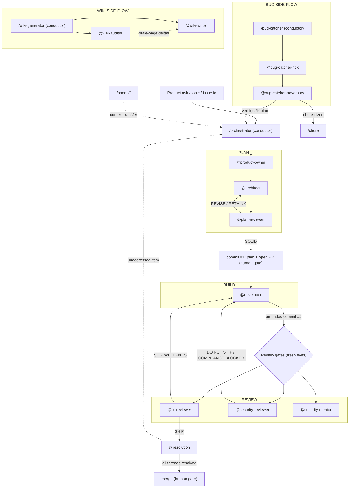

# Architecture

This document is the end-to-end narrative of the `Maungs-agentic-toolbelt`: how a product
ask becomes a merged PR, and the four side-flows (bug, wiki, chore, handoff) that
feed into or run alongside that main line.

## Component inventory

The pipeline is **16 agents + 10 skills = 26 components**. The split is deliberate:

- **Skills (`/name`) are conductors.** They orchestrate a multi-phase process and
  delegate every unit of real work to an agent. They route, gate, and sequence; they
  do not write code, plans, reviews, or wiki pages themselves.
- **Agents (`@name`) are workers.** Each owns exactly one phase, runs in its own
  context window, and returns a structured artifact (issue, plan, commit, verdict,
  dossier, wiki page) to its caller.

| Phase | Component | Type | One-line responsibility |
|---|---|---|---|
| Onboarding | `/agentic-onboard` | skill | Preps any repo for agentic development — scans it and emits CLAUDE.md + AGENTS.md + a concise architecture map; cold-generate or stale-refresh; `--deep` builds the full wiki |
| Onboarding | `@context-writer` | agent | Authors the context files from one verified project profile; read-only on source, writes only the context files |
| Onboarding | `@context-auditor` | agent | Fresh-eyes drift detector for stale context → CURRENT / STALE / INCORRECT / MISSING + delta list |
| Conductor | `/orchestrator` | skill | Step 0 env preflight (gh auth + MCP servers), then runs the full issue→merge cycle; delegates every phase; never codes |
| Plan | `@product-owner` | agent | Fuzzy ask → scoped GitHub issue with business-language acceptance criteria (+ UI/UX flow & wireframes for user-facing work) |
| Plan | `@architect` | agent | Issue → plan file with all architectural decisions front-loaded; lands plan as PR commit #1 (+ UI/UX flow & wireframes) |
| Plan | `@plan-reviewer` | agent | Cold, context-blind adversarial critique of the plan; 8-point rubric → SOLID / REVISE / RETHINK |
| Build | `@developer` | agent | Implements the approved plan as one amended commit #2; auto-detects stack; live Playwright UI verification |
| Testing | `@test-author` | agent | Authors negative-path/edge tests; runs the real test runner; never weakens assertions to pass |
| Migrations | `/migration-planner` | skill | Read-only pre-flight risk dossier for schema/data migrations (data-loss, locks, backfill, expand/contract, rollback) before anything is written |
| Review | `@pr-reviewer` | agent | Fresh-eyes PR review; 7-point rubric; multi-tenant isolation as top bug class → SHIP / SHIP WITH FIXES / DO NOT SHIP |
| Review | `@security-reviewer` | agent | Cold compliance gate; SAST + dep-CVE + secret scan → ship / no-ship / COMPLIANCE BLOCKER |
| Review | `@security-mentor` | agent | Same security review, but teaches the *why* (threat model + payload + structurally-immune fix) |
| Wrap-up | `@resolution` | agent | Pre-merge housekeeping; reads review history; resolves fixed threads, flips checkboxes, HALTs on anything unaddressed |
| Bug | `/bug-catcher` | skill | Diagnose-and-prove conductor; bounded rick↔adversary debate; hands a verified fix plan to `/orchestrator` or `/chore` |
| Bug | `@bug-catcher-rick` | agent | Evidence-backed root-cause dossier (symptom vs cause, file:line chain, SEV, fix direction, blast radius) |
| Bug | `@bug-catcher-adversary` | agent | Fresh-eyes refuter → CONFIRMED / DISPUTED / WRONG-ROOT-CAUSE / INCONCLUSIVE |
| Utility | `/chore` | skill | Escape hatch for small single-concern PRs; same commit/push gates; re-routes to `/orchestrator` if it grows |
| Utility | `/handoff` | skill | Drafts a drift-aware brief so a zero-context agent can resume cold; never written proactively |
| Utility | `/toolbelt` | skill | Self-describing inventory + recommend-a-component + status (router/MCP/CLAUDE.md checks); read-only |
| Utility | `/release-notes` | skill | Grouped release notes (features/fixes/breaking/migrations) + SemVer rec from a commit range/PRs; read-only; `--format deploy-comment` enriches a deploy comment |
| Utility | `/overnight` | skill | Conductor that stands up overnight CLOUD routines (bug · security · wiki) for a repo via `RemoteTrigger`; each its own routine feeding one rolling `[overnight] Dossier` issue (per-job race-safe comments); bug auto-devs top non-SEV1 findings into DRAFT never-merged fix PRs, wiki opens one rolling propose-only PR; gates the one outward create/update/run |
| Wiki | `/wiki-generator` | skill | Conductor for a near-100% technical wiki; full-build + incremental `--update`; output Markdown in `docs/wiki/` |
| Wiki | `@wiki-writer` | agent | Authors/updates ONE wiki page from real code; writes only its page, read-only on code; "verified against commit" stamp |
| Wiki | `@wiki-auditor` | agent | Fresh-eyes drift detector → CURRENT / STALE / INCORRECT / ORPHANED + delta list; writes nothing |

Plus four plugin **hooks** (not counted above): a `UserPromptSubmit` prompt-router that suggests the fitting component on each prompt, a `PreToolUse` guard that blocks cardinal-rule violations (`git add -A`, `--force`, `--no-verify`, catastrophic `rm -rf`, AI-attributed commits), a `SessionStart` loader that injects a project snapshot, and an opt-in `PreToolUse` usage-tracker (on `Task`/`Skill`) that records when components are offered vs. actually used (enable with `MAUNGS_TOOLBELT_DEBUG=on`; view via `/toolbelt metrics`). See the README's "Always-on hooks".

## End-to-end flow

---

## The main line: plan → build → review → wrap-up

### Entry

The pipeline takes one of three inputs: a fuzzy **product ask**, a free-text
**topic** (audit, refactor), or a numeric **issue id**. All of them enter through
**`/orchestrator`**, the conductor. The orchestrator's cardinal contract is that it
**never does engineering work itself** — it acknowledges the target, auto-detects
project conventions (`CLAUDE.md`, plan-file layout, language/test/CI/hook signals),
and then delegates each phase to the agent that owns it, capturing that agent's
return artifact before advancing. It also owns the human-only decision gates and the
quality-degradation HARD-HALT.

Before the first phase it runs a **Step 0 environment preflight** — checking `gh`
auth and the required MCP servers (GitHub, plus Playwright for UI work), auto-adding
the safe ones behind a confirmation gate and guiding the user through anything
interactive (auth, restarting Claude Code). This is what lets the pipeline start from
a cold checkout; the full walkthrough is in [`getting-started.md`](getting-started.md).

### Plan

1. **`@product-owner`** turns the fuzzy ask into a **scoped GitHub issue** with
   business-language acceptance criteria, sequenced within a milestone if a roadmap
   exists. It is read-only plus issue tooling — it does **not** write code. For
   user-facing work it also emits a UI/UX screen-flow and low-fi wireframes. (When the
   entry point is already a well-formed issue id, the orchestrator can skip or
   lightly invoke this step to refine a sparse issue.)

2. **`@product-owner` hands off to `@architect`**, which turns the issue into a
   **plan file** (e.g. `docs/plans/<id>_<slug>.md`). Its governing principle is that
   architectural decisions are ~10x costlier to make mid-build, so it **front-loads
   every decision** via `AskUserQuestion` rather than discovering them during
   implementation. The plan includes a Mermaid control/decision-flow diagram and,
   for user-facing work, the screen-flow and wireframes. The architect is the agent
   that opens the PR and lands the plan as **commit #1**.

3. **`@architect` hands off to `@plan-reviewer`** for a **cold, context-blind
   adversarial critique** *before* the plan is committed. This agent never reads the
   prior planning discussion or any earlier review — a fresh set of eyes is the
   entire point. It scores the plan against an 8-point rubric and returns one of
   three verdicts:
   - **REVISE / RETHINK** → loops back to **`@architect`** to amend the plan.
   - **SOLID** → the orchestrator presents **commit #1 (plan + open PR)** at the
     first **human gate**. Per the orchestrator's cardinal rules, every commit and
     every push — amends and force-pushes included — requires explicit human
     confirmation.

### Build

4. With commit #1 approved, the orchestrator **hands off to `@developer`**, which
   implements the approved plan as a **single amended commit #2** on the PR's
   existing branch. It auto-detects the test/lint/build stack, writes tests, runs the
   full local quality gate (honoring the project's pre-commit hook system, no
   `--no-verify` bypass), and runs **live Playwright UI verification** for
   user-facing changes. It enforces the per-commit/per-push human gates and carries a
   **quality-degradation circuit breaker** for its own fix loops.

### Review

5. Commit #2 fans out to the **review gates**, all of which are **fresh-eyes** — none
   reads prior reviews on the PR:
   - **`@pr-reviewer`** — engineering review against a 7-point rubric, treating
     **multi-tenant isolation as the top bug class**, posting inline comments, and
     returning **SHIP / SHIP WITH FIXES / DO NOT SHIP**.
   - **`@security-reviewer`** — the **cold compliance gatekeeper**: SAST + dependency
     CVE + secret scan, mapping findings to SOC 2 CC1–CC9, OWASP Top 10, PCI DSS v4
     (when payment data is present), NIST 800-63B, and CWE → **SHIP / SHIP WITH FIXES
     / DO NOT SHIP / DO NOT SHIP — COMPLIANCE BLOCKER**. No pedagogy, just the verdict.
   - **`@security-mentor`** — the **teaching variant** of the same security review:
     every finding explains the threat model, a concrete attacker payload, and a
     structurally-immune fix, so the reader learns the pattern rather than just the
     patch.

   Review feedback loops back to **`@developer`**: a **SHIP WITH FIXES** punch list
   or a **DO NOT SHIP / COMPLIANCE BLOCKER** sends the work back for another amended
   commit. The orchestrator watches these loops and **HARD-HALTs** if review
   iteration N+1 has more FAILs than iteration N — a quality regression is treated as
   a signal to hand off to a fresh-context agent rather than grind further.

### Wrap-up

6. On **SHIP**, the orchestrator **hands off to `@resolution`**, the pre-merge
   housekeeper and the deliberate **inverse of `@pr-reviewer`**: where the reviewer is
   forbidden from reading review history, `@resolution`'s whole job *is* to read it.
   It walks every prior review thread plus the PR body's test plan/checklist, replies
   to and resolves the threads that were fixed (**citing the fixing commit**), flips
   the done checkboxes, and **HALTs on anything unaddressed** — surfacing it back to
   the orchestrator for a human decision rather than merging over it.

7. With resolution clean, the orchestrator presents the final **merge** at the last
   **human gate**. The mandated PR shape across the lifecycle is the **3-commit
   structure**: commit #1 plan (architect), commit #2 implementation (developer,
   amend-friendly), and an optional commit #3 plan-sync.

The orchestrator also supports `--experiment`, a local-only **dry-run** variant where
nothing commits or pushes (cardinal commit/push rules are satisfied vacuously), with
exit paths to promote, iterate, or discard.

---

## Side-flow: bug (diagnose-and-prove)

The bug flow is its own conductor, **`/bug-catcher`**, which runs a **bounded
adversarial debate** before any fix is attempted:

1. **`/bug-catcher` hands the symptom to `@bug-catcher-rick`**, which reproduces or
   locates the failure and returns an **evidence-backed root-cause dossier**:
   symptom-vs-cause separation, a file:line evidence chain, a severity (SEV) rank, a
   fix direction, and the blast radius. It is read-only — it never edits or commits.

2. **`@bug-catcher-rick` hands the dossier to `@bug-catcher-adversary`**, a
   fresh-eyes refuter that tries to **prove the diagnosis wrong** — is this the true
   cause or a symptom, is the evidence sound, would the proposed fix actually resolve
   it or merely mask it, what regressions would it introduce — and returns
   **CONFIRMED / DISPUTED / WRONG-ROOT-CAUSE / INCONCLUSIVE**. The conductor runs the
   bounded debate between the two.

3. Once a fix is verified, **`/bug-catcher` routes by size**:
   - Full feature-sized fix → handed to **`/orchestrator`** as a verified fix plan,
     re-entering the main line at the plan phase.
   - Chore-sized fix → handed to **`/chore`**.

   `/bug-catcher --global` runs the same machinery as a codebase-wide sweep, using
   `@bug-catcher-rick` as a per-slice finder and the adversary as the verify stage,
   producing a severity-ranked backlog with a per-bug plan.

## Side-flow: chore (lightweight escape hatch)

**`/chore`** is the escape hatch for small, single-concern PRs (docs, config,
tooling, typo/comment fixes, agent/skill edits, trivial dependency bumps). It skips
the architect/developer/reviewer agents and the plan file — the change is done inline
— but it **keeps the same commit/push human gates and full quality gate**, opens a
summary-only PR, and merges after green CI. If a chore turns out to be larger than a
single concern, it **re-routes to `/orchestrator`** and rejoins the main line.

## Side-flow: handoff (context transfer)

**`/handoff`** drafts a self-contained, **drift-aware brief** so a zero-context agent
— or the user's future self — can resume specific work cold. It is a **context
transfer into `/orchestrator`** (or any agent), not a step in the pipeline, and the
cardinal rule is that it is **never written proactively**: only on explicit request.
It is the orchestrator's recommended recovery move whenever a quality-degradation
HARD-HALT fires.

## Side-flow: wiki (generate and self-maintain)

The wiki flow is conducted by **`/wiki-generator`**, which produces and maintains a
near-100% technical wiki (Markdown in `docs/wiki/`): per-module business analysis,
schemas, flow diagrams, UI mocks, related-files-per-page, a glossary, and onboarding.
It runs in two modes — a full build and an incremental `--update` (re-syncs only
stale pages) — and is schedulable for self-maintenance.

- **`/wiki-generator` hands each page to `@wiki-writer`**, which authors or updates
  **exactly one page** from real code (business summary + technical deep-dive +
  Mermaid + schema + related files@path + a "verified against commit" stamp). It is
  read-only on code and writes only its own page.
- In `--update`/scheduled mode, **`/wiki-generator` first runs `@wiki-auditor`**, a
  fresh-eyes drift detector that compares an existing page against current code and
  returns **CURRENT / STALE / INCORRECT / ORPHANED** plus a delta list. It writes
  nothing — the **`@wiki-auditor` → `@wiki-writer`** dotted edge in the diagram is the
  hand-off of stale-page deltas for the writer to fix, which is what keeps the wiki
  self-maintaining.

---

## Design invariants worth noting

- **Conductors never do the work.** `/orchestrator`, `/bug-catcher`, and
  `/wiki-generator` route and gate; the per-phase agents produce every artifact. The
  orchestrator explicitly refuses to "do agent work itself" and instead records the
  gap as feedback.
- **Fresh eyes are structural, not stylistic.** `@plan-reviewer`, `@pr-reviewer`,
  `@security-reviewer`, `@security-mentor`, `@bug-catcher-adversary`, and
  `@wiki-auditor` are all forbidden from reading prior reviews/discussion.
  `@resolution` is the single deliberate inverse — it exists *to* read history.
- **Human gates are non-negotiable.** Every commit and every push (amends and
  force-pushes included) stops for explicit human confirmation; the orchestrator owns
  the ship and merge decisions.
- **Regression is a stop condition.** More FAILs on iteration N+1 than N triggers a
  HARD-HALT, with `/handoff` as the recommended next move.
- **Both security reviewers run side-by-side** — `@security-reviewer` as the cold
  gate, `@security-mentor` as the teaching pass — so the same diff yields both a
  verdict and the knowledge transfer.
