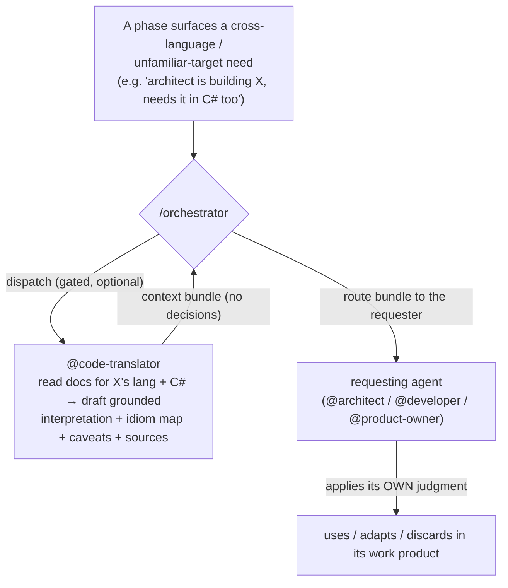

# 10 — Wire @code-translator into the flow as an on-demand doc-grounded context provider

**Topic:** integrate `@code-translator` into the orchestrator/agent flow (no GitHub issue — topic-driven design sketch).

## Goal

Make `@code-translator` a first-class, **on-demand context source** inside the toolbelt. Today it is *defined* as a read-only, documentation-grounded context provider "for the user or the `/orchestrator` flow to act on" (`agents/code-translator.md`), but nothing in the flow ever dispatches it and no peer agent knows it can be asked. This plan closes that gap: `/orchestrator` can dispatch it when a phase needs cross-language or unfamiliar-target grounding, and `@architect` / `@product-owner` / `@developer` can request its bundle to ground their own work.

The defining principle, carried into every integration point: the translator returns **CONTEXT, not decisions.** It grabs the authoritative docs first, drafts its own grounded interpretation plus the research trail that justifies it (translated code + cited idiom map + caveats + sources), and hands that back. The **requester** — the orchestrator, or the agent that asked — applies its own judgment: use it, adapt it, or discard it. The translator never writes code, commits, or decides what ships. This keeps it consistent with the toolbelt's conductor/worker split (context informs; the worker and the human own the call).

## Architecture

A requesting context (the orchestrator on an agent's behalf, or an agent directly) invokes `@code-translator translate <source> from <lang> to <lang>[, …]`. It researches the docs for every language involved and returns a doc-grounded bundle. The bundle flows **back to the requester**, who interprets it and folds the useful parts into its own output. Nothing is auto-applied.

Outside an orchestrator run, the same call returns the bundle to the **user**, who routes it themselves — the integration adds dispatch *affordances*, it does not make the translator mandatory.

## Where it plugs in

- **`/orchestrator` (dispatch + routing).** Add an OPTIONAL "grounded-context" affordance: when the issue/topic or a phase explicitly involves porting/translating to another language, or an agent returns a "needs target-language grounding" signal, the orchestrator may dispatch `@code-translator`, capture the bundle, and pass it into the requesting agent's next invocation. Gated and opt-in — NOT run on every cycle (most cycles need no translation). Document the trigger + the "bundle is context, the requester judges" contract.
- **`@architect` (request when planning cross-language work).** May request a bundle when a plan involves an unfamiliar target language/framework, and cite the grounded idioms/caveats in the plan's design/research — so the plan is anchored in real target-language semantics, not assumption.
- **`@product-owner` (supplement tickets technically).** May request a bundle to ground a ticket: acceptance criteria and scope notes that reflect real target-language constraints/idioms (e.g., "the port must handle X's nuance Y, which in C# maps to Z"). Keeps PO output business-language but technically grounded where it helps.
- **`@developer` (consume when implementing).** When handed a bundle (via the orchestrator or a plan), may use it as grounded reference while implementing in an unfamiliar target — still writing/verifying the code itself; the bundle is reference, not a patch.
- **`@code-translator` (clarify the role).** Tighten its definition to state explicitly that its output is **handoff context for a requester's judgment**, that it is invocable BY the orchestrator and peer agents (not only the user), and that it never decides what ships. (Its behavior already matches this; the change is making the contract + dispatchability explicit.)

## Files to edit

- `skills/orchestrator/SKILL.md` — the optional grounded-context dispatch step + routing + the context-not-decisions contract; one line in the phase list / auto-detection.
- `agents/architect.md` — a "request grounded context" note in the comprehension/decisions phase, with the cite-in-plan guidance.
- `agents/product-owner.md` — a "supplement with grounded context" note (ground tickets technically when a target language is in play).
- `agents/developer.md` — a "consume a provided translation bundle" note for unfamiliar-target implementation.
- `agents/code-translator.md` — clarify the handoff-context role + dispatchability by peers/orchestrator.
- `docs/architecture.md` / `docs/components.md` — note the translator as a cross-cutting, on-demand context provider in the flow (no count-string changes).

## Codex parity (implementation-time)

All five edited files are **canonical** sources. The implementing PR must run `python3 tools/build.py --target codex` and commit the regenerated artifacts — **except** that the Codex tooling is not yet on `main` (it lives in the open PR #7 / `6-codex-port`), so per the current repo state regen is **deferred** until #7 lands, exactly as plans 7 and 9 note. This plan PR edits no canonical component, so it is drift-safe.

## Migrations / Libraries

None — prompt-markdown only.

## Test plan

- **Router (must stay green):** `python3 tests/test_router.py` — no router change expected; the translate intent already routes to `@code-translator`.
- **Implementing PR adds:** a cheap structure check that `skills/orchestrator/SKILL.md` references `@code-translator` (so the dispatch affordance can't silently drop), in the existing per-check style.
- **Counts unchanged:** no new agent/skill — 16 + 10 = 26 stays (note: `main` is now 26 after the `/overnight` merge); the six count-bearing files are untouched.
- **Codex drift:** deferred (no `tools/build.py` on `main` yet); once #7 lands, regenerate the five canonical artifacts and confirm `--check` is clean.

## Blast radius

Low. Prompt-markdown only; no executable code path, no hooks, no new component. The behavioral risk is the orchestrator over-dispatching the translator on cycles that don't need it — mitigated by making the dispatch explicitly OPTIONAL/gated (triggered only by a clear cross-language signal) and by the translator being read-only (a spurious dispatch wastes tokens but cannot change code or decisions). Rollback is a single revert of the prompt edits.

## Out of scope

- Making the translator mandatory or auto-running it every cycle — it stays opt-in/gated.
- Generalizing this to other context providers (a "context-provider dispatch" framework) — only `@code-translator` is wired here; generalize later if a second provider earns it.
- The **#20 example reframe** (framing the showcase around this purpose) — handled in PR #20, which will reference this flow.
- Any change to what the translator produces (its bundle format is unchanged).

## Acceptance criteria

1. `/orchestrator` documents an OPTIONAL grounded-context dispatch: when a cross-language/unfamiliar-target need is present, it can invoke `@code-translator`, capture the bundle, and route it to the requesting agent — gated, not run every cycle.
2. The dispatch contract is explicit everywhere it appears: the bundle is **context the requester judges**; the translator never decides, writes, or commits.
3. `@architect` may request a bundle for cross-language planning and cite it in the plan.
4. `@product-owner` may request a bundle to ground a ticket technically.
5. `@developer` may consume a provided bundle when implementing in an unfamiliar target.
6. `@code-translator`'s definition states it is invocable by the orchestrator/peers and that its output is handoff context, not a decision.
7. No new agent or skill — counts unchanged (16 + 10 = 26); the six count-bearing files untouched.
8. `python3 tests/test_router.py` stays green; the new structure check passes.
9. Codex artifacts regenerate clean once the codex tooling is on `main` (deferred follow-up while #7 is open).

## Follow-up at merge time

- [ ] Implement via the dev cycle (`@developer` on the five canonical files, then `@pr-reviewer`), to merge-ready.
- [ ] Reframe PR #20's example to reference this dispatch flow (the purpose the showcase demonstrates).
- [ ] Once #7 (codex) is on `main`, run `python3 tools/build.py --target codex` and commit the regenerated artifacts.
- [ ] Consider whether a generalized "context-provider dispatch" pattern is worth extracting if/when a second read-only provider appears.
