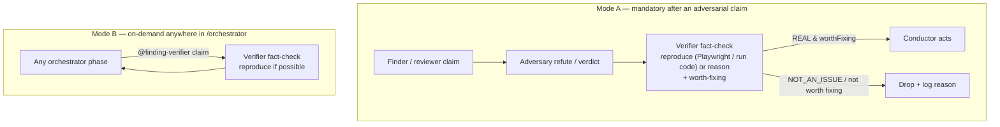

# Plan — reusable finding-verifier / fact-checker for the toolbelt (#25)

> Status: proposed. Tracks issue #25. Adds an independent, neutral **verifier** that the toolbelt
> invokes (a) **automatically after any adversarial claim** and (b) **on demand at any `/orchestrator`
> phase** as a fact-check — producing a verdict that includes *worth-fixing*, not just real-vs-false.

## Problem

The toolbelt's finders (`@bug-catcher-rick`, the constructed security sweep) pair with a single
adversary (`@bug-catcher-adversary`) whose stance is to **refute** (find reasons a finding is *not* a
bug). Two gaps follow:

1. **A single refute pass is not enough in volume.** In a `--global`/batch sweep, survivors still
   include false positives and — more dangerously — **"real but should NOT be fixed"** cases, where the
   proposed fix regresses other behavior.
2. **Adversarial claims are themselves taken at face value.** The adversary's refutation (and any cold
   reviewer's verdict) is an *assertion* — it can be wrong (dismissing a real bug, or confirming a
   non-issue). Nothing independently fact-checks the adversary.

Both were demonstrated during the PR #7 (Codex port) pre-merge validation. After the sweep's built-in
`find → adversary-refute → triage`, an **independent verification pass** over the survivors:

- dropped a `NOT_AN_ISSUE` the adversary had let through,
- reclassified two "real" findings as **real-but-DON'T-fix** — one fix would have *false-allowed*
  `GitHub Copilot` co-author commits (regressing the guard's attribution deny); the other guarded a
  rule that does not exist, and
- corrected ~13 finding severities/scopes.

Without that pass, at least one harmful "fix" would have shipped.

## Goal

A neutral, independent **verifier / fact-checker** the toolbelt can invoke in two modes:

- **Mode A — mandatory after any adversarial claim.** Whenever an adversary agent asserts a claim
  (a finding, a refutation, a verdict), the verifier fact-checks it **before the conductor acts**. An
  adversarial claim is never taken at face value.
- **Mode B — on-demand fact-check anywhere in `/orchestrator`.** The conductor (or the user) can invoke
  the verifier at **any phase** to settle a disputed point, validate an assumption before an outward
  action, or sanity-check a hand-off — not limited to sweep findings.

In both modes the verifier **reproduces the claim whenever it is reproducible** (run code/tests, or drive
the UI via the **Playwright MCP**) and the verdict includes **worth-fixing**, so the conductor only ever
acts on claims that are *demonstrated true* and *worth acting on*.

## Design

### 1. The verifier role (prefer generalizing the existing agent)

A stance-neutral verifier, distinct from finder (find) and adversary (refute):

- **reproduce the claim whenever it is reproducible** — actually run the failing code/test in a throwaway
  copy, drive the UI via the **Playwright MCP** for front-end claims, or use whatever tool the claim's
  domain needs; fall back to reasoned-from-source confirmation ONLY when a claim is latent / by-inspection
  (the verdict records which, via `reproduced`),
- assign a **final confirmed severity**, and — critically —
- judge **worth-fixing** (is acting on it net-positive, or does the fix regress something / guard a
  non-existent case?).

It is **independent**: it never reads the finder's dossier framing or the adversary's refutation — fresh
eyes, matching the toolbelt's existing reviewer philosophy. It is the **terminal arbiter**: it makes no
adversarial claim of its own, so there is no "who verifies the verifier" regress.

**Invocation:** `@finding-verifier <claim>` where `<claim>` is any assertion — a finding, an adversary
refutation, a verdict, or a free-form assumption to fact-check.

**Verdict schema** (proven during the PR #7 run):

```
{ status: REAL | NOT_AN_ISSUE | NUANCED, worthFixing: bool, confirmedSeverity,
  reproduced: bool, reproSteps, verified, fix }
```

**Implementation choice — prefer generalizing `@bug-catcher-adversary`** (rename/extend its remit to
cover the verify verdict + fact-check role) over adding a brand-new agent. A new agent changes the
component count (currently 16 agents + 11 skills = 27), which is CI-load-bearing across six files
(`README.md`, `docs/components.md`, `docs/architecture.md`, `docs/design-philosophy.md`,
`.claude-plugin/plugin.json`, `.claude-plugin/marketplace.json`) **plus** the Codex manifest
`plugins/maungs-agentic-toolbelt/.codex-plugin/plugin.json` skills list, and requires regenerating the
Codex artifacts (`python3 tools/build.py --target codex`). Generalizing the existing agent avoids that
ripple — and is natural, since the adversary is already the closest existing role.

**Reproduction & tool grants — reproduce, don't just reason.** When a claim is reproducible, the verifier
MUST reproduce it before ruling (it is the strongest evidence and the whole point of an independent
check): runtime/logic claims → run the failing code or test in a **throwaway copy** (never the real
tree); front-end/UI claims → drive the app with the **Playwright MCP** (navigate, interact, snapshot) and
observe the real behavior; anything else → whatever the claim's domain needs (HTTP client, DB query, CLI,
WebFetch). If a claim genuinely can't be reproduced (latent / inspection-only), it confirms from source
and records `reproduced: false` with the reason — it never *pretends* to have reproduced. **Tool grants**
(least-privilege, but enough to reproduce): Read, Grep, **Bash** (run code/tests in a throwaway copy), the
**Playwright MCP** browser tools, WebFetch/WebSearch, and the GitHub **read** tools — staying
**read-only on the real repo** (no Edit/Write, no commit/push, never posts to GitHub). This deliberately
widens the read-only-reviewer norm just enough to *execute/observe*, confined to throwaway copies.
*Codex note:* reproduction may need a `workspace-write`/temp-write sandbox to run in a throwaway dir, and
the Playwright grant is whole-server there (per the existing MCP-granularity divergence in `docs/codex.md`).

### 2. Mode A — mandatory after any adversarial claim

Wherever an adversary asserts a claim, the verifier runs before the conductor acts:

- **`/bug-catcher` (single-bug):** `@bug-catcher-rick` (find) → `@bug-catcher-adversary` (refute) →
  **verifier (fact-check the finding AND the adversary's refutation)** → conductor debate/act.
  *(This supersedes the earlier "no extra pass on the single-bug path" non-goal — the adversary's claim
  there is exactly what must be fact-checked.)*
- **`/bug-catcher --global` + the security sweep:** a **per-finding fan-out** `find → refute → verify →
  triage`. Triage consumes `worthFixing`: `NOT_AN_ISSUE` / `worthFixing=false` are dropped **with a
  logged reason** — never silently — so coverage stays honest.
- **Cold reviewers (`@plan-reviewer`, `@pr-reviewer`, `@security-reviewer`):** these assert adversarial
  verdicts too. Per-inline-comment verification is impractical at volume, so the mandatory gate applies
  to their **verdict-level / disputed claims** the conductor is about to act on (e.g. a DO-NOT-SHIP a
  developer disputes), with full claims fact-checkable on demand via Mode B.

### 3. Mode B — on-demand fact-check anywhere in `/orchestrator`

`/orchestrator` (and any conductor) can call `@finding-verifier <claim>` at any phase — e.g. to validate
a plan assumption before `@developer` builds, settle a finder/adversary disagreement, or confirm a fact
before an outward action. The preflight/Phase steps document the verifier as an always-available
fact-check, not a fixed pipeline node.



## Non-goals

- The verifier does **not** replace the finder (find) or adversary (refute) roles — it is the neutral
  arbiter that fact-checks their output.
- It makes **no adversarial claim of its own** (terminal arbiter — no verification regress).
- Mode A on cold reviewers is **verdict/disputed-claim level**, not per-inline-comment, to bound cost.

## Acceptance criteria

- **Mode A:** every adversarial claim in the bug/security finding pipelines is fact-checked by the
  verifier before the conductor acts (single-bug AND `--global`); dropped items are logged (status +
  reason).
- **Mode B:** `/orchestrator` exposes the verifier as an on-demand fact-check invocable at any phase,
  documented in the skill body.
- The **worth-fixing** call is exercised by a test fixture mirroring the "real but don't fix" case
  (e.g. an attribution-rule collision whose fix would regress a deny).
- **Reproducible claims are actually reproduced:** the verdict carries `reproduced: true` + `reproSteps`
  for reproducible claims (UI claims via the Playwright MCP; runtime claims via a throwaway-copy run), or
  `reproduced: false` + a stated reason when a claim genuinely can't be reproduced.
- The full verify gate stays green; component counts + Codex artifacts remain consistent if a new
  component is added (regenerate + drift-guard green).

## Risks

- **Latency / token cost** — Mode A adds a pass to every adversarial claim (incl. the single-bug path).
  Bounded by claim count; acceptable given it prevents acting on false / harmful claims. Tune by scoping
  cold-reviewer verification to verdict level.
- **Component-count ripple** if a NEW agent is added — mitigated by generalizing the existing
  `@bug-catcher-adversary`.

## References

- Issue #25.
- Origin: the PR #7 pre-merge validation run, where this pattern was executed by hand and proved its value.
