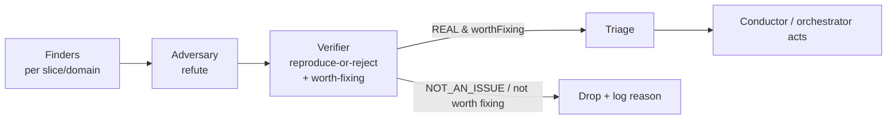

# Plan — reusable finding-verifier stage for adversarial sweeps (#25)

> Status: proposed. Tracks issue #25. This plan adds an independent verification stage between
> adversary-find and orchestrator-action in the toolbelt's batch/`--global` sweeps.

## Problem

The toolbelt's finders (`@bug-catcher-rick`, the constructed security sweep) pair with a single
adversary (`@bug-catcher-adversary`) whose stance is to **refute** (find reasons a finding is *not*
a bug). In a `--global`/batch sweep that single pass is not enough: surviving findings still include
false positives and — more dangerously — **"real but should NOT be fixed"** cases, where applying the
proposed fix regresses other behavior.

This was demonstrated during the PR #7 (Codex port) pre-merge validation. After the sweep's built-in
`find → adversary-refute → triage`, an **independent second verification pass** over the survivors:

- dropped a `NOT_AN_ISSUE` the adversary had let through,
- reclassified two "real" findings as **real-but-DON'T-fix** — one fix would have *false-allowed*
  `GitHub Copilot` co-author commits (regressing the guard's attribution deny); the other guarded a
  rule that does not exist, and
- corrected ~13 finding severities/scopes.

Without that pass, at least one harmful "fix" would have shipped.

## Goal

Add an **independent verify stage** between adversary-find and orchestrator-action in the batch
conductors, producing a verdict that includes **worth-fixing** — not just real-vs-false — so the
conductor (and ultimately `/orchestrator`) only ever acts on findings that are both real and worth fixing.

## Design

### 1. The verifier role (prefer generalizing the existing agent)

A stance-neutral verifier, distinct from the adversary:

- **reproduce / confirm reachability** against the real code (in a throwaway copy for behavioral claims),
- assign a **final confirmed severity**, and — critically —
- judge **worth-fixing** (is fixing it net-positive, or does the fix regress something / guard a
  non-existent case?).

It is **independent**: it never reads the finder's dossier framing or the adversary's refutation —
fresh eyes, matching the toolbelt's existing reviewer philosophy.

**Verdict schema** (proven during the PR #7 run):

```
{ status: REAL | NOT_AN_ISSUE | NUANCED, worthFixing: bool, confirmedSeverity, verified, fix }
```

**Implementation choice — prefer generalizing `@bug-catcher-adversary`** (rename/extend its remit to
cover the verify verdict above) over adding a brand-new agent. A new agent changes the component count
(currently 16 agents + 11 skills = 27), which is CI-load-bearing across six files
(`README.md`, `docs/components.md`, `docs/architecture.md`, `docs/design-philosophy.md`,
`.claude-plugin/plugin.json`, `.claude-plugin/marketplace.json`) **plus** the Codex manifest
`plugins/maungs-agentic-toolbelt/.codex-plugin/plugin.json` skills list, and requires regenerating the
Codex artifacts (`python3 tools/build.py --target codex`). Generalizing the existing agent avoids that
ripple entirely.

### 2. Orchestration — a verify stage in the batch conductors only

Insert `find → verify → triage` as a **per-finding fan-out** in `/bug-catcher --global` (and the
constructed security sweep if/when it becomes a skill). Triage consumes `worthFixing`: `NOT_AN_ISSUE`
and `worthFixing=false` findings are dropped **with a logged reason** (status + why) — never silently —
so coverage claims stay honest.



### 3. Where it does NOT go

The single-bug `/bug-catcher` path already has `@bug-catcher-rick → @bug-catcher-adversary →
conductor-adjudicated debate`; a third pass there adds latency/token cost for little gain. The ROI
concentrates in **volume** (sweeps), where false-positives and don't-fix cases hide.

## Non-goals

- No third verification layer on the single-bug `/bug-catcher` path.
- No change to the finder agents themselves.

## Acceptance criteria

- A batch sweep emits only **verified, worth-fixing** findings to the conductor, with dropped items
  logged (status + reason).
- The worth-fixing call is exercised by a test fixture mirroring the "real but don't fix" case
  (e.g. an attribution-rule collision whose fix would regress a deny).
- The full verify gate stays green; component counts + Codex artifacts remain consistent if a new
  component is added (regenerate + drift-guard green).

## Risks

- **Latency / token cost** in sweeps — acceptable, bounded by the finding count; the stage runs only on
  the batch path.
- **Component-count ripple** if a NEW agent is added — mitigated by generalizing the existing
  `@bug-catcher-adversary` instead.

## References

- Issue #25.
- Origin: the PR #7 pre-merge validation run, where this pattern was executed by hand and proved its value.
