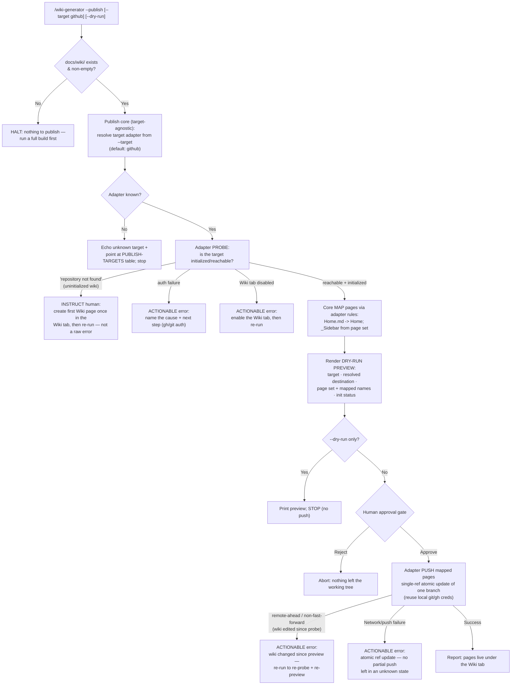

# 4 — Publish the generated wiki to an external wiki platform (agnostic seam; GitHub repository wiki as the first target)

**GitHub item:** https://github.com/Sfzmango/Maungs-agentic-toolbelt/issues/4

## Goal

Give the toolbelt's wiki side-flow the ability to **publish** the wiki it already generates (`docs/wiki/*.md`) to a hosted/external wiki platform, with the **GitHub repository wiki** (the `*.wiki.git` repo behind a repo's Wiki tab) as the first shipped target. Publishing is organized around a pluggable target/adapter seam so Confluence and Azure DevOps wiki can be added later as drop-in targets — "add an adapter + a table row," never a core rewrite — exactly mirroring the EMIT-TO-TARGETS seam `/agentic-onboard` already uses for its context files. Publishing never authors or restructures page **content**: it ships, unchanged, what `/wiki-generator` produced, behind an explicit human approval gate with an always-on dry-run preview.

## Architecture

The publish capability lands as a **third mode on the existing `/wiki-generator` skill** — `/wiki-generator --publish` — alongside the current full-build (no flag) and incremental (`--update`) modes. This placement is deliberate: it adds **no new component**, so the load-bearing component count stays **16 agents + 9 skills = 25** and none of the six CI-checked count strings change, no new router intent is required, and no `test_router.py` cases are added. (The decision and its alternatives — including the exact cost of a dedicated `/wiki-publish` skill — are recorded under "Architectural decisions" below so the reviewer can override with eyes open.) The publish core is a documented sub-section of `skills/wiki-generator/SKILL.md`; it does not touch `@wiki-writer` (which authors content) or `@wiki-auditor` (which detects drift) beyond a one-line note that publish consumes their output and writes none of theirs.

The seam has two layers, mirroring `/agentic-onboard` precisely. A **target-agnostic publish core** reads the already-generated `docs/wiki/` pages, resolves a platform-agnostic page map, renders a dry-run preview, holds the human gate, and dispatches to a target adapter — and it knows nothing about any specific platform. Each **target adapter** is a documented **prose contract** (a named section in `SKILL.md`) plus a row in a **shipped-vs-future PUBLISH-TARGETS table** — the same shape as agentic-onboard's `--target` renderer table. An adapter's contract specifies five things and nothing platform-leaks into the core: how it **probes** the target's initialized/reachable state, how it **maps** the page set to that platform's page model (home page, sidebar/navigation), how it **renders the preview** lines, how it **pushes**, and how it **reports** each failure class actionably. The GitHub-wiki adapter is the one shipped adapter; Confluence and Azure DevOps wiki are documented future rows whose contracts are sketched but explicitly out of scope to build.

The seam earns its name only if a platform with a **different shape** can slot in as a row rather than forcing a core rewrite. Confluence is the stress test: it is **REST-API**, not git; it has **no `Home.md → Home` and no `_Sidebar` convention** (a different home/nav model entirely); and it authenticates via an API token, not local `git`/`gh`. The PUBLISH-TARGETS table below shows the shipped GitHub adapter alongside the two future rows, one line per verb — proving the core stays untouched while only the adapter's five answers differ.

| Adapter | probe | map | preview | push | report |
| --- | --- | --- | --- | --- | --- |
| **GitHub wiki** *(shipped)* | clone/ls-remote the `*.wiki.git` remote; "repository not found" ⇒ uninitialized | `Home.md → Home`; `_Sidebar` generated from the page set | page set → mapped wiki page names + init status | **single-ref atomic update**: one push of one branch to the wiki's default ref, all-or-nothing | names auth / uninitialized / disabled-Wiki-tab / network / **remote-ahead** classes, each with a next step |
| **Confluence** *(future)* | REST `GET` the target **space** (and parent page) via API token; 401/404 ⇒ unreachable/space-missing | space + **parent-page hierarchy** (no `Home`/`_Sidebar` convention; Confluence uses a page tree, not a sidebar file) | page set → space key · parent · target page titles | REST `PUT`/`POST` per page under the parent (no git ref); idempotent upsert by title | names auth-token / missing-space / permission / network classes, each with a next step |
| **Azure DevOps wiki** *(future)* | REST `GET` the wiki (project + wiki id) via PAT; 404 ⇒ wiki not provisioned | project wiki **path hierarchy** (`/Parent/Child` pages; order via `.order`, no `_Sidebar`) | page set → project · wiki · target page paths | REST `PUT` per page path (no git ref) | names PAT / missing-wiki / permission / network classes, each with a next step |

Only the GitHub row's five cells are built now; the Confluence and Azure DevOps cells are the sketched contracts a follow-up issue fills in. The core's call sites (`probe → map → preview → gate → push → report`) are identical across all three rows — the table is the whole adapter surface, which is what makes "add a row, not a core rewrite" literally true even for the REST-API, non-git, no-`_Sidebar` platform.

All GitHub specifics live **only** in the GitHub adapter, never in the core: the separate `*.wiki.git` repo model, the create-the-first-page-once requirement, the `Home.md → Home` page mapping, the `_Sidebar.md` navigation convention, and credential reuse via the human's existing local `git` / `gh`. Because the GitHub adapter pushes over the human's existing local git remote / `gh` auth, the feature introduces **no new secret** and writes none to any committed file — future targets document the **names** of the env vars they would read (e.g. a Confluence API token), never values. Nothing the feature adds writes an absolute home path or a secret, so the leak-grep gate stays green.

The "no partial push left in an unknown state" guarantee has a concrete mechanism: the GitHub adapter's push is a **single-ref atomic update** — one push of one branch to the wiki repo's default ref, which git applies **all-or-nothing at the ref level**. Either every mapped page lands together or the ref is unchanged; there is no half-published intermediate. The adapter's `report` verb names **five** failure classes: auth, uninitialized wiki, disabled Wiki tab, network/push, and **remote-ahead / non-fast-forward** — the wiki was edited in the Wiki tab between probe and push, so the local push no longer fast-forwards. Rather than force or silently clobber, the adapter reports the remote-ahead case actionably ("the wiki changed since preview; re-run to re-probe and re-preview"), keeping the human's out-of-band edit intact.

The publish flow is strictly gated and never autonomous. The core always renders a **dry-run preview first** (target, resolved destination, the page set with their mapped target names, and the initialized-vs-uninitialized status), then holds an **explicit human approval gate**, and only on approval does the adapter push. There is no scheduled or unattended external push — any future automation rides the same gate. The uninitialized-wiki case is detected and explained rather than failing opaquely: the GitHub adapter probes the `*.wiki.git` remote first, and a "repository not found" signature is surfaced to the human as "create the first Wiki page once in the Wiki tab, then re-run" — not a raw git error. (This repo's own wiki is enabled but not yet initialized, so this path is reachable on day one.)



The GitHub adapter's `report` verb names **five** failure classes — auth, uninitialized wiki, disabled Wiki tab, network/push, and remote-ahead — each with an actionable next step. These are the rows the developer mirrors into the CIRCUIT-BREAKER table in `SKILL.md`:

| Failure class | Signature | Actionable message |
| --- | --- | --- |
| Auth | `gh`/`git` credential rejected | name the cause + next step (re-auth `gh`/`git`) |
| Uninitialized wiki | "repository not found" on the `*.wiki.git` remote | create the first Wiki page once in the Wiki tab, then re-run |
| Disabled Wiki tab | Wiki feature off for the repo | enable the Wiki tab in repo settings, then re-run |
| Network / push | transport/push error mid-operation | atomic single-ref update — no partial push left in an unknown state; retry |
| **Remote-ahead / non-fast-forward** | wiki was edited in the Wiki tab between probe and push | the wiki changed since preview; re-run to re-probe and re-preview (no force-push) |

## Files to edit

- `skills/wiki-generator/SKILL.md` — the substantive change. Add `--publish` (and `--target`, `--dry-run`) to the argument parsing; add the **PUBLISH MODE** section (publish core: page-set read, target resolution, mapping handoff, dry-run preview, human gate); add the **PUBLISH-TARGETS** shipped-vs-future table (GitHub shipped; Confluence + Azure DevOps wiki as sketched future rows); add the **GitHub-wiki adapter** prose contract (probe / map / preview / push / report, with the uninitialized-wiki detect-and-instruct path, git/`gh` credential reuse, the **single-ref atomic-update push**, and all **five** report failure classes including remote-ahead / non-fast-forward). Append a publish-specific **rule 9** to the existing eight numbered cardinal rules — "publish ships `docs/wiki/` UNCHANGED outward; it never authors, edits, or restructures page content" — framed as a **clarification that complements existing rule 1** (which already restricts writes to `docs/wiki/`), neither duplicating nor contradicting it. Add publish rows to the OUTWARD-ACTION GATES and CIRCUIT-BREAKER tables (the latter gains the fifth, remote-ahead, failure-class row); extend the example invocations. Update the frontmatter `description` to mention the publish mode (a description-only edit — does not change counts).
- `docs/wiki-generator.md` — add a new section documenting the publish seam: the target-agnostic core vs. per-target adapter split, the shipped GitHub target end to end, the future Confluence / Azure rows, the human gate, the dry-run preview, the uninitialized-wiki UX, and the credential posture. This is the design-doc home for criterion 10's "documented" requirement. Update the "See also" / intro framing so the publish side is discoverable.
- `docs/components.md` — refresh the `wiki-generator` one-liner in the "Wiki side-flow" table and its prose paragraph to mention the `--publish` mode + the agnostic target seam. **Description-only — the `25 components` / `16 agents` / `9 skills` counts do NOT change** under the chosen placement.
- `README.md` — if the wiki side-flow is described in the README's component listing, add a clause that `/wiki-generator --publish` ships the wiki to an external target (GitHub wiki shipped; Confluence/Azure future). **No count-string edit** under the chosen placement.

## Files to add

- `examples/sample-wiki/_publish-preview.md` *(optional, recommended)* — a captured example of the dry-run preview output (target, resolved destination, page-set → mapped-name table, init status) so a reader sees what the gate shows before approving. Pure documentation; no code. (If the reviewer prefers zero new files, fold this example into `docs/wiki-generator.md` as a fenced block instead.)

> No new `agents/*.md` and no new `skills/*/SKILL.md` under the chosen placement — that is what keeps the component count at 25 and the six count-string files untouched.

## UI/UX

None — this is a CLI/agent side-flow with no graphical surface. The only human-facing surface is the **terminal dry-run preview + approval gate**, specified textually below (it is a CLI interaction, not a screen, so no screen-flow diagram or wireframe applies — the Architecture `flowchart TD` already captures the control flow including the gate).

The preview the human sees before the gate (illustrative shape):

```text
PUBLISH PREVIEW — target: github
  Destination : <owner>/<repo>.wiki.git  (repo Wiki tab)
  Wiki state  : INITIALIZED            (or: UNINITIALIZED — see instruction)
  Pages (N)   :
    docs/wiki/Home.md                 ->  Home          (wiki index/home page)
    docs/wiki/architecture-overview.md ->  Architecture-Overview
    docs/wiki/module-billing.md       ->  Module-Billing
    (generated _Sidebar from the page set)  ->  _Sidebar
  Nothing has been pushed. Approve to publish, or re-run with --dry-run to preview only.
```

UX-flow note — happy path: `--publish` → preview renders → human approves → pages land under the Wiki tab → success report. Empty state: no `docs/wiki/` → halt with "run a full build first." Uninitialized state: probe returns "repository not found" → instruct to create the first page once, then re-run (never a raw git error). Error states: auth failure, disabled Wiki tab, network/push failure, and a remote-ahead / non-fast-forward push (the wiki was edited in the Wiki tab since preview — re-run to re-probe and re-preview) each print a named cause + next step, and because the push is a single-ref atomic update a failed push never leaves a partial publish in an unknown state.

## Migrations

None — no schema, no database, no data model. This is a prompt-markdown + docs change.

## Libraries

None — no new dependencies. The GitHub adapter reuses the human's existing local `git` and `gh` (already assumed by the toolbelt; see `install.sh` next-steps note). No package manager exists in this repo and none is introduced.

## Test plan

This repo's CI (`/.github/workflows/validate.yml`) is the quality gate; there is no application logic to unit-test for this feature. The verification surface:

- **`python3 tests/test_router.py`** — must still exit 0. Under the chosen placement **no router change is made**, so this is a regression guard, not a new-case addition. (If the reviewer overrides to a dedicated `/wiki-publish` skill, this file MUST gain a `publish` intent's labeled cases — see the decision's alternative below.)
- **`python3 tests/translator_eval/eval.py`** — unaffected; must still exit 0 (regression guard).
- **CI frontmatter check** — `skills/wiki-generator/SKILL.md` keeps its `---` frontmatter and `name:` field (edited in place, so it stays valid).
- **CI leak-grep** — manually confirm the diff introduces no absolute home path and no secret (the GitHub adapter documents credential **reuse**, and future-target env vars by **name only**). The plan's own text already avoids spelling the denylisted strings.
- **CI component-count check** — under the chosen placement the derived counts are unchanged (still 16 / 9 / 25), so every `chk` assertion in `validate.yml` continues to pass with the existing strings. The description-only edits to `SKILL.md`, `docs/components.md`, `README.md`, and `docs/wiki-generator.md` must NOT alter any count substring.
- **Manual end-to-end smoke (documented, not automated)** — against this repo's own (currently uninitialized) wiki: run `/wiki-generator --publish --dry-run` and confirm the preview reports UNINITIALIZED with the create-first-page instruction rather than a raw error; this exercises criterion 5's reachable-on-day-one path without performing an external write.
- **Criterion 3 (GitHub happy-path publish) — verified by contract review, NOT execution.** This repo's wiki is uninitialized, so the happy path (pages landing under the Wiki tab) is **not runnable here**; the only reachable GitHub path on day one is the uninitialized-detect path above. Criterion 3 is therefore verified by **review of the GitHub adapter's `push` spec against its contract** — single-ref atomic update, the documented page mapping, and the credential reuse — not by running it. A real end-to-end run would require **standing up an initialized wiki** (create the first Wiki page once in the Wiki tab), which is out of reach on this repo today; that live run is the acceptance check whoever first publishes against an initialized wiki performs, and it is called out here rather than left as a silent gap.

## Blast radius

- **Sensitive surface:** the only outward action is a `git push` to the repo's `*.wiki.git` over the human's own credentials, and it happens **only** after the always-on dry-run preview and an explicit approval gate. No autonomous or scheduled external push exists. The push is a **single-ref atomic update** (one branch → the wiki's default ref, all-or-nothing at the ref level), which is the mechanism behind the "never a partial publish in an unknown state" guarantee — git either advances the ref with every page or leaves it untouched. If the wiki was edited in the Wiki tab between probe and push, the push is **non-fast-forward** and is reported as an actionable error ("re-run to re-probe and re-preview") rather than force-pushed over the human's edit.
- **Existing-behavior risk:** low. Full-build and `--update` modes are untouched; `--publish` is an additive branch on argument parsing. `@wiki-writer` / `@wiki-auditor` are not modified.
- **CI risk:** the chosen placement keeps the six count strings stable, so the most common self-inflicted CI failure (a stale count) does not apply. The remaining CI risks are leak-grep (mitigated above) and the frontmatter check (mitigated by editing in place).
- **Rollback:** the change is documentation + prompt markdown; reverting the commit fully removes the capability with no migration, no state, and no external residue (a wiki already published stays published — that is the human's call to revert in the Wiki tab, exactly as with any manual wiki edit).

## Out of scope

- **Implementing the Confluence adapter** — the seam must *accommodate* it (documented future row + sketched contract); building it is a separate follow-up issue.
- **Implementing the Azure DevOps wiki adapter** — same: accommodated by the seam, built later.
- **Generating or restructuring wiki content** — publishing ships exactly what `/wiki-generator` already produced; it never authors, edits, or reorganizes page content (captured as the publish-specific cardinal **rule 9**, which complements existing rule 1's write restriction — not a feature).
- **Auto / scheduled publishing without a human gate** — any automation rides the same approval gate; an unattended external push is explicitly excluded.
- **A dedicated `/wiki-publish` skill** — considered and recorded as an alternative (below); not chosen, to avoid the component-count churn. The reviewer may override.

## Acceptance criteria

These restate issue #4's ten criteria as ship-gates for this plan:

1. **Publish is a distinct capability from generation** — `/wiki-generator --publish` ships the already-generated `docs/wiki/` and never generates or edits page content (enforced by publish-specific cardinal **rule 9**, complementing existing rule 1).
2. **The target is a pluggable, agnostic seam** — a target-agnostic publish core plus per-target adapter contracts, with a shipped-vs-future PUBLISH-TARGETS table; adding a platform is adding an adapter contract + a table row, not a core change. The table names GitHub (shipped), Confluence (future), Azure DevOps wiki (future).
3. **The GitHub-wiki adapter works end to end** — given an initialized wiki and valid local creds, a human-approved publish lands `docs/wiki/` pages under the repo's Wiki tab.
4. **Page mapping is explicit and platform-aware** — `Home.md → Home` (wiki index), and an `_Sidebar` is generated from the page set where the platform supports it; the mapping rules are documented per target.
5. **The uninitialized-wiki state is detected and explained** — a publish against an uninitialized `*.wiki.git` reports "create the first Wiki page once, then re-run," never a raw "repository not found."
6. **Credentials are handled securely; no secrets in the repo** — the GitHub adapter reuses local `git` / `gh` (no new secret, none committed); future targets document env-var **names** only. Nothing trips leak-grep.
7. **Publishing is human-gated** — no autonomous or scheduled external push; the push happens only behind an explicit approval gate.
8. **A dry-run / preview is available before any external write** — the preview (target, resolved destination, page set + mapped names, init status) is shown so the gate is informed; `--dry-run` previews without pushing.
9. **Failures are actionable, not silent** — all five failure classes (auth, uninitialized wiki, disabled Wiki tab, network/push, and remote-ahead / non-fast-forward) each name the cause + the next step; no swallowed error, and because the push is a single-ref atomic update no partial push is left in an unknown state.
10. **Documented, and the toolbelt's invariants hold** — `docs/wiki-generator.md` explains the seam, the shipped GitHub target, the future targets, the gate, and the credential posture; the component counts and the six CI-checked files stay correct (unchanged under the chosen placement); no AI-assistant attribution appears anywhere.

## Architectural decisions

The five load-bearing decisions, locked with rationale and the rejected alternatives. (`AskUserQuestion` is unavailable inside this subagent, so these are surfaced here for the orchestrator's cold `@plan-reviewer` pass and approval gate rather than asked interactively. The reviewer can override any of them.)

1. **Placement → `--publish` flag/mode on the existing `/wiki-generator` skill.**
   - *Why:* It adds **no new component**, so the count stays **16 agents + 9 skills = 25**, none of the six CI-checked count strings change, no new router intent is needed, and no `test_router.py` cases are added. It fits the toolbelt's "the product is prompt markdown" nature and keeps the publish/generate split enforced by a cardinal rule rather than a separate surface.
   - *Rejected — dedicated `/wiki-publish` skill:* cleaner separation and its own routing, **but** bumps skills 9→10 = **26 components**, which forces updating the count strings in **all six** CI-checked files (`README.md`, `docs/components.md`, `docs/architecture.md`, `docs/design-philosophy.md`, `.claude-plugin/plugin.json`, `.claude-plugin/marketplace.json`), updating the GitHub "About" via `gh repo edit`, adding a new router `publish` intent in `hooks/toolbelt-router.sh`, and adding labeled `test_router.py` cases. If the reviewer chooses this path, **all of that becomes mandatory developer work to keep CI green** — see the explicit checklist in "Follow-up if placement is overridden" below.
   - *Rejected — adapter set as separate first-class artifacts:* same zero count-change as the flag, but heavier than the toolbelt's norm; folded into the chosen option as the prose-contract adapter table instead.

2. **Adapter seam → prose-contract adapters + a shipped-vs-future PUBLISH-TARGETS table**, mirroring `/agentic-onboard`'s EMIT-TO-TARGETS renderer table.
   - *Why:* Consistent with "the product is prompt markdown"; introduces no new executable code surface or directory; makes "add an adapter + a row" literal and reviewable. Each adapter contract specifies probe / map / preview / push / report.
   - *Rejected — shell-script adapters:* a real runtime boundary, but adds a code surface this side-flow doesn't have and makes credential handling more leak-grep-sensitive — heavier than the toolbelt's norm. *Rejected — formal interface + ref impl:* reasonable middle path, but the prose-contract + table already gives the formal contract without extra ceremony.

3. **Credentials → reuse local `git` / `gh`; future targets document env-var names only.**
   - *Why:* Exactly what criterion 6 asks — no new secret, nothing committed, nothing that trips leak-grep. The GitHub adapter pushes over the human's existing remote/auth like any git push.
   - *Rejected — a documented creds-config file:* introduces a new secret-bearing (gitignored) surface and a gitignore dependency; more leak-grep risk and a heavier footprint than reuse.

4. **Uninitialized `*.wiki.git` → probe → detect → instruct.**
   - *Why:* Criteria 5/8/9. The adapter probes first; a "repository not found" signature becomes a human instruction ("create the first page once, then re-run"), surfaced in the preview's init status too.
   - *Rejected — attempt auto-init:* infeasible (the first wiki page must be created via the web UI; there's no API for it) and it would mask the state instead of explaining it.

5. **Mapping + gate → map → mandatory dry-run preview → human gate → push.**
   - *Why:* Criteria 4/7/8. `docs/wiki/*.md` map per documented per-target rules (`Home.md → Home`; `_Sidebar` from the page set where supported); the preview is always rendered before the gate so the approval is informed; the push happens only on approval; no autonomous/scheduled push exists.
   - *Rejected — preview only on explicit `--dry-run`, else push after a one-line confirm:* the gate wouldn't always be the *informed* gate criterion 8 wants.

## Follow-up at merge time

- [ ] Update `docs/wiki-generator.md` — confirm the new publish-seam section is present and the "See also" links are consistent (this is part of the change itself, listed here as a merge-time sanity check).
- [ ] Confirm the component counts are unchanged (still `16 agents + 9 skills = 25`) and the six CI-checked count strings were not perturbed by the description-only edits.
- [ ] No `CLAUDE.md` convention change is required by the chosen placement. (If a new wiki-publish location/default is later introduced, document it under CONTRIBUTING's "What you might configure" table as the wiki-location row's sibling.)
- [ ] Open the two follow-up issues this unblocks: **Confluence adapter** and **Azure DevOps wiki adapter** (each "add an adapter contract + a PUBLISH-TARGETS row" over this seam).

### Follow-up if placement is overridden to a dedicated `/wiki-publish` skill

Only relevant if the reviewer overrides decision 1. To keep CI green, the developer MUST then also:

- [ ] Update the count strings in **all six** CI-checked files to `16 agents + 10 skills = 26 components` (per `validate.yml`): `README.md` (`16 agents + 10 skills`, `all 26 components`), `docs/components.md` (`**26 components**`), `docs/architecture.md` (`16 agents + 10 skills = 26 components`), `docs/design-philosophy.md` (`16 agents + 10 skills (26 components)`), `.claude-plugin/plugin.json` (`16 subagents + 10 skills`), `.claude-plugin/marketplace.json` (`16 agents + 10 skills`).
- [ ] Add the new skill to the listings in `README.md` and `docs/components.md`.
- [ ] Update the GitHub "About" out of band: `gh repo edit Sfzmango/Maungs-agentic-toolbelt --description "…16 agents + 10 skills…"` (CI only warns on this, but it is a documented release step).
- [ ] Add a `publish` router intent in `hooks/toolbelt-router.sh` and labeled cases in `tests/test_router.py`, then confirm `python3 tests/test_router.py` exits 0.
