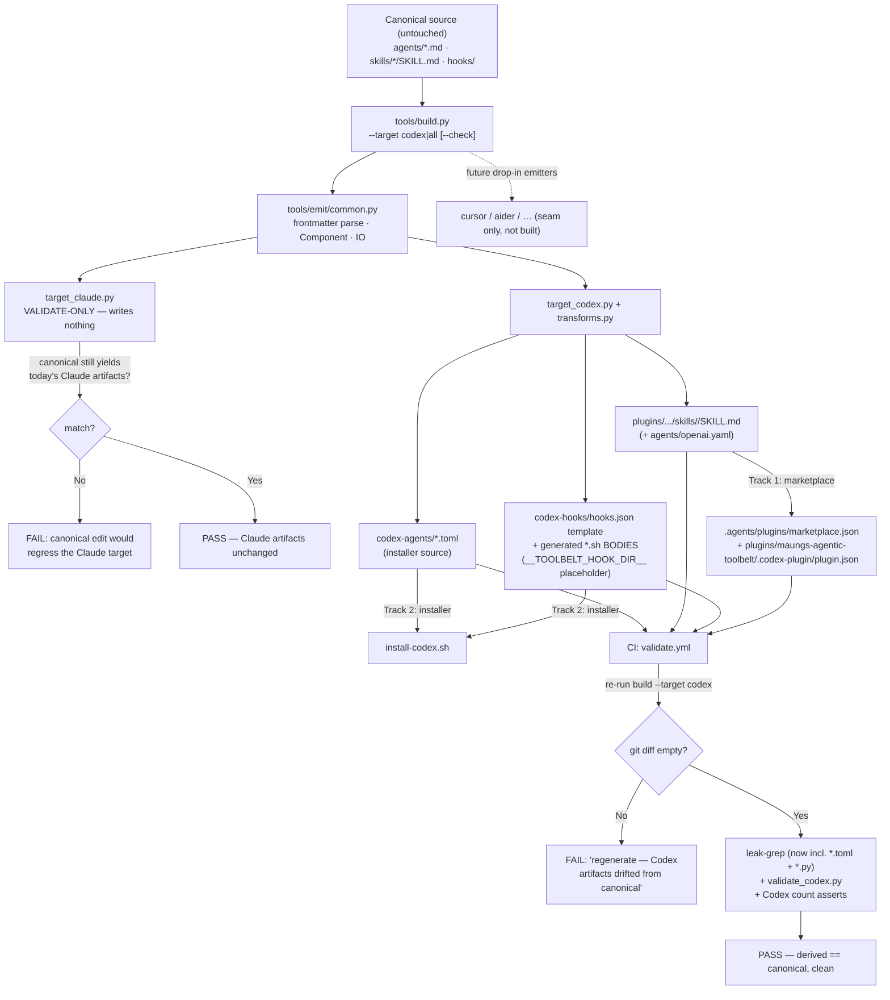

# 6 — Make the toolbelt model-agnostic: stand up the OpenAI Codex CLI as the first new target

**GitHub item:** https://github.com/Sfzmango/Maungs-agentic-toolbelt/issues/6

## Goal

Make the toolbelt **model-agnostic** so the same 16 agents and 9 skills work beyond Claude Code, with the **OpenAI Codex CLI** as the first new target. Components stay defined **once** — the existing `agents/*.md` + `skills/*/SKILL.md` are the single canonical source. A new **generator** (`tools/build.py`) reads that canonical source and emits per-target artifacts: the Codex emitter renders the components into Codex's native forms (TOML subagents, transformed `SKILL.md` skills, a `hooks.json` template), while the Claude emitter is **validate-only** — it confirms the canonical source still produces today's Claude artifacts and never rewrites them. A **CI drift guard** re-runs the generator and fails the build on any diff between freshly-generated and committed Codex artifacts, so the derived files can never silently diverge from canonical. Because Codex's plugin manifest forbids shipping `agents` + `hooks`, distribution is **two-track**: skills ship via the Codex marketplace/plugin manifest; agents + hooks ship via an installer (`install-codex.sh`). The seam is structured as a target-agnostic core plus per-target emitters so cursor / aider / others slot in later as "add an emitter + a table row," not a rearchitecture — explicitly accommodated here, not built. This generalizes the same one-canonical-artifact → per-target-renderers seam `/agentic-onboard` already uses for context files, lifted from context files to whole-component distribution.

## Architecture

The canonical source is untouched and stays exactly where it is: `agents/*.md`, `skills/*/SKILL.md`, `hooks/`. The new generator lives under `tools/` as **pure Python 3 stdlib** (matching the repo's no-package-manager, no-build-system constraint — the only existing Python is the stdlib test suite). `tools/build.py` is the entrypoint: `python3 tools/build.py [--target codex|all] [--check]`. The default mode emits artifacts to disk; `--check` regenerates into memory and exits **non-zero on any diff** — that is the exact mode CI runs. A shared `tools/emit/common.py` carries the frontmatter parser (the same `---`-block logic CI's frontmatter check relies on, so the generator reads frontmatter identically to the gate), a `Component` dataclass, and file IO. `tools/emit/target_claude.py` is **validate-only and writes nothing** — the generator can never rewrite Claude source, which is what makes "no Claude regression" a structural guarantee rather than a discipline. `tools/emit/target_codex.py` does the real emission, calling small table-driven body-adaptation rules in `tools/transforms.py`. `tools/validate_codex.py` is a stdlib validator that mirrors Codex's `plugin.json` rules (allowed-keys, strict-semver, required fields, referenced paths exist) so CI can assert the generated manifest/marketplace are well-formed.

**Agent `.md` → TOML.** Each agent renders to `codex-agents/<name>.toml` with `name`/`description` carried verbatim (description also run through the body transforms), and `developer_instructions` set to the agent body as a TOML **literal multiline string** (`'''…'''`) — literal so no escape processing mangles the prompt; the build **fails loudly** if a body itself contains `'''`. **The `tools:` parser (in `common.py`) MUST handle BOTH frontmatter serializations.** 15 of 16 agents declare tools as a YAML **block list** (`tools:` on its own line, then `  - Read`, `  - Grep`, … one per indented line); `agents/code-translator.md` ALONE declares them **inline, comma-separated** on a single line (`tools: Read, Grep, Bash, …, mcp__context7__resolve-library-id, mcp__context7__get-library-docs`). Both `sandbox_mode` (the `Edit`/`Write` detection) and `mcp_servers` (the distinct-`mcp__<server>__` enumeration) parse this same tools list, so the parser must normalize **both** forms to one list of tool tokens — and crucially the marquee parity case (`code-translator` → `mcp_servers = ["context7"]`) is exactly the inline form, so a block-list-only parser would silently yield an empty tools list for `code-translator` and drop Context7 (violating AC-2). `sandbox_mode` is derived from least-privilege: `read-only` when the agent's `tools:` block has no `Edit`/`Write` (the 11 read-only agents — every reviewer among them: bug-catcher-adversary, bug-catcher-rick, code-translator, context-auditor, plan-reviewer, pr-reviewer, product-owner, resolution, security-mentor, security-reviewer, wiki-auditor — read-only on the tree, write to GitHub only via MCP), and `workspace-write` for the 5 that declare `Edit`/`Write` (architect, context-writer, developer, test-author, wiki-writer). `mcp_servers` is derived by **enumerating every distinct `mcp__<server>__` prefix** that appears in the agent's `tools:` block and emitting `mcp_servers = [<each distinct server>]` (sorted, so `github`, `playwright`, `context7`, and any future server are all carried) — it is **omitted only when the agent has zero `mcp__*` tools**. This is the rule, not a hardcoded `github`/`playwright` pair: `@code-translator` declares `mcp__context7__resolve-library-id` + `mcp__context7__get-library-docs` (no github, no playwright), so its emitted TOML must carry `mcp_servers = ["context7"]` — a hardcoded github+playwright derivation would silently drop that real dependency and violate AC-2 ("no component silently dropped"). The transform test (see Test plan) asserts `code-translator`'s TOML carries `context7`. The **dependency** side (the `mcp_servers` enumeration) is thus safe; the **prose** side is handled by the matching server-name-agnostic prose-rewrite rule (see "Body adaptation"), which rewrites the `mcp__context7__*` reference in `code-translator`'s body (`agents/code-translator.md:22`) — so neither the dependency nor the prose carries a stale Claude-flavored token into the Codex body. `model` / `model_reasoning_effort` are **omitted** (model-agnostic by design); the emitter leaves a documented empty override table as a hook for a user who wants to pin them.

**Skill `SKILL.md` → transformed `SKILL.md`.** Skills use Codex's same `SKILL.md` format, so each is re-emitted under `plugins/maungs-agentic-toolbelt/skills/<name>/SKILL.md` with body transforms applied (and an optional `agents/openai.yaml` UI-metadata file — zero drift risk, ships for polish). These generated skills are the marketplace payload (track 1).

**Hooks → Codex (wrapper AND bodies).** The four registered hooks map onto Codex's event model emitted as a `codex-hooks/hooks.json` template: `sessionstart-loader` → `SessionStart`, `toolbelt-router` → `UserPromptSubmit`, `pretooluse-guard` → `PreToolUse`, `usage-tracker` → `PreToolUse`. All stay fail-open / best-effort. The committed template carries a `__TOOLBELT_HOOK_DIR__` **placeholder** rather than any absolute path — the installer substitutes the real directory at install time. This keeps the committed template free of any absolute home path. The leak-grep gate (`grep -rniE '…/Users/[a-z]…'`) is a real backstop here: because CI runs it with `-i`, the `[a-z]` bracket class case-folds and the pattern catches a capitalized home-directory path as readily as a lowercase one — but the build-time "never emit an absolute path" invariant (placeholder substituted only at install time + the determinism no-host-path assertion) means a generated artifact never reaches the grep with a home path to catch in the first place. The invariant is defense-in-depth ahead of an already-case-insensitive grep, not a patch for a grep gap. **Leak coverage is complete across all four generated/added file types:** `*.md` (the generated `SKILL.md` bodies), `*.sh` (the generated `codex-hooks/*.sh` bodies — already covered by the existing `*.sh` glob, relying on the `__TOOLBELT_HOOK_DIR__` placeholder and never an absolute path), plus the **new** `*.toml` (generated agents) and `*.py` (the generator files). The generated hook bodies need no glob change — they are caught by today's `*.sh` include; only `*.toml` + `*.py` are newly added. Note the `*.py` include is **repo-wide, not `tools/`-scoped**: adding `--include='*.py'` scans EVERY `*.py` in the tree — not just the 6 new `tools/*.py` — including the 30+ `tests/translator_eval/**/reference/solution.py` fixtures. Every existing `*.py` was verified clean at plan time, and this repo-wide scope is **accepted by design**, consistent with how `*.md` / `*.json` / `*.sh` already scan repo-wide rather than path-scoped.

But the wrapper is only half the hook. The `.sh` **bodies** carry Claude-only assumptions that silently no-op on Codex — the exact "guard stops gating" failure AC-8 forbids — so the four hook bodies are **genuinely generated**, not copied: they are routed through `tools/transforms.py` (a table of env-var-name + output-schema rules, the same shape as the agent-body transforms) into `codex-hooks/<name>.sh`, and the **adapted bodies are brought under the CI drift guard** exactly like the TOML agents (regenerate in CI → fail on diff). The generated `hooks.json` `command` entries point at these generated `codex-hooks/*.sh`, not the canonical `hooks/*.sh`. The Claude-specific tokens and their Codex disposition, enumerated per hook:

- **`hooks/usage-tracker.sh` — `CLAUDE_PLUGIN_ROOT` (+ the two-root resolution problem).** The "is this component ours" fallback checks BOTH `[ -f "${CLAUDE_PLUGIN_ROOT}/agents/${slug}.md" ]` and `[ -d "${CLAUDE_PLUGIN_ROOT}/skills/${slug}" ]`, keying off a Claude-only env var that is unset on Codex, so the fallback silently never fires. Disposition for the **agent join**: the transform rewrites the env-var name to a Codex-resolved hook-root (`__TOOLBELT_HOOK_DIR__`-derived install root, the same directory the installer substitutes) and adjusts the membership check to the installed layout (`agents/${slug}.toml` for the Codex tree). The **skill join is harder**: on Codex, agents + hooks install under the installer-owned root (`~/.codex/agents`, `~/.codex/hooks`) while **skills install via the marketplace plugin directory**, which is a *separate* root the installer does not own — so a single `__TOOLBELT_HOOK_DIR__`-derived path cannot resolve both. Disposition (explicit, since telemetry is opt-in / fail-open): the Codex `usage-tracker.sh` body **degrades the skill-side join to agent-only** — it resolves the agent membership against the hook-root and does NOT attempt a filesystem skill-membership check on Codex. The skill case still counts via the explicit `maungs-agentic-toolbelt:` namespace prefix when present (that branch is platform-independent and unchanged); only the *bare-slug filesystem fallback for skills* is dropped on Codex. This is acceptable because (a) telemetry is opt-in and best-effort, so a missed bare-slug skill event is non-fatal, and (b) the marketplace-installed skill path is not reliably discoverable from the installer-owned hook root, so a wrong join would be worse than a skipped one. The plan does NOT claim the skill join "works" on Codex — it is documented as agent-only fallback by design. (A future enhancement could pass the marketplace plugin dir to the hook via a second substituted placeholder; out of scope here.)
- **`hooks/pretooluse-guard.sh` — `{hookSpecificOutput:{permissionDecision:"deny"|"ask",permissionDecisionReason}}` (+ the Claude-specific attribution denylist).** This is Claude's PreToolUse schema; Codex's deny-vs-ask schema parity is **unverified**. If Codex doesn't recognize the envelope the guard's `deny`/`ask` becomes a silent no-op — the guard stops gating. Disposition: the transform emits the guard's decision in Codex's PreToolUse form (both the canonical `hookSpecificOutput` envelope and a flat `{decision,reason}` shape) so a recognized-but-different Codex schema still surfaces a decision; **with jq present an unrecognized schema degrades to "ask"** (locked decision 12). **Accuracy note:** the guard's rules run only when jq is present — on a jq-less host the canonical top-of-file `command -v jq … || exit 0` ALLOWS, exactly as the canonical Claude guard does, so the guard does NOT "fail open to ask" without jq; it allows. Install jq for full guard coverage (the installer warns when jq is absent). Both the deny tier and the ask tier are preserved. Separately, the guard's **rule 5** (`hooks/pretooluse-guard.sh:68`) denies an AI-attribution commit message by matching ONLY `Co-Authored-By:[[:space:]]*Claude` / `Generated with[[:space:]].*Claude` / `🤖` — a **Claude-specific** denylist. On Codex the offending attribution string is not "Claude," so the no-attribution cardinal rule (AC-11) would **under-enforce**. Disposition: the transform **broadens the attribution pattern in the generated Codex guard body to be model-agnostic** — it denies any AI/assistant co-author trailer or "generated with" line (e.g. `Co-Authored-By:` naming any AI/assistant/model, `Generated with <any AI tool>`, the 🤖 marker), not just Claude's literal string — so the guard catches a non-Claude attribution on Codex. A transforms test (see Test plan) asserts the generated Codex guard body denies a **non-Claude** attribution example (e.g. a `Co-Authored-By:` trailer naming a different assistant), proving the broadened pattern fires.
- **`hooks/toolbelt-router.sh` — `{hookSpecificOutput:{hookEventName:"UserPromptSubmit",additionalContext}}`.** Claude's UserPromptSubmit injection envelope; whether Codex consumes `additionalContext` is the **top unverified risk** (locked decision 11). Disposition: the transform emits **both** the JSON `additionalContext` shape and the plain-stdout fallback the body already has (`printf '%s\n' "$3"`), so the suggestion still surfaces whichever channel Codex reads.
- **`hooks/lib-telemetry.sh` — the `~/.claude`-rooted default usage-log path (a real rewrite site).** `lib-telemetry.sh:38` defaults the usage log to `${HOME}/.claude/maungs-toolbelt/usage.jsonl` (the `tb_log_path` fallback when `MAUNGS_TOOLBELT_LOG` is unset). On a Codex-only machine the generated `usage-tracker.sh` / `toolbelt-router.sh` source this helper, so without a rewrite the toolbelt would mis-home **written** telemetry under `~/.claude` — a directory that may not exist on a Codex install. Disposition: the transform **rewrites the default log root in the GENERATED `lib-telemetry.sh` (the WRITER) to a Codex-appropriate path** (`${HOME}/.codex/maungs-toolbelt/usage.jsonl`), while **preserving the `MAUNGS_TOOLBELT_LOG` override** verbatim (the override branch is platform-independent and must keep winning). A transforms test (see Test plan) asserts the generated `lib-telemetry.sh` default path resolves under `~/.codex`, not `~/.claude`. This corrects the earlier "no Codex-specific token to rewrite" framing: `lib-telemetry.sh` IS a rewrite site. **The READER side is a separate, un-closed matter:** this rewrites only the writer, so on Codex the readers (`bin/toolbelt-metrics.sh:15`, `statusline/toolbelt-statusline.sh:95`) still default to `~/.claude` and reading the Codex log requires `MAUNGS_TOOLBELT_LOG` until the reader-port follow-up lands — see the WRITER/READER scope note in decision 15 and the `docs/codex.md` divergence note. The plan does not claim `/toolbelt metrics` reads the Codex log out of the box.
- **`hooks/sessionstart-loader.sh` — the `CLAUDE.md` / `CLAUDE.local.md` nudge (layer-1 disposition, made explicit).** `sessionstart-loader.sh:30-31` checks for `CLAUDE.md` / `CLAUDE.local.md` and, when neither is present, prints the user-facing "No CLAUDE.md found — run @agentic-onboard …" nudge. The load-bearing path carries **no Claude-only env var or output schema** (it reads git + optional `gh` and prints stdout), so no env-var/output-schema rewrite applies. The nudge carries two distinct tokens dispositioned separately: (1) the `CLAUDE.md` / `CLAUDE.local.md` **filename** check, and (2) the `/agentic-onboard` **skill invocation**. **Layer-1 canonical FILENAME neutralization is deliberately scoped to agent/skill BODIES, not hook scripts** (decision 16): the hook's `CLAUDE.md` filename check is therefore **left as-is by design** — it is an informational filename the user looks for, harmless and fail-open on Codex even though `AGENTS.md` is the active context file there. The **skill invocation**, by contrast, **IS rewritten** `/agentic-onboard` → `@agentic-onboard` (the same left-boundary `/skill`→`@skill` rule the router-suggestion exception applies), because a bare `/skill` slash form is non-functional on Codex (no slash layer) and would violate AC-3. So the filename stays verbatim while the invocation is made `@`-form. This removes the earlier contradiction (the plan no longer claims sessionstart has "no token" while layer-1 references `CLAUDE.md`): both tokens exist, the filename is consciously left unrewritten (layer-1 does not reach hook scripts), and the invocation is rewritten for AC-3 fidelity.

**Body adaptation (`tools/transforms.py`).** Two layers. (1) A **canonical-safe neutralization** applied once and safe on Claude too, **scoped to agent/skill BODIES (not hook scripts)**: `CLAUDE.md` → `AGENTS.md / CLAUDE.md` (the repo already ships both), and "restart Claude Code" → "restart your agent". This layer-1 scope is deliberate (decision 16): hook `.sh` bodies adapt only through the layer-2 env-var/output-schema rules, so `sessionstart-loader.sh`'s `CLAUDE.md`-filename nudge is left unrewritten on purpose (see the per-hook disposition under "Hooks → Codex"). (2) **Codex-only transforms** (~9 table-driven rules) applied only on the Codex path: `claude mcp add`/`claude mcp list` → `codex mcp add`/`codex mcp list`; **every** `mcp__<server>__*` tool reference in prose → "the `<server>` MCP server" — this is a **server-name-AGNOSTIC** rule (the same "don't hardcode the server pair" generalization the `mcp_servers` enumeration already applies), so `mcp__github__*` → "the github MCP server", `mcp__playwright__*` → "the playwright MCP server", `mcp__context7__*` → "the context7 MCP server", and any future `mcp__<server>__*` are all rewritten by the one rule rather than an enumerated github/playwright pair. This matters because `agents/code-translator.md:22` references `mcp__context7__*` IN PROSE ("Discover the Context7 MCP tools (via ToolSearch for `mcp__context7__*` …)"), so a github/playwright-only rule would leak that stale `mcp__context7__*` prose token unrewritten into the Codex `code-translator` body (the *dependency* is already safe via the frontmatter-derived `mcp_servers = ["context7"]`; this is prose-only, but it is still Claude-flavored prose that must not survive). **`ToolSearch` disposition (same `code-translator.md:22` prose):** `ToolSearch` is a Claude-side tool-discovery mechanic with no Codex equivalent, so the same rule neutralizes that mechanic token to generic phrasing — the "via ToolSearch for `mcp__context7__*`" parenthetical becomes a plain "discover the MCP tools" instruction, dropping the Claude-only `ToolSearch` reference rather than carrying it through. `AskUserQuestion` → "ask the user in chat (and wait)" — which **preserves the commit/push gate semantics** (on every outward-action gate the rewrite carries the imperative "wait for an explicit 'yes' before proceeding" wording **verbatim**, never a softened "proceed"; see the gate-preservation requirement below); `/skill` → `@skill` for the 9 skill names via a **LEFT-BOUNDARY rule** — a `/name` token is rewritten **only when preceded by whitespace or line-start** (and `name` ∈ the 9-skill set), **never when preceded by a path component**. Name-set anchoring alone is insufficient: it would also rewrite `skills/orchestrator/SKILL.md` → `skills@orchestrator/SKILL.md` and `developer/orchestrator` → `developer@orchestrator`, mangling file paths and slashed prose (there are, e.g., 41 `/orchestrator`, 73 `/chore`, 125 `/wiki-generator` occurrences across the tree, most of them path or slashed-pair tokens, not bare skill invocations). The left-boundary requirement (whitespace-or-line-start to the left) rewrites a bare ` /orchestrator ` invocation while leaving `skills/orchestrator/SKILL.md`, `developer/orchestrator`, and `@playwright/mcp@latest` untouched; a transforms test (see Test plan) asserts exactly that split. **Skill-invocation-WITH-ARGUMENTS disposition (pinned):** skills are invoked in prose with trailing args / sub-commands (`/orchestrator <topic>`, `/toolbelt metrics`, `/toolbelt status`, `/agentic-onboard --deep --target all`, `/wiki-generator --publish`). On Codex an `@mention`-triggered skill carries those trailing arguments exactly the way the slash form did — `@orchestrator <topic>` ≡ `/orchestrator <topic>`, `@toolbelt metrics` ≡ `/toolbelt metrics` — and `$ARGUMENTS` is preserved verbatim by the skill runtime. The left-boundary rule therefore rewrites only the leading skill TOKEN (`/orchestrator` → `@orchestrator`) and **leaves everything to its right (the args, sub-commands, and flags) intact**, so the invocation's behavior is unchanged; a transforms test (see Test plan) asserts a bare skill token FOLLOWED BY arguments rewrites the token only and keeps the args. This matters because AC-1's "trigger a skill" live check exercises exactly this with-arguments form. Strip `disable-model-invocation` (Codex has no equivalent and all 9 skills set it `false` anyway); keep `$ARGUMENTS` as-is. Existing `@agent` mentions are already Codex-correct and pass through untouched. The same `transforms.py` table also carries the hook-body env-var + output-schema rules described under "Hooks → Codex" above, so agent bodies, skill bodies, and hook bodies all adapt through one rule table.

**One un-rewritten skill-body token, dispositioned (not a gap).** `skills/toolbelt/SKILL.md:131` resolves the metrics summarizer via `"${CLAUDE_PLUGIN_ROOT}"/bin/toolbelt-metrics.sh` — a Claude-only env var that is unset on Codex, the same silent-no-op class the plan flags for `usage-tracker.sh`. Disposition: this `CLAUDE_PLUGIN_ROOT` reference is **deliberately left as-is** in the Codex skill emission and degrades to the **documented manual fallback at `skills/toolbelt/SKILL.md:135`** — the skill body already instructs, when the script "isn't found," to fall back to the literal log path plus `export MAUNGS_TOOLBELT_DEBUG=on` rather than fabricating numbers. This is the same disposition class as the sessionstart `CLAUDE.md` nudge (decision 16): a fail-open user-facing hint with a built-in fallback, consciously left rather than rewritten. It is recorded here so the token audit stays exhaustive — `CLAUDE_PLUGIN_ROOT` in the `/toolbelt` skill body is accounted for, not missed.

**Gate preservation (testable, AC-8).** The `AskUserQuestion` rewrite distinguishes a **gate** (a commit / push / PR / merge / external-post / file-write pause that MUST block) from a **front-loaded design question** (architectural choices or scope questions surfaced up front). For every outward-action gate the transform preserves a blocking "ask the user and wait for an explicit choice/confirmation before proceeding" instruction; design-question occurrences become ordinary "ask the user in chat" prose. `AskUserQuestion` gates outward actions in **more than just the agents' commit/push imperative** — it also appears as an **enumerated-choice form** (a list of options the user must pick from, not the "wait for an explicit 'yes'" wording) in the skills, and AC-8 says *every* gated outward action survives. The audit of `AskUserQuestion` sites, each classified gate-vs-design so the transform preserves blocking semantics on the gates while neutralizing the literal tool name everywhere:

- **`agents/developer.md` / `agents/architect.md` — commit / push / PR gates → GATE.** The "wait for an explicit 'yes' before proceeding" imperative is carried verbatim.
- **`agents/architect.md` — plan-approval gate (`architect.md:190`, "Show the plan summary… Call `AskUserQuestion`") → GATE (a DISTINCT outward-action site BEFORE the plan commit).** This is not the same site as the commit gate (`architect.md:201`); it is the up-front "approve plan — proceed to implementation / request changes / abort" pause. `architect.md` has 11 `AskUserQuestion` sites vs developer's 5, and the plan-approval ask is one of them. The downstream commit gate at line 201 still blocks, so AC-8 coverage is not holed even if this site were missed — but a transform that flattened the approval ask into ordinary design-question prose would weaken a real gate, so it is enumerated as a GATE in its own right. The rewrite preserves a blocking "ask the user and wait for an explicit approve/request-changes/abort choice before proceeding to implementation."
- **`skills/orchestrator/SKILL.md` — Step 11 human-review gate (~line 138) + Step 11b ready-to-merge sub-gate (~line 146) → GATE (these gate the MERGE).** Enumerated-choice forms ("Ship as-is" / "Yes — ready to merge" / "Abort"). The rewrite preserves a blocking "ask the user and wait for an explicit choice/confirmation before proceeding to merge" — the merge does not proceed without an explicit pick.
- **`skills/handoff/SKILL.md` — Step 5 outline-approval gate (~line 130) → GATE (gates the `Write` of the handoff file).** Enumerated-choice form ("Approve outline — write the full file" / "Request changes" / "Abort"); the body already states "Do NOT call `Write` until the user has explicitly approved." The rewrite preserves the blocking-until-explicit-approval semantics.
- **`skills/migration-planner/SKILL.md` — HANDOFF GATE (~line 113) → GATE (gates handing the work off to implement).** Enumerated-choice form ("Hand off to `@developer`" / "Hand off to `/chore`" / "Stop here"); the body already states "Never interpret silence as approval... Require an explicit pick." The rewrite preserves the require-an-explicit-pick semantics.
- **`agents/product-owner.md` — scope-clarification (~line 47) → DESIGN (not a gate).** A front-loaded "surface scope questions if the ask is vague" prompt; no outward action is gated, so it becomes ordinary "ask the user in chat" prose.

A transform unit test (see Test plan) asserts that each rewritten body **still contains an explicit wait-for-confirmation / blocking-choice instruction at each gate point** — for `developer.md` / `architect.md` at each commit / push / PR point, for `architect.md` at the **plan-approval gate (`architect.md:190`) as a distinct assertion** (so a transform that flattens the approval ask into design-question prose is caught), and for `skills/orchestrator/SKILL.md` at the merge gate (Step 11 / 11b) — not merely that the literal string `AskUserQuestion` is gone.

**Determinism (testable, no spurious CI diffs).** The generator is required to be byte-deterministic so the drift guard never flags a non-change: (1) **all file enumeration goes through `sorted(...)`** — no reliance on filesystem `readdir` order; (2) emitted TOML and JSON use a **fixed key order** (a declared field sequence, not dict-insertion or hash order); (3) **no timestamps, no host paths, no environment-derived values** ever land in emitted content — the only path token is the literal `__TOOLBELT_HOOK_DIR__` placeholder, substituted at install time, never at build time; (4) **newline + trailing-newline normalization** — because agent bodies become `'''…'''` TOML literals and skill bodies become re-emitted `SKILL.md`, a canonical `.md` saved with CRLF (`\r\n`) or with an inconsistent trailing newline would otherwise flip the drift guard red spuriously. The generator therefore **normalizes all line endings to `\n` on read** (strips any `\r`) and **pins trailing-newline handling** in emitted content to a single declared rule (each emitted file ends with exactly one trailing `\n`; the literal-string body is stored with `\n`-only line endings and a pinned trailing-newline state) — it never passes through CRLF or an inconsistent trailing newline from the source into the emitted artifact. These four are the classic spurious-CI-diff sources and are each covered by the idempotency/determinism test below.

The CI drift guard makes derivation enforceable: a deliberate edit to a canonical `.md` that is not accompanied by regenerated Codex artifacts turns CI red with an actionable "regenerate" message. The Codex artifacts are therefore never hand-authored content — only the three hand-maintained **wrappers** are not generated: `plugins/maungs-agentic-toolbelt/.codex-plugin/plugin.json` (strict-semver manifest, skills-only — this is the **one canonical manifest path**, used everywhere in this plan), `.agents/plugins/marketplace.json` (Codex marketplace root), and `install-codex.sh` (the installer). These carry packaging, not component content, so they cannot drift from a component's prompt.

**`validate_codex.py` base dirs + the cross-wrapper reference contract (pinned).** The manifest and the marketplace root live at different depths, so the validator resolves each one's "referenced paths exist" check against its **own** directory as the base dir, never against the repo root: for `plugins/maungs-agentic-toolbelt/.codex-plugin/plugin.json` the base dir is the manifest's parent's parent — `plugins/maungs-agentic-toolbelt/` — so a manifest reference like `skills/<name>/SKILL.md` resolves to `plugins/maungs-agentic-toolbelt/skills/<name>/SKILL.md`; for `.agents/plugins/marketplace.json` the base dir is the repo root (where `.agents/` sits). The validator takes the manifest/marketplace file path as input and derives its base dir from that path, so the two roots never collide.

The **one cross-wrapper reference is pinned exactly** so the validator and the wrapper cannot disagree: the marketplace entry's **`source` key** holds the **repo-root-relative path to the plugin directory** — `source = "plugins/maungs-agentic-toolbelt/"` (mirroring how the Claude `.claude-plugin/marketplace.json` entry sets `source` to the plugin root, which is `"./"` there because that marketplace sits at the repo root; the Codex marketplace sits at `.agents/plugins/`, so its `source` is the explicit repo-relative `plugins/maungs-agentic-toolbelt/` rather than `./`). `validate_codex.py` resolves that marketplace `source` **from the repo root** (the marketplace's base dir), confirming `plugins/maungs-agentic-toolbelt/` exists and contains the `.codex-plugin/plugin.json` manifest; it then resolves the **manifest's own internal references** (the `skills/<name>/SKILL.md` entries) from `plugins/maungs-agentic-toolbelt/` (the manifest's base dir). So the marketplace→plugin hop is repo-root-relative on the `source` key, and every manifest-internal hop is plugin-root-relative — one declared key (`source`), one declared value (`plugins/maungs-agentic-toolbelt/`), no ambiguity between validator and wrapper. Critically, **neither wrapper carries a numeric component count** — that closes the same trap CI check 5 exists for. The new Codex count assertion derives the count from the filesystem (`ls codex-agents/*.toml` for agents, the generated skill folders for skills) and asserts nothing against a hand-maintained count string, so a count can never go stale in a Codex wrapper because no count is written there.

## Files to add

- `tools/build.py` — generator entrypoint; `--target codex|all`, `--check` (CI's idempotency/diff mode). Pure stdlib.
- `tools/emit/common.py` — frontmatter parser (same `---`-block logic CI uses), `Component` dataclass, file IO helpers. The frontmatter parser's **`tools:` reader normalizes BOTH serializations** — the YAML block-list form (15 agents) and the inline comma-separated form (`agents/code-translator.md` alone) — into one tool-token list, since both `sandbox_mode` and `mcp_servers` derive from it and the `code-translator` → `["context7"]` parity case is exactly the inline form.
- `tools/emit/target_claude.py` — **validate-only** Claude emitter; confirms canonical still yields today's Claude artifacts, writes nothing.
- `tools/emit/target_codex.py` — Codex emitter: agents `.md` → `.toml`, skills `SKILL.md` → transformed `SKILL.md` (+ optional `agents/openai.yaml`), hooks → Codex `hooks.json` template.
- `tools/transforms.py` — table-driven body-adaptation rules (canonical-safe neutralization + the ~9 Codex-only transforms).
- `tools/validate_codex.py` — stdlib validator mirroring Codex `plugin.json` rules (allowed-keys, strict-semver, required fields, referenced paths exist) for CI.
- `.agents/plugins/marketplace.json` — Codex marketplace root (distinct from `.claude-plugin/marketplace.json`; the file `maung-tools` reads on Codex). Its plugin entry's **`source` key = `plugins/maungs-agentic-toolbelt/`** (the repo-root-relative path to the plugin dir; this is the single cross-wrapper reference `validate_codex.py` pins — see Architecture). **Carries NO numeric component-count string** (so there is nothing to hand-maintain or drift); the new CI count assertion runs against `ls codex-agents/*.toml` + the generated skill folders instead. **Hand-maintained wrapper.**
- `plugins/maungs-agentic-toolbelt/.codex-plugin/plugin.json` — Codex plugin manifest, **skills-only** (manifest cannot carry agents + hooks), strict-semver `0.3.0`. **Carries NO numeric component-count string** — see above; CI asserts counts from the filesystem, not from this wrapper. **Hand-maintained wrapper.**
- `plugins/maungs-agentic-toolbelt/skills/<name>/SKILL.md` (+ `agents/openai.yaml`) — **GENERATED**, one folder per skill (9).
- `codex-agents/<name>.toml` — **GENERATED**, one per agent (16); the installer's source for `~/.codex/agents/`; not referenced by the manifest.
- `codex-hooks/hooks.json` — **GENERATED** template with the `__TOOLBELT_HOOK_DIR__` placeholder; the installer's source for `~/.codex/hooks.json`. Its `command` entries reference the generated `codex-hooks/*.sh` by the substituted hook dir (see installer entry).
- `codex-hooks/<name>.sh` — **GENERATED** adapted hook bodies, one per registered hook: `toolbelt-router.sh`, `pretooluse-guard.sh`, `usage-tracker.sh`, `sessionstart-loader.sh`, plus the sourced `lib-telemetry.sh`. Each is `transforms.py`-adapted (env-var-name + output-schema rules) and brought under the CI drift guard alongside the TOML agents. These are the bodies `hooks.json` points at — never the canonical `hooks/*.sh`.
- `install-codex.sh` — installs agents → `~/.codex/agents/` (each generated `codex-agents/<name>.toml`); copies the five generated hook bodies — `codex-hooks/{toolbelt-router,pretooluse-guard,usage-tracker,sessionstart-loader,lib-telemetry}.sh` — into `~/.codex/hooks/`; then **merges** the generated `codex-hooks/hooks.json` into `~/.codex/hooks.json` (never clobbers an existing `notify` / `mcp_servers`) **after substituting** every `__TOOLBELT_HOOK_DIR__` placeholder with the absolute `~/.codex/hooks` install dir, so each merged `command` entry resolves to the copied script (e.g. `__TOOLBELT_HOOK_DIR__/pretooluse-guard.sh` → `<home>/.codex/hooks/pretooluse-guard.sh`). Prints MCP setup guidance, `--skills` opt-in fallback. Same flag surface as `install.sh` (`--target DIR`, `--dry-run`). **Hand-maintained wrapper.**
- `docs/codex.md` — the single home for the two-track install reality (marketplace skills + installer agents/hooks, and why the split exists). README links to it rather than duplicating it. Also states the **telemetry writer/reader divergence** explicitly: the generated `lib-telemetry.sh` writer homes telemetry under `~/.codex/maungs-toolbelt/usage.jsonl` on Codex, but the readers (`bin/toolbelt-metrics.sh:15` for `/toolbelt metrics`, `statusline/toolbelt-statusline.sh:95` for the cockpit tally) keep their `~/.claude` defaults — so reading Codex telemetry requires setting `MAUNGS_TOOLBELT_LOG` (honored by both readers) until a follow-up ports the reader defaults. Documented, not claimed closed.

## Files to edit

- `.github/workflows/validate.yml` — add the Codex drift-guard step (`python3 tools/build.py --target codex` then fail if `git diff` is non-empty); add the **validate-only Claude emitter step (AC-7) as its OWN, SEPARATE CI step** — `python3 tools/build.py --target claude --check` (scoped to `claude`, NOT `--target all`), which runs the Claude side in validate-only mode and **FAILS when canonical no longer reproduces today's committed Claude artifacts** (the committed `git diff` drift step only re-runs the *Codex* emitter, so without this step a canonical edit that would change Claude output produces no signal — this wires AC-7 into CI rather than leaving it merely structural). **Scope this to `--target claude`, not `--target all`, deliberately:** `--target all` couples the Claude-regression signal to a successful Codex emit, so if the Codex emitter fails loud (e.g. a body contains `'''` per decision 7, or any other emit-time abort) `--target all` would abort **before** the Claude validate-only assertion runs, masking the Claude signal and pointing the failure at the wrong cause. Running the Claude validate-only (`--target claude --check`) and the Codex drift guard (`--target codex`) as two **orthogonal** steps keeps the two signals independent — a Codex emit failure trips the Codex step, a Claude-regression trips the Claude step, and neither masks the other; extend the leak-grep `--include` set to **`*.toml` AND `*.py`** (add `--include='*.toml' --include='*.py'` alongside today's `*.md` / `*.json` / `*.sh`; `*.py` is the new code surface where a path or secret could land — note this is **repo-wide, not `tools/`-scoped**: it scans every `*.py` including the pre-existing `tests/translator_eval/**/reference/solution.py` fixtures, consistent with the existing repo-wide globs, and all pre-existing `*.py` were verified clean at plan time); add Codex count asserts (`ls codex-agents/*.toml` == agent count; generated skill folders == skill count); run `tools/validate_codex.py` on the generated manifest + marketplace. **Pin all four new steps (Codex drift guard, Claude validate-only, widened leak-grep, `validate_codex.py` + count asserts) to `if: always()` and have each append its own summary row** — matching the established `validate.yml` contract where every check in the single `structure` job runs with `if: always()` so one failure never masks the others and every check feeds the summary table. Without `if: always()` a Codex-emit failure would short-circuit the job and mask the leak-grep / count / Claude-regression signals — the exact masking this split is designed to prevent (a Codex failure must trip ONLY the Codex step, leaving the orthogonal leak-grep / count / Claude signals to report independently). **The Codex `plugins/maungs-agentic-toolbelt/.codex-plugin/plugin.json` + `.agents/plugins/marketplace.json` wrappers carry NO numeric component-count string** (see Architecture + decision 14) — the new count assertion runs only against `ls codex-agents/*.toml` and the generated skill folders, so there is no hand-maintained count to drift. **The existing 6-file count guard (check 5) is untouched** — see Blast radius.
- `README.md` — add Codex as a first-class supported target: the marketplace add + plugin install for skills, the `install-codex.sh` invocation for agents + hooks, and the verification a user runs. Add the shipped-vs-future target table.
- `docs/architecture.md` — document the generator + per-target-emitter seam and the two-track Codex distribution in the canonical module map.
- `docs/components.md` — note that Codex artifacts are derived (not new components); keep the existing count strings exact.
- `CONTRIBUTING.md` — add the "edit canonical, then regenerate (`python3 tools/build.py --target codex`)" contributor step so CI's drift guard never surprises a contributor.

## UI/UX

None — this is a developer-tooling / distribution change. The only human-facing surface is the **CLI install flow** (`install-codex.sh`, marketplace add + plugin install) and **docs**. The install flow honors the toolbelt's existing CLI conventions: `--dry-run` first, MCP guidance printed not auto-run, never clobbering an existing `~/.codex/hooks.json`. No web/mobile UI, no screens.

## Migrations

None — there is no database or schema in this repo.

## Libraries

None — `tools/*` is pure Python 3 stdlib (matching the repo's no-package-manager / no-third-party-deps constraint). The installer is Bash + `jq` for the `hooks.json` merge (with a print-and-skip fallback when `jq` is absent, so `jq` is not a hard dependency).

## Test plan

The repo's test framework is plain Python 3 stdlib (no pytest); new tests follow that.

- **Committed-tree drift check (new) — the real CI mode:** on a clean checkout, `python3 tools/build.py --check --target codex` runs `--check` against the **COMMITTED** Codex tree and exits **0** only when the committed artifacts equal canonical. This is exactly what CI does and is what catches the real staleness mode (someone edits a canonical `.md` and forgets to regenerate). PLUS **two symmetric negative cases**, one per direction the drift guard must police:
  - **(a) Canonical edited, generated stale → AC-5 ("edited canonical, forgot to regenerate"):** in a throwaway temp copy, mutate one **canonical** `.md` (or one canonical hook `.sh` body) leaving the generated tree untouched, run `--check`, and assert it exits **non-zero** with the "regenerate" message — proving the guard trips when canonical moves ahead of the committed generated artifacts.
  - **(b) Generated edited, canonical untouched → AC-4 ("no hand-authored Codex content"):** in a throwaway temp copy, mutate one **committed GENERATED artifact** (a `codex-agents/*.toml` agent or a `codex-hooks/*.sh` body) leaving the **canonical source untouched**, run `--check`, and assert it exits **non-zero** — proving a hand-edit to derived output is ALSO caught, because `--check` regenerates from canonical and diffs against the committed generated file, so any divergence (whichever side moved) turns CI red. This is the test that makes AC-4 enforceable: a contributor cannot smuggle a hand-authored change into a Codex artifact and have it survive, because the next `--check` regenerates over it.

  Together (a) + (b) prove the guard is symmetric — neither a canonical-ahead-of-generated drift nor a generated-ahead-of-canonical hand-edit can pass — rather than only catching a fresh-vs-fresh comparison.
- **Generator determinism (new):** `build` twice into two temp trees and assert byte-identical output; assert no emitted file contains a timestamp or a host path; assert two runs with different `readdir` orderings (via a shuffled-enumeration shim) still produce identical output; assert **newline normalization** — feed a canonical body whose temp copy has CRLF (`\r\n`) line endings and/or a missing-or-doubled trailing newline, and assert the emitted artifact is **byte-identical** to the one emitted from the `\n`-only / single-trailing-newline source (i.e. CRLF and trailing-newline differences in the source do NOT flip the drift guard) — covering the `sorted(...)` / fixed-key-order / no-timestamps / newline-and-trailing-newline normalization requirements from Architecture.
- **`tools/validate_codex.py` (new):** run against the generated `plugins/maungs-agentic-toolbelt/.codex-plugin/plugin.json` + `.agents/plugins/marketplace.json`; asserts allowed-keys, strict-semver, required fields, and that referenced paths exist — resolving each file's references against its own base dir (manifest → `plugins/maungs-agentic-toolbelt/`; marketplace → repo root; see Architecture), and asserting the two base dirs do not collide. Pin the cross-wrapper hop: assert the marketplace entry's **`source` key equals `plugins/maungs-agentic-toolbelt/`** and that it resolves (from the repo root) to the directory holding `.codex-plugin/plugin.json`, so the marketplace→plugin reference contract cannot drift from what the validator expects.
- **Transforms unit coverage (new):** table-driven cases proving each Codex-only rule fires (`claude mcp` → `codex mcp`, `AskUserQuestion` → ask-and-wait prose); for the **server-name-agnostic prose MCP-rewrite rule**, assert it rewrites EVERY `mcp__<server>__*` prose reference to "the `<server>` MCP server" rather than an enumerated github/playwright pair — specifically assert that `code-translator`'s EMITTED Codex body rewrites the `mcp__context7__*` prose reference at `agents/code-translator.md:22` (so the stale `mcp__context7__*` token does not survive into the Codex body) AND that the Claude-only `ToolSearch` mechanic token in that same line is neutralized to generic "discover the MCP tools" phrasing — proving the rule is not hardcoded to github/playwright and handles context7/any-future-server; for the **`/skill` → `@skill` LEFT-BOUNDARY rule**, assert a bare ` /orchestrator ` (whitespace/line-start to its left) IS rewritten to `@orchestrator`, while `skills/orchestrator/SKILL.md`, `developer/orchestrator`, and `@playwright/mcp@latest` are **left untouched** (preceded by a path component, not whitespace) — proving the rule does not mangle file paths or slashed prose; for the **skill-invocation-WITH-ARGUMENTS case**, assert a bare skill token FOLLOWED BY arguments rewrites the token ONLY and keeps the args intact — e.g. `/orchestrator <topic>` → `@orchestrator <topic>`, `/toolbelt metrics` → `@toolbelt metrics`, `/agentic-onboard --deep --target all` → `@agentic-onboard --deep --target all` (trailing args / sub-commands / flags unchanged) — proving the Codex `@mention` form carries arguments the same way the slash form did (so AC-1's "trigger a skill" live check, which exercises this with-arguments form, is supported by the transform); that the **`tools:` parser handles BOTH serializations** — a dedicated `common.py` parser unit test feeds the **inline comma-separated form** (e.g. `tools: Read, Grep, Bash, mcp__context7__resolve-library-id, mcp__context7__get-library-docs`, the exact shape `agents/code-translator.md` uses) AND the YAML block-list form and asserts both normalize to the same tool-token list — so the headline Context7 assertion actually exercises the inline shape it depends on rather than assuming the block-list form; that the **`mcp_servers` derivation enumerates every distinct `mcp__<server>__` prefix** — specifically asserting `code-translator`'s emitted TOML carries `mcp_servers = ["context7"]` (proving the rule is not a hardcoded github+playwright pair and does not silently drop Context7, AC-2, and — because `code-translator` uses the inline form — that the parser read the inline serialization correctly), that an agent with no `mcp__*` tools omits `mcp_servers` entirely, and that a github+playwright agent carries both; that the hook-body rules fire (`CLAUDE_PLUGIN_ROOT` rewritten in `usage-tracker.sh` and its bare-slug skill-membership fallback degraded to agent-only on Codex; `pretooluse-guard.sh` emits a Codex PreToolUse decision and fails open to "ask"; the **guard's attribution denylist is broadened to model-agnostic** — assert the generated Codex guard body **denies a non-Claude attribution example**, e.g. a `Co-Authored-By:` trailer naming a different assistant, not just the literal "Claude" string; `toolbelt-router.sh` emits both the `additionalContext` JSON and the stdout fallback; the **router's anti-autonomy gate string survives the transform** — assert the generated `toolbelt-router.sh` still contains the PREFIX guard "do NOT auto-run … without confirmation" (`toolbelt-router.sh:76`: "do NOT auto-run workflows that commit/push/open PRs without confirmation"), so AC-8 is closed on the hook layer, not just on agent/skill bodies; the generated `lib-telemetry.sh` **default usage-log path resolves under `~/.codex`, not `~/.claude`** — assert `tb_log_path` (with `MAUNGS_TOOLBELT_LOG` unset) defaults to `${HOME}/.codex/maungs-toolbelt/usage.jsonl`, and that an explicit `MAUNGS_TOOLBELT_LOG` override still wins unchanged), and that the canonical-safe neutralization is a no-op-equivalent on Claude.
- **Gate-semantics preservation (new, AC-8):** for each rewritten `developer.md` and `architect.md` body, assert that at every commit / push / PR point the body **still contains an explicit wait-for-confirmation instruction** (a regex for the imperative "wait for an explicit 'yes' before proceeding"-style wording) — NOT merely that the literal string `AskUserQuestion` is gone. **For `architect.md`, add a distinct assertion for the plan-approval gate (`architect.md:190`, the "Show the plan summary… Call `AskUserQuestion`" site):** assert the rewritten body **still contains a blocking "ask the user and wait for an explicit approve / request-changes / abort choice before proceeding to implementation" instruction** at that point — a separate enumerated assertion from the commit/push/PR points, since `architect.md` has 11 `AskUserQuestion` sites (vs developer's 5) and the plan-approval ask is a real outward-action gate that precedes the plan commit; a transform that flattened the approval ask into ordinary design-question prose would otherwise slip through. **Extend the test to `skills/orchestrator/SKILL.md`:** assert the **merge gate survives** — that after the rewrite, Step 11 (human-review gate, ~line 138) and Step 11b (ready-to-merge sub-gate, ~line 146) **still contain a blocking "ask the user and wait for an explicit choice/confirmation before proceeding to merge" instruction** (the enumerated choices "Ship as-is" / "Yes — ready to merge" / "Abort" become prose options the user must explicitly pick, and the merge does not proceed without one). Also assert the handoff (`skills/handoff/SKILL.md` Step 5 — "Do NOT call `Write` until explicitly approved") and migration-planner (`skills/migration-planner/SKILL.md` HANDOFF GATE — "Require an explicit pick") gates keep their blocking-until-explicit-pick wording, while the `product-owner.md` scope-clarification site (a design question, not a gate) is allowed to become ordinary "ask the user" prose. This distinguishes a preserved gate from a softened one across **every** gated outward action — agents AND skills — and is the testable backbone of AC-8.
- **Router regression unchanged:** `python3 tests/test_router.py` still exits 0 — this change adds no router intent and edits no canonical body, so routing is unaffected.
- **Existing CI checks stay green:** frontmatter (check 1), leak-grep (check 2, now also scanning `*.toml` and `*.py`), translator eval (check 4), component counts (check 5) — none regress.
- **Live Codex verification (manual, when Codex CLI is installed — escalate, not in this agent's tool list):** `codex plugin marketplace refresh` + `add` → new thread → model-trigger a skill and `@orchestrator <topic>`; `./install-codex.sh --dry-run` then real; `ls ~/.codex/agents` shows 16; `~/.codex/hooks.json` merged with any pre-existing `notify`/`mcp_servers` intact; `@architect` / `@developer` resolve and respect `sandbox_mode`; confirm `@developer` / `@architect` still **PAUSE** on the commit/push gates. The **#1 thing to verify live** is the router's `additionalContext` injection on Codex — the emitter emits both the JSON `additionalContext` shape **and** stdout so it degrades gracefully if Codex consumes only one.

## Blast radius

- **The 6-file component-count guard (CI check 5) is deliberately untouched.** That check derives counts from `ls agents/*.md` and `ls skills/*/SKILL.md` and asserts exact strings in `README.md`, `docs/components.md`, `docs/architecture.md`, `docs/design-philosophy.md`, `.claude-plugin/plugin.json`, `.claude-plugin/marketplace.json`. The generated skills live under `plugins/maungs-agentic-toolbelt/skills/<name>/SKILL.md` (not `skills/<name>/SKILL.md`) and the generated agents are `*.toml` (not `*.md`), so **neither matches the guard's globs** — the canonical count stays exactly **16 agents + 9 skills = 25** and none of the six count strings change. The new Codex manifest/marketplace carry **no count string at all**; the new CI count assertion derives the count purely from the generated file lists (`ls codex-agents/*.toml` + the generated skill folders), so it introduces no second hand-maintained count to drift — independent of check 5 and immune to the same trap check 5 closes.
- **Leak-grep (CI check 2) is widened, not loosened.** Adding `--include='*.toml'` and `--include='*.py'` only expands coverage — `*.toml` covers the generated agents, `*.py` covers the new code surface where a path or secret could land. **`--include='*.py'` is repo-wide, not `tools/`-scoped:** it scans every `*.py` in the tree (the 6 new `tools/*.py` generator files AND the 30+ pre-existing `tests/translator_eval/**/reference/solution.py` fixtures), exactly as `*.md` / `*.json` / `*.sh` already do. All pre-existing `*.py` were verified clean at plan time, so the wider scope adds coverage without introducing a failure; this repo-wide scope is accepted, not framed as tools-scoped. **The full leak-coverage story across the four generated/added file types is: `*.md` (generated `SKILL.md` bodies) + `*.sh` (generated `codex-hooks/*.sh` bodies — already caught by the existing `*.sh` glob, no glob change needed, relying on the `__TOOLBELT_HOOK_DIR__` placeholder rather than any absolute path) + the new `*.toml` (generated agents) + the new `*.py` (generator files).** Only `*.toml` and `*.py` are newly added to the include set; the generated `.sh` bodies were already in scope. The committed hook template and generated hook bodies use the `__TOOLBELT_HOOK_DIR__` placeholder (never an absolute home path) and all generated TOML is mechanical, so the gate stays green. Risk: a transform that accidentally emits an absolute path into TOML, a `*.py` file, or a generated `.sh` — mitigated because the only path token is the placeholder, substituted at install time, not build time, and the determinism test asserts no emitted file carries a host path. Note on the grep's reach: the committed leak-grep runs `grep -rniE` (`validate.yml:61`, `'…/Users/[a-z]'`), and the `-i` flag **case-folds the `[a-z]` bracket class**, so the pattern DOES catch a capitalized emitted home path — a home-directory path whose first character is upper-, lower-, or mixed-case all match equally (the grep is stronger than a naive read of the lowercase bracket class suggests; verified empirically). The widened `--include` set (`*.toml`/`*.py`) only expands which files are scanned, not the pattern's reach. So the case-insensitive grep is a real backstop across all four file types. The **build-time invariant that no absolute path is ever emitted** (the `__TOOLBELT_HOOK_DIR__` placeholder substituted only at install time + the determinism "no emitted file carries a host path" assertion) is the **primary guarantee and defense-in-depth** — it means the leak-grep never has to fire on a generated artifact in the first place — but it does NOT compensate for a grep gap, because there is no grep gap to compensate for. (Recording the grep's true reach matters: a future contributor must not "harden" the already-case-insensitive grep, nor weaken the no-emit-absolute-path invariant, on the false belief that the grep is the weak link.)
- **Claude target — zero regression by construction.** The Claude emitter writes nothing; `install.sh`, `.claude-plugin/*`, `hooks/*`, and every `agents/*.md` / `skills/*/SKILL.md` are unchanged. On-Claude behavior is identical.
- **Rollback story:** the change is additive — new `tools/`, `codex-agents/`, `codex-hooks/`, `plugins/`, `.agents/`, `install-codex.sh`, `docs/codex.md`, plus edits to `validate.yml` + docs. Reverting the commit removes the Codex target wholesale; nothing in the canonical source or the Claude path depends on it.

## Out of scope

- **Implementing cursor / aider (or any third) target** — the seam accommodates them (a per-target emitter + a table row) but no such emitter is built here.
- **Changing the Claude artifacts or on-Claude behavior** — the Claude emitter is validate-only and must not regress.
- **Re-authoring component content for Codex** — Codex artifacts are emitted from the existing canonical `.md`; this issue does not rewrite what any component does. The body transforms adapt phrasing/invocation mechanically; they do not change behavior.
- **Pinning `model` / `model_reasoning_effort`** — omitted by design (model-agnostic); the emitter leaves a documented empty override table, not a value.

## Acceptance criteria

Restating issue #6's 12 criteria as the ship bar:

1. **Installs and runs on Codex CLI.** Following the documented Codex steps, a Codex user has the toolbelt available and can complete a real run — `@mention` an agent and trigger a skill — with behavior equivalent to Claude Code.
2. **Full parity: all 16 agents + 9 skills available on Codex.** Every agent reachable via `@mention`, every skill model-triggered. No component silently dropped; any that cannot be represented is called out, not omitted.
3. **Codex-native invocation only.** Agents `@mention`-invoked, skills model-triggered, no slash-command compatibility layer. Claude's invocation unchanged.
4. **Codex artifacts are derived, never hand-authored.** Every skill, every `*.toml` agent, the `hooks.json` is produced by the generator from canonical `agents/*.md` + `skills/*/SKILL.md`. No separately hand-maintained Codex copy of a component's content exists.
5. **CI drift guard fails on any diff.** CI re-runs the generator and fails if generated Codex artifacts differ from committed, with a "regenerate" message. A canonical `.md` edit without regenerated artifacts turns CI red.
6. **Two-track distribution is real and documented.** Skills via the marketplace/plugin manifest; agents + hooks via the installer (manifest cannot carry `agents` + `hooks`). Docs explain the end-to-end split and why it exists as a Codex platform constraint.
7. **Claude target unchanged — no regression.** Existing Claude artifacts, marketplace, `install.sh`, and on-Claude behavior untouched; the Claude emitter is validate-only and never rewrites them.
8. **Human commit/push gates survive on Codex without `AskUserQuestion`.** Every gated outward action (commit, push, PR, external post) is preserved as an explicit "ask the user in chat and wait for confirmation before proceeding" instruction in the Codex-emitted form. No autonomous commit/push/outward action.
9. **Leak-grep covers the new generated file types AND the new code surface.** The CI leak-grep extends to `*.toml` (generated agents) and `*.py` (the new `tools/*.py` generator files) alongside today's `*.md` / `*.json` / `*.sh`.
10. **Agnostic seam visibly accommodates future targets.** Target-agnostic core + per-target emitters; docs carry a shipped-vs-future target table (Claude shipped, Codex shipped, cursor / aider / others future). Adding a target is "add an emitter and a row," not a rearchitecture. Future targets accommodated, not built.
11. **Toolbelt invariants hold.** No AI-assistant attribution in any added file, generated artifact, commit, or PR body. If counts change, all six CI-checked count strings are updated and the GitHub "About" flagged per CONTRIBUTING. The full `validate` workflow passes. (This change adds no component, so the canonical counts do not change.)
12. **Codex documented as a first-class install path.** README/docs present Codex alongside Claude: marketplace add + plugin install for skills, the installer invocation for agents + hooks, and the verification a user runs to confirm the toolbelt is live on Codex.

## Architectural decisions

The pre-baked design's three locked decisions are treated as **fixed** (they restate issue #6's locked constraints). The decisions below are the ones the design resolves; each records the chosen option and the rejected alternatives so a cold reviewer can override with eyes open. `AskUserQuestion` does not reach the user from a subagent, so the best-justified option is locked rather than asked.

1. **One canonical source → per-target emitters (LOCKED, from issue).** Chosen: keep `agents/*.md` + `skills/*/SKILL.md` as the single source; emit every target. Rejected: a parallel hand-maintained Codex tree — it rots and violates AC-4/AC-5.

2. **Generator + CI drift guard (LOCKED, from issue).** Chosen: Codex artifacts are committed *and* regenerated in CI, which fails on any diff. Rejected: generate-at-install-time only (no committed artifacts) — loses the reviewable diff and the drift signal; rejected: no drift guard — artifacts silently rot.

3. **Codex-native invocation only (LOCKED, from issue).** Chosen: `@mention` agents + model-triggered skills, no slash layer. Rejected: a slash-command shim — deprecated on Codex and explicitly out of scope.

4. **Generator language = Python 3 stdlib.** Chosen to match the repo's only existing code surface (`tests/*.py`, stdlib-only) and its "no package manager, no build system" constraint. Rejected: Node/TS (adds a `package.json` the repo deliberately lacks); rejected: Bash (frontmatter parsing + TOML emission + transforms are unwieldy and error-prone in shell).

5. **Generator placement = `tools/` with a `tools/emit/` per-target package.** Chosen so the target-agnostic core (`build.py`, `common.py`, `transforms.py`) is visibly separate from per-target emitters (`target_claude.py`, `target_codex.py`), making "add an emitter" literal. Rejected: a single monolithic script (no seam); rejected: putting emitters under `hooks/` or `skills/` (conflates tooling with shipped components and risks the count globs).

6. **Claude emitter is validate-only (writes nothing).** Chosen so "no Claude regression" (AC-7) is a *structural* guarantee — the generator physically cannot rewrite Claude source. Rejected: a write-capable Claude emitter that re-emits today's files — even if byte-identical, it makes accidental Claude rewrites possible and turns AC-7 into a discipline rather than an invariant.

7. **Agent body → TOML literal multiline string (`'''…'''`), fail build on embedded `'''`.** Chosen: literal strings skip escape processing, so prompts survive verbatim. Rejected: basic (escaped) multiline strings — every backslash/quote in a prompt becomes an escaping hazard and a silent corruption risk. The fail-loud-on-`'''` guard is the price of the literal form and is acceptable (no current body contains `'''`).

8. **`sandbox_mode` derived from the `tools:` allowlist** — `read-only` when no `Edit`/`Write` (11 agents, all reviewers among them), else `workspace-write` (5 agents). Chosen to carry the existing least-privilege posture into Codex mechanically. Rejected: `workspace-write` for all (widens privilege, violates the house least-privilege rule); rejected: a hand-maintained per-agent table (drifts from the canonical `tools:` block).

9. **`AskUserQuestion` → "ask the user in chat (and wait)" prose, gate semantics preserved and tested.** Chosen so the commit/push/PR gates remain explicit pauses on Codex (AC-8). The transform distinguishes a **gate** (must block) from a **design question** (front-loaded choice): on every outward-action gate it carries the imperative "wait for an explicit 'yes' before proceeding" wording **verbatim**, and a transform unit test asserts each rewritten `developer.md` / `architect.md` body still contains an explicit wait-for-confirmation instruction at each commit / push / PR point (not merely that `AskUserQuestion` is gone). Rejected: dropping the gate (autonomous outward actions — unacceptable); rejected: a soft "proceed and inform" rewording (silently weakens the gate); rejected: relying on a string-absence check only (passes even if the gate is softened). Also verified live by confirming `@developer` / `@architect` still pause.

10. **Hooks → Codex via an installer that merges into `~/.codex/hooks.json`, with a committed placeholder template and GENERATED bodies.** Chosen: the manifest cannot carry `agents` + `hooks`, so an installer is the only track; merging (not clobbering) preserves a user's existing `notify` / `mcp_servers`; the `__TOOLBELT_HOOK_DIR__` placeholder keeps the committed template leak-grep-clean. The installer copies the five generated `codex-hooks/*.sh` into `~/.codex/hooks/` and substitutes the placeholder so each `command` entry resolves to the copied script. Rejected: writing the absolute install path into the committed template (trips leak-grep); rejected: overwriting `~/.codex/hooks.json` wholesale (destroys user config); rejected: shipping the canonical Claude `hooks/*.sh` bodies unchanged (their Claude-only env var / output schema silently no-op on Codex — see decision 15).

11. **Router emits both the JSON `additionalContext` shape and stdout.** Chosen because the router's `additionalContext` injection on Codex is unverified (top risk); emitting both degrades gracefully whichever Codex consumes. Rejected: JSON-only (silent no-op if Codex ignores it); rejected: stdout-only (loses structured injection where Codex supports it).

12. **`PreToolUse` guard emits a Codex-shaped decision; jq-present → "ask" on an unrecognized schema, jq-absent → allow (matching the canonical Claude guard).** Chosen because Codex's `PreToolUse` deny-vs-ask schema parity with Claude is unverified. **Accuracy (corrected):** the generated guard runs its rules ONLY when jq is present — the canonical top-of-file `command -v jq … || exit 0` ALLOWS on a jq-less host exactly as the canonical Claude guard does, so the guard does NOT "fail open to ask" without jq; it allows. The earlier "fails open to ask" framing overstated jq-less behavior. Precisely: **with jq present, an unrecognized PreToolUse schema → ask; without jq, the guard allows (matching the canonical Claude guard) — install jq for full guard coverage** (the installer already warns when jq is absent). The deny/ask helpers also emit a flat `{decision,reason}` shape alongside the canonical `hookSpecificOutput` envelope so a recognized-but-different Codex schema still surfaces a decision; the no-jq `else` branch in each helper is defensive shape, unreachable while the top-of-file jq guard stands. Rejected: fail-closed deny (could block legitimate work if the schema differs); rejected: an "ask on every command when jq is absent" behavior (noisy, and a divergence from the canonical Claude guard for no real safety gain — jq is the documented prerequisite instead).

13. **Ship `agents/openai.yaml` UI metadata + leave `model_reasoning_effort` default + `install-codex.sh --skills` as opt-in.** Minor defaults: the UI metadata is zero-drift-risk polish; the empty model override keeps the target model-agnostic; the marketplace is the recommended skills path with `--skills` as an installer fallback. Rejected alternatives are the inverses (omit UI metadata — loses polish for no gain; pin a reasoning effort — breaks model-agnosticism; installer-only skills — bypasses the marketplace track the issue wants documented).

14. **Codex wrappers carry NO component-count string; the count assertion is filesystem-derived.** Chosen so the new CI count check never depends on a hand-maintained number inside `plugins/maungs-agentic-toolbelt/.codex-plugin/plugin.json` / `.agents/plugins/marketplace.json` — it asserts only `ls codex-agents/*.toml` (agents) and the generated skill folders (skills). This avoids re-introducing the exact drift trap CI check 5 exists to close. Rejected: deriving the count strings into the wrappers in the same CI step (works, but adds a count surface for no user-facing benefit); rejected: hand-maintaining a count in each wrapper (the original trap — a `.md` edit could leave it stale).

15. **Hook `.sh` bodies are generated (transform-adapted), not copied, and brought under the drift guard.** Chosen because the canonical bodies carry Claude-only assumptions that silently no-op on Codex: `usage-tracker.sh` keys "is this ours" off `CLAUDE_PLUGIN_ROOT` (unset on Codex); `pretooluse-guard.sh` emits Claude's `{permissionDecision:"deny"|"ask"}` schema (Codex parity unverified); `toolbelt-router.sh` emits the `{additionalContext}` envelope (Codex consumption unverified); `lib-telemetry.sh` defaults the usage log to a `~/.claude`-rooted path (`lib-telemetry.sh:38`) that mis-homes telemetry on a Codex-only machine. Routing the bodies through `transforms.py` (env-var + output-schema + log-path rules) and regenerating them in CI makes the guard genuinely gate on Codex — the AC-8 failure mode (guard silently stops gating) cannot ship. The guard emits a Codex-shaped decision (with jq present an unrecognized schema degrades to "ask"; without jq it allows, matching the canonical Claude guard — install jq for full coverage; see decision 12), the router emits both JSON + stdout (and keeps its anti-autonomy PREFIX guard, and its `/skill` suggestions are rewritten to `@skill` — see decision 16's router exception), and the generated `lib-telemetry.sh` defaults to `~/.codex/maungs-toolbelt/usage.jsonl` (override preserved), so an unverified schema degrades safely rather than no-opping. Scope note on the telemetry rewrite: this revision rewrites the **WRITER** default only. The two telemetry **READERS** keep their `~/.claude` defaults un-rewritten and are NOT routed through the generator — `bin/toolbelt-metrics.sh:15` (the `/toolbelt metrics` summarizer, `LOG="${MAUNGS_TOOLBELT_LOG:-${HOME}/.claude/maungs-toolbelt/usage.jsonl}"`) and `statusline/toolbelt-statusline.sh:95` (the cockpit statusline tally, `tbl="${MAUNGS_TOOLBELT_LOG:-$HOME/.claude/maungs-toolbelt/usage.jsonl}"`). This is proportionate: `bin/` is not shipped by the analogous Claude `install.sh` either, and telemetry is opt-in / fail-open. The consequence is explicit: on a Codex-only machine the writer homes telemetry under `~/.codex` while the reader (`bin/toolbelt-metrics.sh`) and the statusline still default to `~/.codex`'s sibling `~/.claude`, so **the writer/reader loop is NOT closed by the writer rewrite alone** — reading the Codex telemetry requires setting `MAUNGS_TOOLBELT_LOG` (which both readers honor) or a follow-up that ports the reader/statusline defaults. Noted as a follow-up, not claimed closed. Rejected: shipping the canonical bodies verbatim (the silent no-op AC-8 forbids); rejected: adapting only the `hooks.json` wrapper (leaves the load-bearing body logic Claude-specific).

16. **Layer-1 canonical-safe neutralization is scoped to agent/skill BODIES, not hook scripts — with ONE explicit exception: the router's `/skill`→`@skill` suggestion rewrite.** Chosen so the `CLAUDE.md` → `AGENTS.md / CLAUDE.md` and "restart Claude Code" → "restart your agent" rewrites apply where they are behaviorally load-bearing (the prompts an agent/skill reads), while hook `.sh` bodies adapt only through the layer-2 env-var/output-schema/log-path rules. Consequence: `sessionstart-loader.sh`'s `CLAUDE.md` / `CLAUDE.local.md` filename check (`sessionstart-loader.sh:30-31`) is **deliberately left unrewritten at the FILENAME level** — the `CLAUDE.md` filename is an informational string the user looks for, harmless and fail-open on Codex even though `AGENTS.md` is the active context file there. The nudge's embedded **skill INVOCATION**, however, **IS rewritten** — `transform_sessionstart_loader` applies the same left-boundary `/skill`→`@skill` rule so "run /agentic-onboard …" becomes "run @agentic-onboard …", because a bare slash-form skill invocation is non-functional on Codex (no slash layer; skills are `@mention`/model-triggered) and would violate AC-3. So in that one nudge line the two tokens are dispositioned oppositely on purpose: the `CLAUDE.md` FILENAME reference stays verbatim (informational), while the `/agentic-onboard` INVOCATION is made `@`-form for AC-3 fidelity. **Router-suggestion exception (corrected):** the `/skill`→`@skill` left-boundary rewrite (one of the layer-2 body rules) IS applied to the `toolbelt-router.sh` body during the hook-body transform, because the router is the one hook whose stdout/`additionalContext` SUGGESTS skill invocations to the user (`- /orchestrator`, `- /agentic-onboard`, …). On Codex there is no slash layer — skills are `@mention`/model-triggered — so a `/skill` suggestion is invalid and contradicts `docs/codex.md`. The rewrite is anchored to the 9 skill names with a whitespace/line-start left boundary, so `skills/<name>/…` paths and non-skill slashes (`commit/push`, `plan -> build`) are untouched; it is scoped to the router only (the guard/loader/tracker hooks emit no skill suggestions). The original phrasing scoped the `/skill`→`@skill` rewrite to agent/skill bodies and skipped hook scripts wholesale, which left the router suggesting invalid slash-form skills on Codex — this exception corrects that. Rejected: extending ALL of layer-1 into hook scripts (would force a contradiction-free but pointless rewrite of a fail-open user hint, and risks over-rewriting shell tokens that are not prose); rejected: leaving the router's slash suggestions (they are user-facing and invalid on Codex); rejected: claiming sessionstart "has no Claude token" (factually wrong — the token exists; it is consciously out of layer-1's scope).

### Risks (ranked) and mitigations

1. **Hook bodies carry Claude-only assumptions that silently no-op on Codex** (the AC-8 failure mode) → generate the bodies through `transforms.py` (env-var + output-schema rules), bring them under the drift guard, fail the guard open to "ask", and emit the router's context on both JSON + stdout. The single highest-leverage fix in this revision.
2. Router `additionalContext` injection on Codex unverified → emit JSON + stdout; verify live (the #1 live check).
3. `PreToolUse` deny-vs-ask schema parity → with jq present, an unrecognized schema degrades to "ask" (the guard also emits a flat `{decision,reason}` alongside the canonical envelope); without jq the guard allows, matching the canonical Claude guard — install jq for full coverage (decision 12).
4. Two-track confusion for users → loud, explicit docs (single `docs/codex.md`, README links to it).
5. `mcp_servers=["github"]` assumes the user's server is named `github` → the installer checks `codex mcp list` and prints the `codex mcp add` command rather than assuming.
6. Tool-allowlist widening on Codex → bodies still instruct least-privilege; documented.
7. `AskUserQuestion` → prose could soften a gate → preserve the "wait for an explicit 'yes'" wording verbatim, assert it with the gate-semantics transform test, and verify `@developer` / `@architect` still pause on commit/push live.
8. A generator (`tools/*.py`) or generated artifact accidentally emits a host path/secret → leak-grep now covers `*.toml` + `*.py`; the determinism test asserts no emitted file carries a host path.

## Follow-up at merge time

- [ ] Update `docs/architecture.md` — add the generator + per-target-emitter seam and the two-track Codex distribution to the canonical module map (it is the CI-load-bearing map).
- [ ] Update `README.md` — Codex as a first-class install path + the shipped-vs-future target table.
- [ ] Update `CONTRIBUTING.md` — the "edit canonical, then `python3 tools/build.py --target codex`" contributor step.
- [ ] Update `CLAUDE.md` / `AGENTS.md` — note the new `tools/` generator + the canonical → emit → drift-guard convention so future agents treat Codex artifacts as derived, never hand-edited.
- [ ] Confirm the GitHub "About" needs no change (no component count change in this issue).
- [ ] Open the cursor / aider follow-up issue(s) the seam now unblocks (each: add an emitter + a target-table row).
- [ ] Open a telemetry-reader follow-up issue: port the `~/.claude` default in the two un-rewritten readers (`bin/toolbelt-metrics.sh:15`, `statusline/toolbelt-statusline.sh:95`) to a Codex-aware default so reading Codex telemetry no longer requires `MAUNGS_TOOLBELT_LOG` — this revision rewrites only the writer (`hooks/lib-telemetry.sh:38`).
