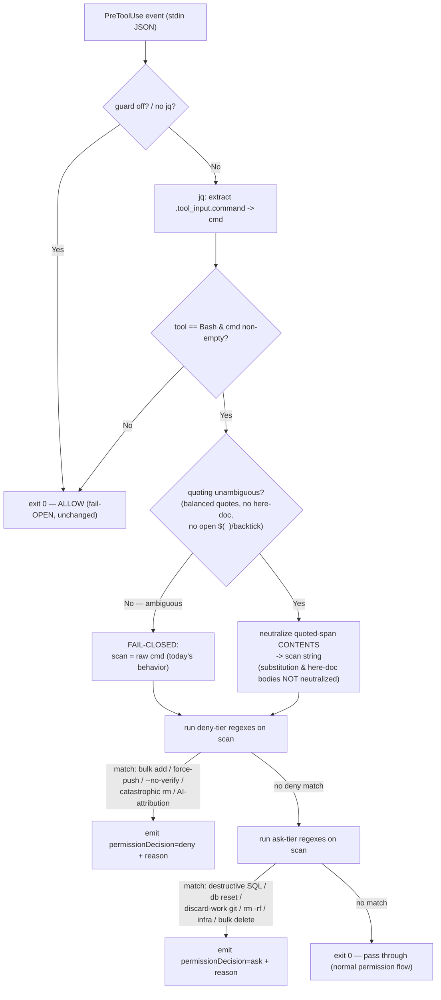

# 7 — Make the PreToolUse guard precise: no false-positive on a danger token inside a quoted argument

**GitHub item:** _none yet — open an issue titled "Make the PreToolUse guard precise (no false-positive on a guarded token inside a quoted argument)" and back-link this plan. The repo keys plan filenames to issue numbers; `7` is the next number and matches the issue this plan should be filed against._

## Goal

The PreToolUse guard (`hooks/pretooluse-guard.sh`) scans the **entire** shell-command string for its danger tokens. So a command that merely *documents* a banned action inside a quoted argument — e.g. `gh pr create --body "the project forbids --no-verify, git add -A, and git push --force"` or `git commit -m "explain why git add -A is banned"` — is **denied as if the banned action were being invoked**. This is a real, just-hit false-positive: it blocked shipping a chore PR whose body described the safety rules. The fix makes the guard distinguish a danger token in **command/operator position** (a real invocation → keep denying) from one inside a **quoted argument** (`--body "…"`, `-m "…"` → not an invocation → allow). Because this is a **security control**, the change may ONLY remove the quoted-argument/documentation false-positive; **every currently-blocked real dangerous command must stay blocked**, and the matcher must **fail closed** (behave exactly like today) whenever quote parsing is ambiguous. A new stdlib test locks BOTH directions, wired into CI.

## Architecture

The guard today is a linear bash script: read the JSON event on stdin, `jq` out `.tool_input.command` into `$cmd`, then run a sequence of `has`/`hasi` checks (`grep -qE` against `$cmd`) that emit a `deny` or `ask` decision. The defect is purely in the **input to the matchers**: `$cmd` carries quoted argument text, and a banned token sitting inside quotes matches the same regex a real invocation would.

The fix inserts **one preprocessing stage** between extracting `$cmd` and running the checks: build a **scan string** in which the *contents of single- and double-quoted spans are neutralized* (replaced with a fixed placeholder), then run **today's existing token regexes unchanged** against that scan string instead of the raw `$cmd`. Quote-stripping is the chosen strategy (over a full command-anchored rewrite) because it removes exactly the proven false-positive while leaving every battle-tested deny/ask regex intact — a near-total rewrite of the rule bodies would risk *under*-matching an unusually-phrased real dangerous command, which in a security control is the dangerous failure direction (fail-open). The catastrophic-`rm` and force-push rules keep their existing command-context awareness; they simply now scan the quote-neutralized string.

The stage is **fail-closed by construction**. Quote-neutralization only happens when the quoting is unambiguous (balanced quotes, no here-doc, no unterminated command substitution). When parsing is ambiguous — unbalanced quotes, a here-doc (`<<EOF … EOF`), escaped quotes it cannot confidently resolve, or an unterminated `$( … )`/backtick — the stage **does NOT neutralize**: it falls back to scanning the **raw `$cmd`**, i.e. behaves exactly as today and still denies. Likewise, command-substitution bodies (`$(…)`, backticks) and here-doc bodies are **NOT** treated as quoted arguments: a danger token inside `$(git push --force)` is a real invocation and must still deny. The guard's top-of-file fail-OPEN contract (missing `jq`/parse error → `exit 0`/allow) is preserved unchanged; the new stage adds an *internal* fail-CLOSED fallback (ambiguous quoting → scan raw → still match) layered under it. The matcher stays **pure Bash** — no new dependency, no new process the hook must find on the host — so the only runtime needs remain `jq` + `grep`, exactly as today.

Command chaining needs no special handling: because neutralization operates on quoted spans across the whole string, `echo "…--force…" && git push --force` correctly neutralizes the quoted `echo` argument while leaving the real `git push --force` after `&&` unquoted — so it still denies. This is verified as a test vector (and was confirmed against the live script while planning).

## Files to edit

- `hooks/pretooluse-guard.sh` — add the quote-neutralization preprocessing stage (a pure-Bash function that produces a `scan` string from `$cmd`, fail-closed on ambiguity); point the `has`/`hasi` matchers at `scan` instead of the raw `$cmd`. The deny/ask regex bodies themselves are unchanged. Update the top-of-file comment block to document the new "tokens inside quoted arguments are not invocations" semantics and the fail-closed-on-ambiguity rule.
- `.github/workflows/validate.yml` — add **check 11** (`Guard precision — quoted-argument false-positive`) that runs the new test, mirroring the existing per-check summary-row pattern (checks 3/4/10).
- `README.md` — the "Guardrail (`PreToolUse`)" paragraph (line ~74): add one sentence that the guard matches tokens in *invocation position* and does not trip on a banned token quoted inside an argument (e.g. a PR body or commit message that *mentions* the rule).
- `docs/components.md` and/or `docs/architecture.md` — if either narrates the guard's matching behavior, align the one-line description. (Verify during implementation; touch only if a guard-behavior description exists there. Do **not** touch component-count strings.)

## Files to add

- `tests/test_pretooluse_guard.py` — stdlib (no pytest), mirrors `tests/test_router.py`: drives the **real** `hooks/pretooluse-guard.sh` via `subprocess`, feeding it a `Bash` PreToolUse JSON event on stdin and asserting the emitted `permissionDecision` (`deny` / `ask` / `allow`). Corpus locks BOTH directions plus the edge cases (see Test plan).
- `tests/README.md` — append a short section documenting the new guard test (mirroring the existing `test_router.py` write-up).

## Migrations

None — no schema, no data store. This repo has no database.

## Libraries

None. The matcher stays pure Bash (runtime needs remain `jq` + `grep`, unchanged); the test is Python 3 stdlib only, consistent with the repo's no-package-manager constraint.

## UI/UX

None — this is a backend/hook-script change with no user-facing surface. The only human-visible artifacts are the guard's existing `deny`/`ask` reason strings (unchanged) and the new CI check row in the GitHub Actions job summary.

## Test plan

New `tests/test_pretooluse_guard.py`, plain Python 3 stdlib, structured exactly like `tests/test_router.py`:

- A `decision(command)` helper builds `{"tool_name":"Bash","tool_input":{"command":command}}`, pipes it to `bash hooks/pretooluse-guard.sh` via `subprocess`, and maps the JSON output's `permissionDecision` to one of `deny` / `ask` / `allow` (no output → `allow`).
- Each case is `(command, expected_decision)`; the runner prints a per-case + per-category summary and `sys.exit(0/1)`, CI-friendly, identical in shape to the router test.

**IMPORTANT test-authoring note (the meta-footgun):** this test file's *source* and the test *runner's own shell invocations* must NEVER contain the literal banned tokens (`git add -A`, `--no-verify`, `git push --force`, `Co-Authored-By: <AI>`), or the shipped guard will deny the very `Bash` call that runs the suite (this exact interception happened while planning). Build the danger tokens at runtime from fragments (e.g. assemble `"--" + "no-" + "verify"`), pass each command into the subprocess via stdin/`input=`, and keep the literal tokens out of any command line the harness's own PreToolUse guard would see. Document this constraint in a header comment so future editors don't reintroduce a literal.

Test vectors (BOTH directions + edge cases):

**A. Quoted-argument false-positives — now ALLOW (the regression this plan fixes):**
- `gh pr create --body "the project forbids the bypass flag and bulk-add and force-push"` → `allow`
- `git commit -m "doc: note that force-push is banned"` → `allow`
- `git commit -m "explain why bulk-add is forbidden"` → `allow`
- single-quoted variant of each → `allow`
- a token mentioned inside a `--message=` style `=`-joined quoted value → `allow`

**B. Real invocations — STILL DENY (the security invariant; #1 priority):**
- bulk add `-A` / `--all` / `.` (unquoted) → `deny`
- the bypass flag on a real `git commit` → `deny`
- real `git push --force` (without lease) → `deny`
- catastrophic `rm -rf` on `/` `~` `*` → `deny`
- AI-attribution trailer (assembled at runtime) on a real `git commit` → `deny`

**C. Allowed-by-design (must NOT deny):**
- `git push --force-with-lease …` → `allow` (lease form is permitted)
- ordinary `git add path/to/file` → `allow`

**D. Chaining / substitution / here-doc edge cases (fail-closed):**
- `echo "force-push is bad" && <real force push>` → `deny` (real invocation after `&&` is unquoted)
- `<safe add of a path> && <real bypass-flag commit>` → `deny`
- a danger token inside `$( … )` command substitution → `deny` (substitution body is a real invocation, not a quoted arg)
- a danger token inside backticks → `deny`
- a command with **unbalanced** quotes that also contains a real danger token → `deny` (ambiguous quoting ⇒ fail closed ⇒ scan raw)
- a here-doc whose body contains a real danger token → `deny` (here-doc body not treated as a quoted arg)
- escaped-quote case the parser cannot confidently resolve, with a real danger token present → `deny` (fail closed)

**E. Ask-tier preserved (sanity, unchanged behavior):**
- a destructive SQL statement (e.g. `DROP TABLE …`) → `ask`
- the same destructive SQL token quoted inside a `--body "…"` → `allow` (documentation, not invocation) — confirms quote-neutralization applies to the ask tier too

**How to verify before claiming done (the repo's quality bar):**
1. `python3 tests/test_pretooluse_guard.py` exits 0.
2. `python3 tests/test_router.py` exits 0 (unchanged — no router touch, but confirm no regression).
3. The guard change does not alter `agents/*.md` / `skills/*/SKILL.md` / counts, so CI checks 1/5/9 are unaffected; check 2 (leak-grep) stays clean because the new files use `~/…` not absolute home paths.
4. **Codex drift (CI check 6):** `hooks/pretooluse-guard.sh` is canonical source for the Codex emitter, which generates an adapted `codex-hooks/pretooluse-guard.sh`. After editing the canonical guard, run `python3 tools/build.py --target codex` and commit the regenerated Codex artifacts, or CI's drift guard turns red. See Blast radius.

## Blast radius

**Sensitive surface (high care):** `hooks/pretooluse-guard.sh` IS a security control — the structural enforcement of the toolbelt's cardinal rules. The overriding risk is a change that *weakens* it (lets a real `git add -A` / `--no-verify` / `git push --force` / catastrophic `rm` / AI-attributed commit through). The plan mitigates this structurally: (1) quote-stripping leaves every existing deny/ask regex **unchanged** — it only changes what string they scan; (2) the new stage is **fail-closed** — any ambiguity scans the raw string = today's behavior; (3) the test corpus's #1 block (B) asserts every real dangerous command STILL denies, so a weakening regression fails CI; (4) the fail-OPEN top-of-file contract (no jq / parse error → allow) is untouched, so the guard still cannot wedge the workflow.

**Codex coupling (must-not-forget):** per `docs/codex.md` / `docs/plans/6_codex-port.md`, the guard is canonical input to the Codex emitter (`tools/transforms.py` adapts it into `codex-hooks/pretooluse-guard.sh`, brought under the CI drift guard). Editing the canonical guard **requires regenerating the Codex artifact** (`python3 tools/build.py --target codex`) and committing it, or CI check 6 fails. The quote-neutralization logic should be plain-enough Bash that the existing Codex body-transforms carry it through unchanged; the implementation must confirm the regenerated Codex guard preserves the same deny/ask semantics (the Codex generator suite, `tests/test_codex_build.py`, is the backstop).

**Rollback story:** the change is contained to one hook script + one new test + one CI step + doc lines. Revert is a single `git revert` of the commit; the guard returns to scanning the raw `$cmd`. No data migration, no state, nothing to back out beyond the file diff. Worst case during rollout (guard too strict again) is the *original* false-positive — annoying but safe; the dangerous direction (too lenient) is the one the test corpus blocks from ever merging.

## Out of scope

- A full shell parser / `shlex`-grade tokenizer, or delegating the matcher to a Python/other-language helper. The fix is a targeted quote-neutralization pass in pure Bash; a general parser is unnecessary and adds a dependency.
- A command-anchored rewrite of the deny/ask rule bodies (every token must be adjacent to its command). Rejected: high under-match (fail-open) risk for a security control; the quote-strip hybrid achieves the goal with the existing regexes intact.
- Changing **which** actions are denied or asked, or their reason strings. The deny/ask tiers are unchanged; only the false-positive on quoted text is removed.
- The Codex `usage-tracker` / `router` / `lib-telemetry` hook-body concerns from plan 6. Out of scope here except for the mechanical "regenerate the Codex guard artifact after editing canonical" step.
- Any change to the `MAUNGS_TOOLBELT_GUARD=off` escape hatch or the fail-OPEN-on-missing-jq contract.

## Acceptance criteria

1. **Security invariant (top priority):** every currently-denied real dangerous command STILL denies after the change — unquoted bulk `git add -A`/`--all`/`.`, the `--no-verify` bypass on a real commit, real `git push --force` without `--force-with-lease`, catastrophic `rm -rf` on `/`/`~`/`*`, and an AI-attribution trailer on a real commit. Locked by test block B.
2. The documented quoted-argument false-positives now **allow**: `gh pr create --body "…<banned tokens>…"` and `git commit -m "…<banned token>…"` (both quote styles). Locked by test block A.
3. A danger token inside command substitution (`$( … )` / backticks) or a here-doc body STILL denies (those are real invocations, not quoted arguments). Locked by test block D.
4. **Fail-closed:** ambiguous quoting (unbalanced quotes, here-doc, unresolvable escaped quote, unterminated substitution) that contains a real danger token STILL denies — the matcher scans the raw string when it cannot confidently neutralize. Locked by test block D.
5. Command chaining is handled: a quoted mention before `&&`/`;`/`|` does not suppress a real danger invocation in a later segment. Locked by test block D.
6. The ask tier is preserved: destructive-SQL / db-reset / discard-work-git / `rm -rf` / infra / bulk-delete still `ask`, and the same tokens quoted in a `--body`/`-m` now allow. Locked by test block E.
7. The guard's existing fail-OPEN contract is intact: `MAUNGS_TOOLBELT_GUARD=off`, missing `jq`, empty/non-Bash input all still `exit 0` (allow) exactly as before.
8. `tests/test_pretooluse_guard.py` exists, is pure stdlib (mirrors `test_router.py`), drives the real script, locks all of the above, and exits 0; it contains **no literal banned tokens** in source or in any command line its runner emits (so it cannot self-trip the shipped guard).
9. A CI step (validate.yml check 11) runs the new test on every push and PR, with a job-summary row in the existing pattern.
10. `python3 tests/test_router.py` still exits 0 (no router regression); CI checks 1/2/5/9 are unaffected.
11. The canonical guard edit is reflected in the regenerated Codex artifact (`python3 tools/build.py --target codex` produces no further diff after commit), so CI check 6 (Codex drift guard) passes and the Codex guard preserves the same deny/ask semantics.
12. README's "Guardrail" paragraph states the guard matches tokens in invocation position and does not trip on a banned token quoted inside an argument.
13. **Review gates:** the change has passed a **`@security-reviewer`** review (it modifies the security control) **in addition to** a normal **`@pr-reviewer`** pass before merge. Neither reviewer reads a prior review of the same diff (fresh-eyes).

## Review gates (explicit)

This change touches the security-enforcement layer, so it carries an **extra mandatory gate**:

- **`@security-reviewer`** — REQUIRED. Must confirm the change removes ONLY the quoted-argument false-positive and weakens no deny/ask rule; must specifically probe the fail-closed edge cases (substitution, here-doc, unbalanced quotes, chaining) and confirm a real dangerous command in each still denies.
- **`@pr-reviewer`** — the normal correctness/quality pass, in addition to the security review.

Both are fresh-eyes (no reading of prior reviews of this diff). Merge only after BOTH pass.

## Follow-up at merge time

- [ ] Open the GitHub issue this plan is filed against (title above) and back-link this plan file; reconcile the plan `id`/filename with the real issue number if it differs from `7`.
- [ ] Run `python3 tools/build.py --target codex` and commit the regenerated `codex-hooks/pretooluse-guard.sh` (and any other regenerated Codex artifact) so CI check 6 stays green.
- [ ] Update `README.md` "Guardrail (`PreToolUse`)" paragraph (done in-PR) — verify the wording shipped.
- [ ] Update `CLAUDE.md` "Security / tenancy notes" / "Gotchas" only if the guard's documented matching contract is described there in a way the change makes stale (verify; the count strings and leak-grep notes are unaffected).
- [ ] Confirm `docs/codex.md`'s guard-disposition note still reads correctly given the broadened (quote-aware) matcher.
