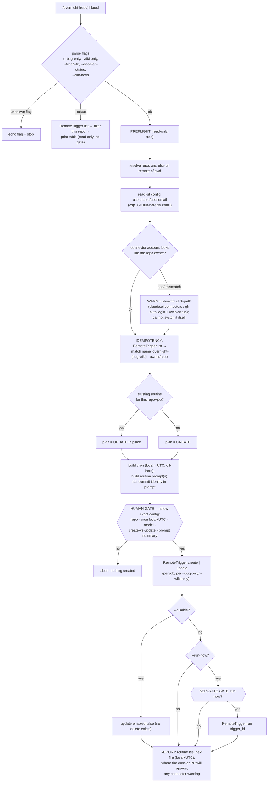

# 8 — `/overnight`: one-command setup for overnight cloud "dossier" routines

**GitHub item:** _none yet — open an issue titled "Add a repo-agnostic `/overnight` conductor skill that sets up the overnight cloud 'dossier' routines (bug backlog + wiki drift-sync) for any target repo" and back-link this plan. The repo keys plan filenames to issue numbers; `8` is the next number and matches the issue this plan should be filed against._

> **Open decisions to confirm (front-loaded — defaults chosen, each trivially overridable).** AskUserQuestion is unavailable from the architect subagent context, so these four genuine decisions are surfaced here with the architect's recommended default baked into the plan. Confirm or override before implementation begins; none touches the core flow, so a change here is cheap.
> 1. **Skill name / slash command** — default **`/overnight`** (skill dir `skills/overnight/`, slug `overnight-routines-skill`). Alternatives considered: `/nightly` (CI connotation), `/dossier` (names the output, hides the scheduling). The name bakes into the Codex artifact path, the router corpus, and the six count-string files, so it is the most expensive thing to rename later.
> 2. **Teardown** — default **`--disable` + `--status`**. The RemoteTrigger API has NO delete (only `enabled:false`), so "remove" is honestly a disable; `--status` adds read-only observability (which routines exist for this repo, enabled?, last run). Alternative: ship create/update only and document the manual disable click-path.
> 3. **Default time / timezone** — default **`04:00`, tz auto-resolved from the host system but ALWAYS echoed in the gated confirm** (never silently scheduled against a guessed tz). Alternatives: confirm-tz-always vs require-explicit-`--tz`.
> 4. **Run-now smoke test** — default **`--run-now` as a separately-gated opt-in** that fires `RemoteTrigger {action:"run"}` on the freshly-created routine so first-time setup validates the connector/identity wiring end-to-end instead of waiting until ~4am. Alternative: schedule-only, no run-now.

## Goal

Add a new project-agnostic **conductor skill** `skills/overnight/SKILL.md` (model-invocable + slash-invoked) that stands up the toolbelt's overnight **cloud routines** for any target repo with one command. `/overnight <repo>` (or no arg → auto-detect the current checkout's `git remote`) creates two scheduled cloud routines via the `RemoteTrigger` tool that run unattended overnight and leave **rolling "dossier" PRs** to review in the morning:

- a **bug backlog** routine that runs `/bug-catcher --global` (or a generic adversarial sweep when the target repo lacks the toolbelt), and
- a **wiki drift-sync** routine that runs `/wiki-generator --update` (or a generic doc-drift sweep).

Both are set up **by default**, with `--bug-only` / `--wiki-only` to scope, `--time <hh:mm>` / `--tz <IANA>` to schedule, `--disable` / `--status` to tear down / inspect, and `--run-now` to smoke-test. The skill is a conductor in the house style: it **reads and preflights for free**, and **gates the one outward action** (calling `RemoteTrigger {action:"create"|"update"|"run"}`) behind an explicit human confirmation that shows the exact config first. Its entire value is encoding eight hard-won operational lessons (idempotency, commit identity, connector preflight, rolling-PR dedup, revision stamps, no-AI-attribution, repo-agnostic methodology, human-gating) so a user never re-learns them by hand.

## Architecture

The skill is a **conductor** (`§7` of `docs/design-philosophy.md`): it routes, preflights, gates, and reports — it does **not** itself sweep for bugs or write wiki pages. The work happens later, **in the cloud**, when each scheduled routine fires; the routine's *prompt* is what invokes `/bug-catcher --global` or `/wiki-generator --update` (or a generic fallback) inside the claude.ai/code environment. So this skill's job is purely **setup + lifecycle of the schedule**, and the heavy lifting is delegated twice over: first to the cloud routine, then (inside the routine) to the existing toolbelt skills.

Cloud routines are created with the **`RemoteTrigger`** tool (the claude.ai/code routines API). The create body shape — verified working — is:

```jsonc
{ "name": "<routine name>",
  "cron_expression": "<5-field UTC, MIN interval 1h>",
  "enabled": true,
  "job_config": { "ccr": {
    "environment_id": "<env id>",
    "session_context": {
      "model": "claude-opus-4-8",
      "sources": [ { "git_repository": { "url": "https://github.com/<owner>/<repo>" } } ],
      "allowed_tools": ["Bash","Read","Write","Edit","Glob","Grep"]
    },
    "events": [ { "data": {
      "uuid": "<fresh v4 uuid>",
      "session_id": "",
      "type": "user",
      "parent_tool_use_id": null,
      "message": { "role": "user", "content": "<routine prompt>" }
    } } ]
  } } }
```

Cron is **UTC** with a **minimum interval of 1h**; the skill converts the user's local `--time`/`--tz` to a 5-field UTC expression and deliberately **avoids the `:00`/`:30` herd** — e.g. for 4:00am Pacific it schedules the bug routine at `0 11 * * *` and the wiki routine a few minutes later at `7 11 * * *` (4:00 / 4:07 local), so two routines for the same repo never fire in the same instant and the cloud fleet isn't stampeded on the hour. `RemoteTrigger {action:"list"}` enumerates routines; `{action:"update",trigger_id}` edits one; `{action:"run",trigger_id}` runs one now. **There is no delete** — `--disable` sets `enabled:false` via `update`.

The control flow is: **parse args/flags → preflight (resolve repo, read commit identity, connector sanity-check) → idempotency list-check → gated confirm → create-or-update the routine(s) → optional gated run-now → report**. The single outward, gated action is the `RemoteTrigger` create/update/run call; everything before the gate is read-only and free. The flow is **idempotent by construction**: before creating, the skill lists existing routines and matches on a deterministic name (`overnight-bug · <owner>/<repo>` and `overnight-wiki · <owner>/<repo>`); a match means **update in place**, never create a duplicate — designed this way precisely because the API cannot delete a stray second routine.



Each routine, when it fires in the cloud, maintains **exactly one rolling dossier PR** for its job. The routine prompt itself encodes the rolling-PR discipline (open-PR lookup → update-in-place-or-create), the visible revision stamp, the commit-identity config, the no-AI-attribution + footer-strip step, and the **HYBRID repo-agnostic methodology**: run the toolbelt skill if the target repo / the user's plugins provide it, otherwise perform a generic stack-adapted sweep. This skill *writes those prompts*; the cloud routine *executes* them. The two are separate concerns and the plan keeps them separate — the skill is tested/reviewed as a conductor, and the prompt text is reviewed as the contract handed to the cloud.

A note on the existing scheduling surface: `docs/scheduling.md` documents a **local daemon** cron path for `/wiki-generator --update` (5-field *local*-time cron in `.claude/scheduled_tasks.json`). This skill targets the **cloud RemoteTrigger** path instead (UTC cron, account-bound connector, dossier PRs) — a different, complementary mechanism. The plan adds a cross-reference between the two so a reader isn't confused about which scheduler is which; it does not change the local-daemon doc's behavior.

## Files to add

- `skills/overnight/SKILL.md` — **the new conductor skill** (foldered, per the layout invariant). Frontmatter `name: overnight` / `description: …` / `disable-model-invocation: false`. Body follows the house template: an "Auto-detection on every invocation" block, a numbered "Cardinal rules" block, an argument/flag parser, the preflight → idempotency → gated-confirm → create/update → report flow, a circuit-breaker failure-mode table, a token budget with 60%/80% checkpoints, and the two **routine-prompt templates** (bug + wiki) it installs. Encodes all eight lessons (see *Eight lessons baked in* below).

## Files to edit (count-string + docs sync — CI-load-bearing)

Adding one skill changes the totals to **16 agents + 10 skills = 26 components**. CI (`.github/workflows/validate.yml` check 9) **derives the real counts from the filesystem** and asserts these *exact* strings; every one must be updated or CI hard-fails. (Strings verified against `validate.yml:146-153`.)

- `README.md` — must contain `16 agents + 10 skills` (line ~3) **and** `all 26 components` (line ~181). Also add a one-line mention of `/overnight` to the component narrative/list where the other skills are introduced.
- `docs/components.md` — must contain `**26 components**` **and** `**16 agents**` (line 3), and the standalone note at line 109 that the Codex count "stays exactly **25 components**" must bump to **26**. Add a **new table row** for `overnight` in the most fitting section (recommended: the **Utility** stage table, alongside `/chore` / `/handoff` / `/toolbelt` / `/release-notes`) plus a sentence in that section's narrative.
- `docs/architecture.md` — must contain `16 agents + 10 skills = 26 components` (appears at **line 9 and line 284** — both occurrences). Update the inventory/flow narrative if it enumerates skills.
- `docs/design-philosophy.md` — must contain `16 agents + 10 skills (26 components)` (line 3).
- `.claude-plugin/plugin.json` — description must contain `16 subagents + 10 skills` (note: **"subagents"**, not "agents"). **Also bump the strict-semver `version`** from `0.3.0` to `0.4.0` (a new component is a minor feature, not a patch).
- `.claude-plugin/marketplace.json` — description must contain `16 agents + 10 skills`.

**Non-CI-asserted but should-update-for-accuracy (flag, don't let rot):**
- `skills/toolbelt/SKILL.md` line ~22 hardcodes "grown to ~25 components (16 agents + 9 skills + hooks)" in prose — update to 26 / 10 for accuracy (CI does **not** assert this string, but it is the discoverability front door and shouldn't lie). Line ~116's `9 skills + 16 agents` is an *example of derive-don't-hardcode output*, not a literal to chase — leave it or update the example; either is fine.
- GitHub "About" description (`gh repo edit Sfzmango/Maungs-agentic-toolbelt --description "…"`) — CI only **warns** on this, but bump `16 agents + 9 skills` → `16 agents + 10 skills` for consistency.

## Generated artifacts (Codex — must regenerate, CI drift guard)

The Codex target is **generated**, never hand-edited. `tools/build.py --target codex` renders each `skills/<name>/SKILL.md` into `plugins/maungs-agentic-toolbelt/skills/<name>/SKILL.md` (per `tools/emit/target_codex.py:257-260`). Adding `skills/overnight/SKILL.md`:

- emits a new `plugins/maungs-agentic-toolbelt/skills/overnight/SKILL.md` (+ its `agents/openai.yaml`), and
- the **Codex count check** (`validate.yml` check 9, lines 248-270) asserts codex skill folders == canonical skills, so the regenerated artifact must be committed.

**Implementation step:** after writing the skill, run `python3 tools/build.py --target codex` and commit the regenerated Codex artifacts, or CI check 6 (drift guard) and check 9 (Codex counts) turn red. Confirm `python3 tools/build.py --target codex --check` then reports no drift.

## Migrations

None — this repo has no database or schema. The only "state" the skill touches is **remote cloud routines** (created/updated via `RemoteTrigger`), and that state is managed idempotently at runtime (list-then-update), not via a migration.

## Libraries

None. No package manager exists in this repo and none is introduced. The skill is Markdown; it relies only on tools already available to the model at runtime: the **`RemoteTrigger`** tool (cloud routines API), plus `Bash`/`Read`/`Grep` for the read-only preflight (`git remote`, `git config`). No new dependency, no new test framework.

## UI/UX

None — backend/tooling skill, no web/mobile UI surface. The only human-visible surfaces are **text**: the skill's gated-confirm panel (the exact routine config), its `--status` table, its final report, and the **dossier PRs** the cloud routines open in the morning (rendered by GitHub, not by this skill). For completeness, the confirm panel's shape (a text mockup, not a UI screen) is:

```text
About to CREATE 2 overnight routines for Sfzmango/Maungs-agentic-toolbelt
  ┌ bug backlog   overnight-bug · Sfzmango/Maungs-agentic-toolbelt
  │   fires: 04:00 America/Los_Angeles  →  cron (UTC): 0 11 * * *
  │   model: claude-opus-4-8   runs: /bug-catcher --global (HYBRID fallback)
  │   action: CREATE (no existing routine matched)
  ├ wiki drift    overnight-wiki · Sfzmango/Maungs-agentic-toolbelt
  │   fires: 04:07 America/Los_Angeles  →  cron (UTC): 7 11 * * *
  │   model: claude-opus-4-8   runs: /wiki-generator --update (HYBRID fallback)
  │   action: UPDATE (matched existing routine trigger_id=…)
  └ commits will attribute to: Maung Htike <…@users.noreply.github.com>
  ⚠ connector check: the claude.ai GitHub connection authenticates the push/PR —
    verify it is YOUR account (not a bot) before relying on attribution. Fix: …
Proceed? (explicit "yes" required)
```

## Eight lessons baked in (explicit requirements — these came from a painful live debugging session)

The skill MUST encode each of these; they are acceptance criteria, not suggestions:

1. **Idempotency / no-duplicate routines.** Before any create, `RemoteTrigger {action:"list"}` and match on the deterministic per-repo+job name; on a match, **UPDATE** that routine, never create a second. The API cannot delete, so a duplicate is permanent — design it out. (Mirrors the idempotent-flow discipline in `docs/scheduling.md §4`.)
2. **Commit identity.** The routine prompt sets `git config user.name` / `user.email` to the **invoking user's** identity — read from `git config` during preflight, *especially the GitHub-noreply email* that maps commits to their account — so the dossier commits attribute to them, not the cloud env's default bot.
3. **GitHub connector preflight + warning.** The account that authenticates the push / opens the PR is the **claude.ai GitHub connection** (account-level, bound at routine creation), **NOT settable from the routine prompt**. The skill MUST (a) detect/warn if the connected account looks like a bot vs the repo owner, and (b) document the fix click-path (claude.ai connectors; or `gh auth login` + `/web-setup`; re-create or re-save routines after switching, since identity binds at creation). It **cannot** switch the connector itself — only warn.
4. **Rolling dossier (no spam).** Each routine maintains **ONE** rolling PR: first `gh pr list … in:title` for an open dossier PR; if present, check out its branch and **UPDATE in place** (never open a duplicate); if absent, create one. A still-open finding keeps its original `First seen:` date; resolved ones flip to resolved; a quiet night = **no PR**. (Same propose-only, reuse-the-open-PR posture as `docs/scheduling.md §4/§6`.)
5. **Visible revision stamp.** The bug backlog file carries `**Last updated: <date>** — swept against main @ <sha>` at the top plus a dated `## Revision log`; the wiki PR body carries `Last synced: <date>`. Bumped every refresh.
6. **No AI attribution + footer-strip.** PR bodies/commits carry **NO** AI attribution; if the platform auto-appends a "Generated by Claude Code" footer, the routine strips it via `gh pr edit <n> --body …`. (Aligns with the repo cardinal rule + the shipped `pretooluse-guard.sh` which denies AI-attributed commits.)
7. **Repo-agnostic methodology (HYBRID).** The routine prompt says: **if** the target repo / the user's plugins provide `/bug-catcher` and `/wiki-generator`, run those; **otherwise** perform a generic sweep adapted to the detected stack (read manifests → derive language/test framework → diagnose → adversarially verify → drop unconfirmed findings). The current toolbelt-specific prompts (which read `skills/bug-catcher/SKILL.md` from the checkout) must be **generalized** — an arbitrary repo won't have those files.
8. **Human-gated.** The skill shows the **exact** routine config (repo, cron in local + UTC, model, prompt summary, create-vs-update) and requires an explicit confirmation **BEFORE** any `RemoteTrigger create/update`. Reading/preflight is free; creating routines (and `--run-now`) are the gated outward actions, each its own fresh "yes" — never bundled, never inferred. (`§4` of `docs/design-philosophy.md`.)

## Flags (the full surface)

| Flag | Effect |
|---|---|
| _(none)_ + optional `<repo>` | Set up **both** routines for `<repo>` (or the cwd's `git remote` if omitted). |
| `--bug-only` | Only the bug-backlog routine. |
| `--wiki-only` | Only the wiki-drift routine. |
| `--time <hh:mm>` | Local fire time (default **04:00**). Bug routine at the time; wiki a few minutes later (off-herd). |
| `--tz <IANA>` | Timezone for `--time` (default: host system tz, **always echoed** in the confirm). |
| `--status` | **Read-only**: list this repo's overnight routines (enabled?, next fire local+UTC, last run). No gate. |
| `--disable` | Set `enabled:false` on this repo's routines (the API has no delete). Re-running `/overnight` re-enables. |
| `--run-now` | After create/update, fire `RemoteTrigger {action:"run"}` **behind its own separate gate** to validate wiring immediately. |
| unknown `--flag` | Echo it and stop — never guess intent (mirrors `/chore`). |

`$ARGUMENTS` empty and no actionable flag → the skill explains what it does and asks for the repo (or confirms cwd) before doing anything.

## Test plan

Consistent with the repo's "the product is prompt markdown" reality, there is **no application logic to unit-test** for a skill — the existing suites validate routing and the translator, not skill bodies. The verification surface for this change is therefore the **CI structure gates** plus the **generator suite**, run locally before claiming done:

1. **Frontmatter (CI check 1):** `skills/overnight/SKILL.md` starts with `---` and declares `name: overnight`. Verify it is picked up by the `agents/*.md skills/*/SKILL.md` glob.
2. **Leak-grep (CI check 2):** the new skill + the doc edits contain **no** absolute `/Users/<lowercase>` home path and none of the private name fragments. Use `~/…` / repo-relative paths only; the routine-prompt examples must not embed an absolute home path.
3. **Router (CI check 3):** `python3 tests/test_router.py` exits 0. If a router intent/corpus entry is added for `/overnight` (optional, recommended for discoverability), update the corpus and keep it green; if not, confirm no regression.
4. **Count strings (CI check 9-equiv, the count asserter):** after editing the six files, the derived counts are `16 agents + 10 skills = 26`, and every asserted string matches (run the validate-count logic locally, or eyeball against `validate.yml:146-153`).
5. **Codex generator + drift (CI checks 6 & 9):** `python3 tools/build.py --target codex` regenerates `plugins/maungs-agentic-toolbelt/skills/overnight/`; commit it; then `python3 tools/build.py --target codex --check` reports **no drift**, and `python3 tests/test_codex_build.py` exits 0 (the generator/gate-semantics backstop).
6. **Manual prompt review (not automatable):** the two routine-prompt templates are read end-to-end to confirm all eight lessons are present and the HYBRID fallback is correct — this is what `@plan-reviewer` and `@pr-reviewer` cover (see Review gates).

There is no new Python/stdlib test required by this change (no new matcher or logic to lock, unlike plan 7's guard). If review surfaces a need to assert the skill is router-discoverable, that lands as a router-corpus addition under `tests/test_router.py`.

## Blast radius

**Sensitive surface — the outward `RemoteTrigger` action.** This skill is the first toolbelt component that **creates standing cloud automation** (routines that run unattended overnight with write access to the repo). The dominant risks and their structural mitigations:

- **Duplicate routines that can't be deleted** → mitigated by the mandatory list-then-update idempotency check (lesson 1); the worst case is one extra disabled routine, never an unkillable pile.
- **Mis-scheduled fire (wrong tz → 4am-somewhere-else)** → mitigated by always echoing the resolved tz + UTC cron in the gated confirm (lesson 8 + decision 3); a human sees the real fire time before anything is created.
- **Wrong-account attribution / a bot opening PRs** → mitigated by the connector preflight warning (lesson 3) and commit-identity config (lesson 2); the skill cannot fix the connector, but it cannot silently ship a mis-attributed setup either — it warns loudly.
- **PR spam** → mitigated by the rolling-single-PR discipline + quiet-night-no-PR rule (lesson 4).

**Count-string coupling (high care, CI hard-fail).** The six count files + the Codex regeneration are the most error-prone part of the change — miss one string and CI is red. The Files-to-edit and Generated-artifacts sections enumerate every one with its exact asserted string and line; the implementer must hit all of them in the same commit.

**No code blast radius.** No application code, no hook, no test-harness behavior changes. The guard (`pretooluse-guard.sh`) is untouched. The `docs/scheduling.md` local-daemon path is untouched (only cross-referenced).

**Rollback story.** Reverting the PR removes the skill + restores the count strings + removes the Codex artifact in one `git revert`. **Important:** a revert does **not** delete any cloud routines a user already created with the skill — those live in the RemoteTrigger backend, not in the repo. The skill's own `--disable` is the teardown path for already-created routines; the PR body and the skill docs must state this so a user knows reverting the plugin ≠ tearing down their schedules.

## Out of scope

- **Any non-overnight / sub-hourly cadence.** RemoteTrigger's minimum interval is 1h; this skill is built around a once-nightly fire. A general cron-builder skill is a separate concern.
- **Routines beyond bug-backlog and wiki-drift.** The skill ships exactly the two documented routines. A pluggable "register an arbitrary routine prompt" mode is a possible follow-up, not this iteration.
- **Switching the claude.ai GitHub connector.** The skill **warns** about a bot/mismatched connector and documents the fix click-path; it does not (and structurally cannot) change the account-level connection. Out of scope by API constraint, not by choice.
- **A true delete.** The RemoteTrigger API has no delete; `--disable` (`enabled:false`) is the only teardown. Not a gap this plan can close.
- **Changing the local-daemon scheduler in `docs/scheduling.md`.** That path stays as-is; this skill is the complementary *cloud* path. Only a cross-reference is added.
- **Editing the Codex artifacts by hand.** They are generated; the plan regenerates them via `tools/build.py`.

## Acceptance criteria

1. `skills/overnight/SKILL.md` exists, is foldered (layout invariant), starts with `---`, and declares `name: overnight` / a clear `description` / `disable-model-invocation: false` — so CI check 1 (frontmatter) passes.
2. `/overnight [repo]` with **no flags** sets up **both** routines (bug + wiki); `--bug-only` and `--wiki-only` scope to one; an unknown flag is echoed and the skill stops without acting.
3. The skill **resolves the target repo** from the positional arg, falling back to the cwd's `git remote` when omitted, and refuses to proceed if it cannot determine one.
4. **Idempotency (lesson 1):** before creating, the skill lists existing routines and, on a name match for this repo+job, **updates in place** instead of creating a duplicate — verified in the skill text and surfaced as `action: CREATE|UPDATE` in the confirm panel.
5. **Commit identity (lesson 2):** the installed routine prompt configures `git config user.name`/`user.email` (incl. the GitHub-noreply email) from the user's identity read during preflight.
6. **Connector preflight (lesson 3):** the skill detects/warns on a bot-vs-owner connector mismatch and documents the fix click-path, while making clear it cannot switch the connector itself.
7. **Rolling dossier (lesson 4):** each installed routine prompt encodes the "find open dossier PR → update in place, else create; quiet night → no PR" rule.
8. **Revision stamp (lesson 5):** the bug routine stamps `Last updated … @ <sha>` + a dated revision log; the wiki routine stamps `Last synced: <date>`.
9. **No AI attribution + footer-strip (lesson 6):** the installed prompts produce **no** AI-attributed commit/PR and strip any auto-appended "Generated by Claude Code" footer.
10. **HYBRID methodology (lesson 7):** the routine prompts run `/bug-catcher --global` and `/wiki-generator --update` **when available**, and otherwise fall back to a generic stack-adapted adversarial sweep — i.e. they do **not** assume the target repo contains the toolbelt's own `skills/*` files.
11. **Human-gated (lesson 8):** creating/updating routines and `--run-now` are each gated behind an explicit, fresh "yes" that follows a panel showing repo · cron (local **and** UTC) · model · create-vs-update · prompt summary; `--status` is read-only with no gate.
12. **Scheduling correctness:** the local `--time`/`--tz` (default 04:00, host tz) is converted to a valid **5-field UTC** cron honoring the **1h-minimum** interval, and the two routines for one repo are staggered off the `:00`/`:30` herd.
13. **Teardown:** `--disable` sets `enabled:false` (the API has no delete) and `--status` lists this repo's routines read-only.
14. **Count strings (CI check 9):** the derived counts are **16 agents + 10 skills = 26 components**, and every asserted string in `README.md`, `docs/components.md`, `docs/architecture.md`, `docs/design-philosophy.md`, `.claude-plugin/plugin.json` (`16 subagents + 10 skills`), and `.claude-plugin/marketplace.json` matches — CI count check is green.
15. `docs/components.md` gains a table **row** for `overnight` (recommended: Utility stage) + a narrative sentence, and its line-109 "stays exactly **25 components**" note is bumped to **26**.
16. `.claude-plugin/plugin.json` `version` is bumped `0.3.0` → `0.4.0` (strict semver; new component = minor).
17. **Codex (CI checks 6 & 9):** `python3 tools/build.py --target codex` was run and the regenerated `plugins/maungs-agentic-toolbelt/skills/overnight/` is committed; `--target codex --check` reports no drift and `python3 tests/test_codex_build.py` exits 0.
18. **No leak (CI check 2):** no absolute `/Users/<lowercase>` home path and none of the private name fragments appear in the new skill or doc edits (routine-prompt examples included).
19. `python3 tests/test_router.py` exits 0 (no regression; plus a `/overnight` corpus entry if discoverability routing is added).
20. **Review gates:** the change has passed a fresh-eyes **`@plan-reviewer`** pass (on this plan) **and** a fresh-eyes **`@pr-reviewer`** pass (on the implementation) before merge.

## Review gates (explicit)

- **`@plan-reviewer`** — REQUIRED on this plan (cold, context-blind), per the standard plan→review→commit flow. Should specifically probe: are all eight lessons truly encoded as requirements; is the idempotency design actually duplicate-proof given the no-delete API; is the count-string + Codex blast radius complete.
- **`@pr-reviewer`** — REQUIRED on the implementation (fresh-eyes, no prior-review reading). Should verify the routine-prompt templates honor lessons 1–8 and the HYBRID fallback, and that every count string + the Codex artifact landed in the same commit.

No `@security-reviewer` gate is mandated (no security-control code changes here, unlike plan 7) — though the reviewer should still sanity-check that the routine prompts never embed a secret or an absolute home path, and that the connector-warning copy is accurate. Both gates are fresh-eyes (no reading of a prior review of the same artifact). Merge only after both pass.

## Follow-up at merge time

- [ ] Open the GitHub issue this plan is filed against (title in the header) and back-link this plan; reconcile the plan `id`/filename with the real issue number if it differs from `8`.
- [ ] Confirm the four front-loaded open decisions (skill name, teardown surface, default time/tz, run-now) were resolved as built; if any was overridden, the plan was edited in place to match (no change log).
- [ ] Run `python3 tools/build.py --target codex` and commit the regenerated `plugins/maungs-agentic-toolbelt/skills/overnight/` so CI checks 6 + 9 stay green.
- [ ] Update the GitHub "About" description via `gh repo edit Sfzmango/Maungs-agentic-toolbelt --description "… 16 agents + 10 skills …"` (CI warns, doesn't fail, on this).
- [ ] Update `CLAUDE.md` — bump the inventory line "**16 agents + 9 skills (25 components)**" / "**16 agents + 10 skills = 26 components**" and add `overnight` to the skills roster in the module map; add a one-line "Plan-file convention" / scheduling note if useful. (CLAUDE.md is not in the CI six, but it is the agent-context source of truth and should not lie.)
- [ ] Update `skills/toolbelt/SKILL.md` line ~22 prose count ("~25 components (16 agents + 9 skills…)") to 26/10 for accuracy (not CI-asserted, but the discoverability front door).
- [ ] Add a cross-reference between `docs/scheduling.md` (local-daemon path) and the new `/overnight` skill (cloud RemoteTrigger path) so readers know which scheduler is which.
