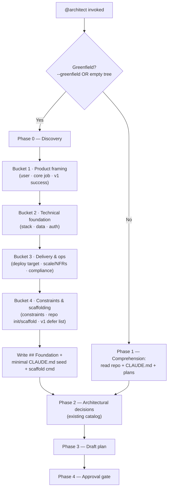

# 9 — Greenfield discovery phase + the shared interview-catalog pattern

**Topic:** greenfield discovery phase, generalized into a reusable interview-catalog pattern (no GitHub issue — topic-driven design sketch)

## Goal

Give the toolbelt a structured, front-loaded **discovery interview** for from-scratch builds, so the foundational choices a greenfield project needs — stack, deployment target, the MVP cut, the target user, non-functional requirements, and how the repo gets scaffolded — are surfaced by a guaranteed checklist instead of being left to the architect to improvise.

Today the ecosystem feeds context to its agents two ways: it **derives** it by reading the repo (`CLAUDE.md`, manifests, recent plans, source) and it **asks** for the rest via `AskUserQuestion`. In greenfield the derive half is empty — there is no repo to read — so the entire burden falls on the asking half. But the architect's decision catalog (`agents/architect.md:72-79`: scope, data model, data access, migration ordering, UI, backward-compat, future-readiness) is tuned for an *existing* project: it presumes a stack already exists ("Match the project's idioms — don't impose a stack it doesn't use", `agents/architect.md:46`). The foundational greenfield questions are not on any checklist, so they ride on the model's general competence rather than a structured prompt. This plan closes that gap.

**And it does so reusably.** Rather than bolt a one-off checklist onto the architect, this plan establishes the greenfield checklist as the **first instance of a shared, declarative interview-catalog pattern** — adopted deliberately *instead of* a centralized runtime "interviewer middleware" (evaluated and declined; see "Generalization" + "Alternatives" below). To prove the pattern generalizes, the plan also adds a **second instance**, a migration-discovery catalog consumed by `/migration-planner`.

## Architecture

A new **Phase 0 — Discovery** runs inside `@architect` *before* its existing Phase 2 (architectural-decisions surfacing), gated on a greenfield signal. It is not a new agent and not a new skill — it is a mode of the agent that already owns front-loaded questioning, so it adds zero components and leaves the 16-agent + 9-skill count untouched.

Greenfield is detected one of two ways: an explicit `--greenfield` flag passed by the caller (`/orchestrator --greenfield <topic>` → architect), or an auto heuristic — an empty-or-near-empty tree (no recognized package manifest, no `CLAUDE.md`/`AGENTS.md`, and fewer than a small threshold of tracked source files). The router already *suggests* the greenfield agents at priority block 00 (`hooks/toolbelt-router.sh:80-89`); this phase is what those agents actually *do* once invoked.

Phase 0 walks a fixed **discovery catalog** (below) grouped into four buckets, each asked via `AskUserQuestion` (≤4 questions per call, so ~2 calls), looping until the foundation is locked. The answers are written into a new `## Foundation` section pinned to the top of the plan, plus a recommended minimal `CLAUDE.md` seed and scaffold command — so once the first commit lands, the user runs `/agentic-onboard` to crystallize the context and every subsequent run is back in the cheap "context flows in" mode. Greenfield is the one case where the ecosystem **creates** the context it normally consumes; Phase 0 is the bootstrap step that makes that loop close.

## The discovery catalog (interview catalog instance #1)

The checklist that is currently missing. Four buckets; each line is a question the architect must surface (or explicitly mark "n/a — <reason>") before drafting the plan body. Buckets map 1:1 to the gaps identified in design discussion: stack, deployment, MVP cut, target user, NFRs, scaffolding.

**Bucket 1 — Product framing**
- **Target user** — who is this for (one persona is enough for v1)?
- **Core job** — the single thing v1 must do well (the thinnest viable slice)?
- **v1 success** — what "done" looks like for the first release (a demoable behavior, not a metric dashboard)?

**Bucket 2 — Technical foundation**
- **Stack** — language(s) + framework + runtime. (The decision that is *assumed* in-project and *absent* in greenfield.)
- **Data** — persistence needed? none / file / SQL / NoSQL — and roughly what shape?
- **Identity** — auth needed? none / local sessions / OAuth / third-party IdP?

**Bucket 3 — Delivery & ops**
- **Deployment target** — local CLI / library / container / serverless / PaaS / static host?
- **Scale & NFRs** — single-user toy vs multi-tenant; latency/throughput expectations; offline/availability needs?
- **Compliance** — any regulated/sensitive data (PII, payments, health)? A "yes" pre-flags `@security-reviewer`/`@security-mentor` and PCI/HIPAA criteria downstream.

**Bucket 4 — Constraints & scaffolding**
- **Constraints** — must-use technologies, team familiarity, license, budget, deadlines?
- **Repo bootstrap** — init git? single package vs monorepo? scaffold via a framework CLI (e.g. `create-next-app`, `cargo new`) vs hand-rolled skeleton?
- **v1 defer list** — what is explicitly OUT of the first cut (so scope is bounded from the start)?

Coverage rule (mirrors `agents/architect.md:26`): every catalog line is either asked or marked "n/a — <reason>". The architect must not silently skip a bucket.

## Where it lives

- **`@architect` (primary)** — add Phase 0 gated on the greenfield signal, ahead of Phase 2. Extends the agent that already front-loads decisions; smallest new surface.
- **`/orchestrator` (detector + routing)** — sharpen the existing empty-context branch (`skills/orchestrator/SKILL.md:48`, today: "bootstrap minimal context first" vs "proceed with defaults") into a third branch that detects an empty tree and passes `--greenfield` to the architect. One added line in the 13-steps; one new flag in the `--experiment`-style flag list.
- **`@product-owner` (ordering note only)** — for multi-feature greenfields, PO runs first to slice the build into milestones/issues; the architect's Phase 0 then runs once for the shared foundation. PO already asks scope questions when an ask is vague (`agents/product-owner.md:47`), so no behavioral change — just a documented ordering.
- **Not a new agent / skill** — deliberately. Avoids the six-file component-count sync (`.github/workflows/validate.yml:44-72`) and honors least-surface.

## Generalization: the interview-catalog pattern

The greenfield checklist is not a one-off — it is the first concrete instance of a reusable pattern this plan establishes. The pattern is the constructive half of a decision already taken: a centralized runtime "interviewer middleware" was evaluated and **declined**, and the kernel worth keeping from it — *consistent interview coverage* — is delivered declaratively instead.

**Why a catalog, not middleware.** A middleware would intercept all agent↔user questioning, own a shared interview state, and route answers to whichever agent needs them. It was rejected for four reasons, by weight:

- **No clean interception point.** Subagents run in isolated contexts via the Task tool — there is no shared message bus to sit "between" them and the user, and the harness's `AskUserQuestion` is already the native, uniform questioning UI. A middleware would reimplement it with less integration.
- **It fights fresh-eyes.** The reviewers (`@pr-reviewer`, `@security-reviewer`, `@plan-reviewer`, `@bug-catcher-adversary`) are deliberately blind to prior context (`docs/design-philosophy.md`). A shared interview-state store is exactly the cross-agent context channel that risks leaking into agents that must stay blind.
- **It centralizes what the architecture distributes.** Least-privilege and per-agent ownership of gates are core house style; a middleware re-couples them.
- **The cross-agent dedup it would buy already exists.** The orchestrator carries answered decisions forward through the plan file + issue body, and agents re-read those at their phase boundary (`skills/orchestrator/SKILL.md:196-200`), so an agent doesn't re-ask what an upstream agent already settled.

**What a catalog is.** A named markdown checklist with six invariants:

1. **Declarative** — it is data (bucketed questions), not code. No runtime, no interception, no shared state.
2. **Bucketed** — questions are grouped so one `AskUserQuestion` call maps cleanly onto one or two buckets.
3. **Coverage rule** — every line is asked or explicitly marked "n/a — <reason>"; a consuming agent may not silently skip a bucket.
4. **Front-loaded** — the consuming agent walks it *before* its main work (the "a mid-build pivot costs ~10× a planning question" rationale, generalized).
5. **Referenced, not centralized** — one or more agents consume a catalog by embedding its buckets at the relevant phase and pointing at the canonical file; nothing sits between agent and user.
6. **Drift-guarded** — a CI check asserts each catalog's bucket headers appear in its consuming component(s), the same family as the existing count-string drift guards.

Catalogs live in one home, `docs/interview-catalogs/`: an index/README defining the pattern, plus one file per catalog. A consuming agent's body contains the catalog's buckets at its discovery phase (so it is self-contained at runtime) **and** a pointer to the canonical file; the drift guard keeps the two in sync.

**Instance #1 — Greenfield discovery** (above), consumed by `@architect` Phase 0. This plan relocates it from inline-only into `docs/interview-catalogs/greenfield.md`, with `@architect` pointing at it.

**Instance #2 — Migration discovery** (new), consumed by `/migration-planner` (and `@architect` when a plan includes a migration), walked *before* the risk dossier is produced. `/migration-planner` already emits a rich dossier; this catalog formalizes the front-loaded questions it should ask the user first, so the dossier is grounded in answers rather than assumptions. Buckets:
- **Change shape** — add / drop / rename / type-change / constraint (NOT NULL, unique, FK)? reversible or destructive?
- **Data state** — approximate row count of affected tables? existing data needing a backfill? current nullability/defaults?
- **Lock & downtime** — is any downtime acceptable, and for how long? peak-traffic constraints? (anchors the DB-specific lock profile the planner already detects.)
- **Rollout** — single migration, or expand/contract (parallel-change) for zero downtime? feature-flag coupling?
- **Rollback** — what does "undo" look like — reverse migration, restore, or forward-fix only?
- **Blast radius** — which code reads/writes the affected schema, and who owns it?

**Future instances (out of scope here, to show the pattern is open-ended):** a bug-repro catalog for `/bug-catcher`, a security-scoping catalog for `@security-reviewer`. Add only when a real coverage gap is observed — each catalog must earn its keep.

## Files to edit

- `agents/architect.md` — add the Phase 0 — Discovery section + the discovery catalog + the greenfield-detection note + the `## Foundation` plan-template section; point Phase 0 at `docs/interview-catalogs/greenfield.md` as the canonical catalog.
- `skills/orchestrator/SKILL.md` — add the empty-tree detector branch + the `--greenfield` flag; one-line note in the 13-steps.
- `agents/product-owner.md` — one paragraph on the greenfield ordering (PO-first slice → architect Phase 0 for the foundation).
- `skills/migration-planner/SKILL.md` — add a front-loaded discovery step that walks `docs/interview-catalogs/migration.md` before producing the risk dossier.
- `docs/design-philosophy.md` — add a principle: **"Shared declarative interview catalogs, not a runtime interviewer middleware"** (the pattern, its six invariants, and the rejected alternative), and note that front-loading extends to greenfield.
- `.github/workflows/validate.yml` — add a drift check asserting each catalog's bucket headers appear in its consuming component(s), in the existing per-check summary-row style.
- `docs/components.md` — note the discovery phase under the architect + that interview catalogs are a cross-cutting convention. (No count strings change.)

## Files to add

- `docs/interview-catalogs/README.md` — the pattern definition + index of catalogs + the coverage/drift rules.
- `docs/interview-catalogs/greenfield.md` — the four-bucket greenfield catalog (relocated; this plan remains its functional spec).
- `docs/interview-catalogs/migration.md` — the six-bucket migration-discovery catalog.

## Codex parity (implementation-time, not this PR)

`agents/*.md` and `skills/*/SKILL.md` are **canonical** sources; the Codex artifacts under `codex-agents/`, `codex-hooks/`, and `plugins/maungs-agentic-toolbelt/skills/` are **generated** from them (`docs/codex.md`, `CLAUDE.md` generator section). The implementing PR therefore MUST run `python3 tools/build.py --target codex` after editing the canonical files (`@architect`, `/orchestrator`, `@product-owner`, `/migration-planner`), or CI's drift guard fails on the diff. New `docs/interview-catalogs/` files are Codex-neutral. **Note: the Codex generator is not yet on `main` (it lives in the unmerged codex-port branch), so regeneration is deferred until it lands — at which point the four canonical edits in this PR must be regenerated and committed. There are no Codex artifacts on this base to drift against yet.**

## Migrations

None — no schema, no data store in this repo.

## Libraries

None — the generator and tests are Python 3 stdlib only; this is prompt-markdown + docs.

## Test plan

- **Router (existing, must stay green):** `python3 tests/test_router.py` already asserts greenfield (block 00) beats onboard (block 0) (`tests/test_router.py:135-168`). No change expected; re-run to confirm the plan's framing matches the live router.
- **Implementing PR adds:**
  - a structure check that `agents/architect.md` contains the Phase 0 / discovery-catalog headings and that each of the four buckets is present (cheap `grep` in CI, same family as the frontmatter checks); and, if a `--greenfield` flag string is documented in `skills/orchestrator/SKILL.md`, assert it is present so docs and behavior can't drift apart.
  - a **catalog drift check**: for each catalog in `docs/interview-catalogs/`, assert its bucket headers appear in its declared consuming component(s); a catalog with no consumer, or a consumer missing a bucket, fails CI.
- **Counts unchanged:** catalogs are docs, not agents/skills — the 16 + 9 = 25 count strings and the six count-bearing files are untouched.
- **Codex drift (implementing PR):** `python3 tools/build.py --target codex --check` exits clean after regeneration.

## Blast radius

Low. Plan-only PR touches one new doc. The implementing PR touches four prompt-markdown files + three new `docs/interview-catalogs/` files + two docs + one CI step, and regenerates Codex artifacts; no executable code path, no hooks, no counts. Risks at implementation time: (1) over-eager greenfield auto-detection firing inside a real (but sparse) repo — mitigated by requiring *all three* empty-tree signals and by the architect's existing approval gate; (2) catalog/consumer drift — caught by the new CI drift check; (3) the migration discovery step interrupting a trivial migration — mitigated by the coverage rule's "n/a — <reason>" escape and `/migration-planner`'s existing read-only, human-gated posture.

## Out of scope

- **A centralized "interviewer middleware."** Evaluated and declined as a runtime layer — see "Generalization" + "Alternatives". This plan delivers the declarative catalog pattern instead; it is not a revival.
- **Building every conceivable catalog now.** Only greenfield (relocated) + migration (new) ship; further catalogs (bug-repro, security-scoping) are added when a real coverage gap is observed.
- **Any runtime sharing of answers across agents** — the orchestrator's plan-file/issue-body handoff remains the only cross-agent channel.
- Auto-running framework scaffold commands. Phase 0 *recommends* a scaffold command; running it stays behind the developer's normal commit/gate flow, never auto-executed.
- A greenfield mode for the non-planning agents (reviewers, bug-catcher, wiki) — not needed; they operate on code that exists by the time they run.
- Changing `/migration-planner`'s risk-dossier output format or `@architect`'s plan template beyond pointing each at its catalog.

## Alternatives considered

The centralized **interviewer middleware** decision and its four rejection reasons are documented under "Generalization: the interview-catalog pattern" above (the declarative catalog is the constructive alternative). Other alternatives:

- **A dedicated `@greenfield-interviewer` agent** — rejected: adds a component + the count sync, for behavior the architect already half-owns.
- **Leaving it to the architect's general competence** — rejected: that *is* today's gap.
- **Putting discovery entirely in `@product-owner`** — rejected: PO owns scope/issues, not stack/deploy/NFR foundation; the architect is the right owner, with PO sequencing multi-feature builds ahead of it.
- **A new plan file (id 10) for the pattern** — rejected: the pattern builds directly on the greenfield catalog and is small; folding it into this plan keeps one coherent design rather than proliferating plan files.

## Acceptance criteria

1. **A from-scratch build triggers a structured discovery interview** before any plan body is written — not ad-hoc questions.
2. **Stack, deployment target, MVP cut, target user, NFRs, and scaffolding are each surfaced** (asked or explicitly marked n/a) for every greenfield run.
3. **Greenfield is detected** both explicitly (`--greenfield`) and automatically (empty-tree heuristic), and the orchestrator routes an empty tree into discovery rather than its generic defaults branch.
4. **Discovery answers are captured** in a `## Foundation` section at the top of the plan, with a recommended minimal `CLAUDE.md` seed + scaffold command.
5. **The interview-catalog pattern is documented** in `docs/interview-catalogs/README.md` with its six invariants and the rejected-middleware rationale, and `docs/design-philosophy.md` gains the matching principle.
6. **Both catalogs exist in the shared home** — `greenfield.md` (consumed by `@architect` Phase 0) and `migration.md` (consumed by `/migration-planner`, walked before the risk dossier) — and each consuming component references its catalog.
7. **A CI drift check** asserts every catalog's buckets appear in its consuming component(s); a missing bucket or orphan catalog fails CI.
8. **No new agent or skill is added** — component counts stay 16 + 9 = 25 and the six count-bearing files are untouched.
9. **No catalog silently skips a bucket** — each line is asked or marked "n/a — <reason>".
10. **Codex artifacts regenerate clean** after the implementing edits (`tools/build.py --target codex --check` exits 0); the router suite stays green.
11. **Auto-detection does not false-fire in a real repo** — all three empty-tree signals are required, and the architect's approval gate remains the backstop.

## Follow-up at merge time

- [ ] Open the implementing PR (edits `agents/architect.md`, `skills/orchestrator/SKILL.md`, `agents/product-owner.md`, `skills/migration-planner/SKILL.md`; adds `docs/interview-catalogs/`; adds the CI drift check; regenerates Codex) once this sketch is approved.
- [ ] Update `docs/components.md` + `docs/design-philosophy.md` to mention the discovery phase + the interview-catalog convention.
- [ ] Decide whether a `--greenfield` flag is also worth surfacing in the router's block-00 suggestion text.
- [ ] Revisit future catalogs (bug-repro, security-scoping) only when an observed coverage gap justifies one.
