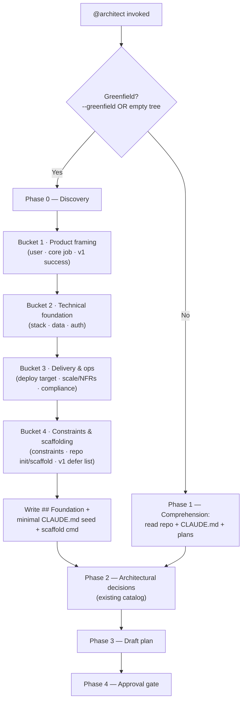

# 9 — Greenfield discovery phase for @architect

**Topic:** greenfield discovery phase (no GitHub issue — topic-driven design sketch)

## Goal

Give the toolbelt a structured, front-loaded **discovery interview** for from-scratch builds, so the foundational choices a greenfield project needs — stack, deployment target, the MVP cut, the target user, non-functional requirements, and how the repo gets scaffolded — are surfaced by a guaranteed checklist instead of being left to the architect to improvise.

Today the ecosystem feeds context to its agents two ways: it **derives** it by reading the repo (`CLAUDE.md`, manifests, recent plans, source) and it **asks** for the rest via `AskUserQuestion`. In greenfield the derive half is empty — there is no repo to read — so the entire burden falls on the asking half. But the architect's decision catalog (`agents/architect.md:72-79`: scope, data model, data access, migration ordering, UI, backward-compat, future-readiness) is tuned for an *existing* project: it presumes a stack already exists ("Match the project's idioms — don't impose a stack it doesn't use", `agents/architect.md:46`). The foundational greenfield questions are not on any checklist, so they ride on the model's general competence rather than a structured prompt. This plan closes that gap.

## Architecture

A new **Phase 0 — Discovery** runs inside `@architect` *before* its existing Phase 2 (architectural-decisions surfacing), gated on a greenfield signal. It is not a new agent and not a new skill — it is a mode of the agent that already owns front-loaded questioning, so it adds zero components and leaves the 16-agent + 9-skill count untouched.

Greenfield is detected one of two ways: an explicit `--greenfield` flag passed by the caller (`/orchestrator --greenfield <topic>` → architect), or an auto heuristic — an empty-or-near-empty tree (no recognized package manifest, no `CLAUDE.md`/`AGENTS.md`, and fewer than a small threshold of tracked source files). The router already *suggests* the greenfield agents at priority block 00 (`hooks/toolbelt-router.sh:80-89`); this phase is what those agents actually *do* once invoked.

Phase 0 walks a fixed **discovery catalog** (below) grouped into four buckets, each asked via `AskUserQuestion` (≤4 questions per call, so ~2 calls), looping until the foundation is locked. The answers are written into a new `## Foundation` section pinned to the top of the plan, plus a recommended minimal `CLAUDE.md` seed and scaffold command — so once the first commit lands, the user runs `/agentic-onboard` to crystallize the context and every subsequent run is back in the cheap "context flows in" mode. Greenfield is the one case where the ecosystem **creates** the context it normally consumes; Phase 0 is the bootstrap step that makes that loop close.

## The discovery catalog

The checklist that is currently missing. Four buckets; each line is a question the architect must surface (or explicitly mark "n/a — <reason>") before drafting the plan body. Buckets map 1:1 to the gaps identified in design discussion: stack, deployment, MVP cut, target user, NFRs, scaffolding.

**Bucket 1 — Product framing**
- **Target user** — who is this for (one persona is enough for v1)?
- **Core job** — the single thing v1 must do well (the thinnest viable slice)?
- **v1 success** — what "done" looks like for the first release (a demoable behavior, not a metric dashboard)?

**Bucket 2 — Technical foundation**
- **Stack** — language(s) + framework + runtime. (The decision that is *assumed* in-project and *absent* in greenfield.)
- **Data** — persistence needed? none / file / SQL / NoSQL — and roughly what shape?
- **Identity** — auth needed? none / local sessions / OAuth / third-party IdP?

**Bucket 3 — Delivery & ops**
- **Deployment target** — local CLI / library / container / serverless / PaaS / static host?
- **Scale & NFRs** — single-user toy vs multi-tenant; latency/throughput expectations; offline/availability needs?
- **Compliance** — any regulated/sensitive data (PII, payments, health)? A "yes" pre-flags `@security-reviewer`/`@security-mentor` and PCI/HIPAA criteria downstream.

**Bucket 4 — Constraints & scaffolding**
- **Constraints** — must-use technologies, team familiarity, license, budget, deadlines?
- **Repo bootstrap** — init git? single package vs monorepo? scaffold via a framework CLI (e.g. `create-next-app`, `cargo new`) vs hand-rolled skeleton?
- **v1 defer list** — what is explicitly OUT of the first cut (so scope is bounded from the start)?

Coverage rule (mirrors `agents/architect.md:26`): every catalog line is either asked or marked "n/a — <reason>". The architect must not silently skip a bucket.

## Where it lives

- **`@architect` (primary)** — add Phase 0 gated on the greenfield signal, ahead of Phase 2. Extends the agent that already front-loads decisions; smallest new surface.
- **`/orchestrator` (detector + routing)** — sharpen the existing empty-context branch (`skills/orchestrator/SKILL.md:48`, today: "bootstrap minimal context first" vs "proceed with defaults") into a third branch that detects an empty tree and passes `--greenfield` to the architect. One added line in the 13-steps; one new flag in the `--experiment`-style flag list.
- **`@product-owner` (ordering note only)** — for multi-feature greenfields, PO runs first to slice the build into milestones/issues; the architect's Phase 0 then runs once for the shared foundation. PO already asks scope questions when an ask is vague (`agents/product-owner.md:47`), so no behavioral change — just a documented ordering.
- **Not a new agent / skill** — deliberately. Avoids the six-file component-count sync (`.github/workflows/validate.yml:44-72`) and honors least-surface.

## Files to edit

- `agents/architect.md` — add the Phase 0 — Discovery section + the discovery catalog + the greenfield-detection note + the `## Foundation` plan-template section.
- `skills/orchestrator/SKILL.md` — add the empty-tree detector branch + the `--greenfield` flag; one-line note in the 13-steps.
- `agents/product-owner.md` — one paragraph on the greenfield ordering (PO-first slice → architect Phase 0 for the foundation).
- `docs/components.md` / `docs/design-philosophy.md` — note the discovery phase under the architect; design-philosophy gains a short "front-loading extends to greenfield" note. (No count strings change.)

## Files to add

- None. Phase 0 is a mode of an existing agent; the only new artifact is this plan.

## Codex parity (implementation-time, not this PR)

`agents/*.md` and `skills/*/SKILL.md` are **canonical** sources; the Codex artifacts under `codex-agents/`, `codex-hooks/`, and `plugins/maungs-agentic-toolbelt/skills/` are **generated** from them (`docs/codex.md`, `CLAUDE.md` generator section). The implementing PR therefore MUST run `python3 tools/build.py --target codex` after editing the canonical files, or CI's drift guard fails on the diff. **This PR is plan-only — it edits no canonical component — so it is drift-safe and requires no regeneration.**

## Migrations

None — no schema, no data store in this repo.

## Libraries

None — the generator and tests are Python 3 stdlib only; this is prompt-markdown + a doc.

## Test plan

- **Router (existing, must stay green):** `python3 tests/test_router.py` already asserts greenfield (block 00) beats onboard (block 0) (`tests/test_router.py:135-168`). No change expected; re-run to confirm the plan's framing matches the live router.
- **Implementing PR adds:** a structure check that `agents/architect.md` contains the Phase 0 / discovery-catalog headings and that each of the four buckets is present (cheap `grep` in CI, same family as the frontmatter checks). And, if a `--greenfield` flag string is documented in `skills/orchestrator/SKILL.md`, assert it is present so docs and behavior can't drift apart.
- **Codex drift (implementing PR):** `python3 tools/build.py --target codex --check` exits clean after regeneration.

## Blast radius

Low. Plan-only PR touches one new doc. The implementing PR touches three prompt-markdown files + two docs and regenerates Codex artifacts; no executable code path, no hooks, no counts. The one behavioral risk at implementation time is over-eager greenfield auto-detection firing inside a real (but sparse) repo — mitigated by requiring *all three* empty-tree signals (no manifest AND no CLAUDE.md AND below the source-file threshold) and by the architect's existing approval gate, which a user can redirect.

## Out of scope

- **A centralized "interviewer middleware."** Considered and declined as a runtime layer — see Alternatives. Its legitimate kernel (consistent interview coverage) is delivered here as the declarative discovery catalog instead.
- Auto-running framework scaffold commands. Phase 0 *recommends* a scaffold command; running it stays behind the developer's normal commit/gate flow, never auto-executed.
- A greenfield mode for the non-planning agents (reviewers, bug-catcher, wiki) — not needed; they operate on code that exists by the time they run.

## Alternatives considered

**A centralized interviewer middleware between agents/skills and the user.** The idea: one component intercepts all agent↔user questioning, owns a shared interview state, and hands answers to whichever agent needs them. **Recommendation: decline it as a runtime layer.**

- **No clean interception point.** Subagents run in isolated contexts via the Task tool — there is no shared message bus to sit "between" them and the user, and the harness's `AskUserQuestion` is already the native, uniform questioning UI. A middleware would reimplement it with less integration.
- **It fights fresh-eyes.** The design's reviewers (`@pr-reviewer`, `@security-reviewer`, `@plan-reviewer`, `@bug-catcher-adversary`) are deliberately blind to prior context (`docs/design-philosophy.md`). A shared interview-state store is exactly the kind of cross-agent context channel that risks leaking into agents that must stay blind.
- **It centralizes what the architecture distributes.** Least-privilege and per-agent ownership of gates are core house style; a middleware re-couples them.
- **The cross-agent dedup it would buy already exists.** The orchestrator carries answered decisions forward through the plan file + issue body, and agents re-read those at their phase boundary (`skills/orchestrator/SKILL.md:196-200`), so an agent doesn't re-ask what an upstream agent already settled.

**Extract the useful kernel instead.** The real need behind "middleware" is *consistent interview coverage* — and that is served by a shared, declarative **interview catalog** (a markdown checklist agents reference), which is precisely what this greenfield discovery catalog establishes as a reusable pattern. If a second catalog earns its keep later (e.g. a migration-discovery catalog), the pattern generalizes without any runtime layer.

**Other alternatives:** (a) a dedicated `@greenfield-interviewer` agent — rejected: adds a component + the count sync, for behavior the architect already half-owns. (b) Leaving it to the architect's general competence — rejected: that *is* today's gap. (c) Putting discovery entirely in `@product-owner` — rejected: PO owns scope/issues, not stack/deploy/NFR foundation; the architect is the right owner, with PO sequencing multi-feature builds ahead of it.

## Acceptance criteria

1. **A from-scratch build triggers a structured discovery interview** before any plan body is written — not ad-hoc questions.
2. **Stack, deployment target, MVP cut, target user, NFRs, and scaffolding are each surfaced** (asked or explicitly marked n/a) for every greenfield run.
3. **Greenfield is detected** both explicitly (`--greenfield`) and automatically (empty-tree heuristic), and the orchestrator routes an empty tree into discovery rather than its generic defaults branch.
4. **Discovery answers are captured** in a `## Foundation` section at the top of the plan, with a recommended minimal `CLAUDE.md` seed + scaffold command.
5. **No new agent or skill is added** — component counts stay 16 + 9 = 25 and the six count-bearing files are untouched.
6. **The catalog never silently skips a bucket** — each line is asked or marked n/a with a reason.
7. **Codex artifacts regenerate clean** after the implementing edits (`tools/build.py --target codex --check` exits 0); the router suite stays green.
8. **Auto-detection does not false-fire in a real repo** — all three empty-tree signals are required, and the architect's approval gate remains the backstop.

## Follow-up at merge time

- [ ] Open the implementing PR (edits `agents/architect.md`, `skills/orchestrator/SKILL.md`, `agents/product-owner.md`; regenerates Codex) once this sketch is approved.
- [ ] Update `docs/components.md` + `docs/design-philosophy.md` to mention the discovery phase under the architect.
- [ ] Decide whether a `--greenfield` flag is also worth surfacing in the router's block-00 suggestion text.
