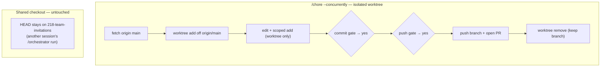
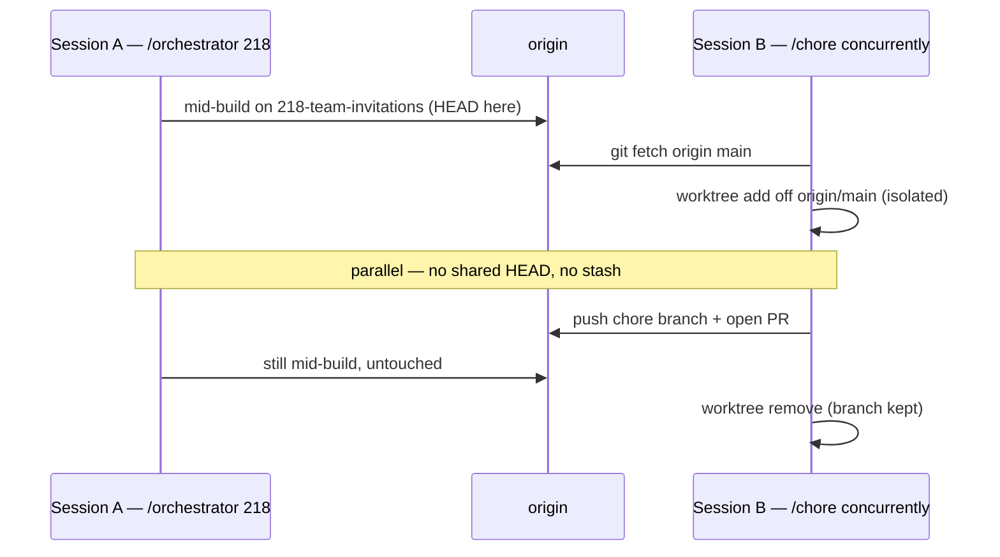

# Sample: a concurrency-safe chore — `/chore --concurrently`

> A frozen, representative example of what `/chore --concurrently` does. Like the
> other artifacts here it uses **ExampleApp** and the running **EX-218 "team
> invitations"** feature, so it slots into the same story. Nothing here is
> executable; it's the shape of a real run.

## The scenario

You're mid-flight on EX-218: `/orchestrator` has the `218-team-invitations`
branch checked out and `@developer` is partway through commit #2. A teammate
pings you about a typo in `README.md` — trivial, but you don't want to:

- move the shared checkout's `HEAD` off `218-team-invitations` (that would yank
  the ground out from under the in-flight `@developer` run), or
- stash / commit the half-finished invitations work just to slip in a one-line fix, or
- wait until EX-218 merges.

`/chore --concurrently` exists for exactly this. It does the whole fix in a
**throwaway git worktree based on `origin/main`**, opens its own PR, and never
touches the in-flight branch.

```text
/chore --concurrently fix the "recieve" typo in the README invitations section
```

## The mechanic at a glance

`--concurrently` does the whole chore in a throwaway worktree based on
`origin/main`, so the shared checkout — and whatever it has in flight — is never
touched:



The two sessions run on the same repo at the same time without colliding —
separate `HEAD`s, no stash, no waiting:



## What you'd see

### 1 — Scope + "is it a chore?"

> Chore: fix a typo (`recieve` → `receive`) in `README.md`. Single file,
> docs-only, no behavior change, low blast radius — passes the chore gate.
> Running in **`--concurrently`** mode (a session is active on
> `218-team-invitations`).

### 2 — Isolated worktree off the default branch

The shared checkout is **expected to look dirty** — that's the other session's
in-flight work, and the chore neither investigates nor touches it:

```text
$ git status --short            # the SHARED checkout (NOT our status of record)
 M app/models/invitation.rb     # ← EX-218, another session's work
 M app/controllers/invitations_controller.rb
?? app/views/invitations/

# the chore ignores all of that and works off origin/main instead:
$ git fetch origin main
$ git worktree add -b chore/readme-typo /tmp/exampleapp-chore-readme origin/main
Preparing worktree (new branch 'chore/readme-typo')

$ git -C /tmp/exampleapp-chore-readme status --short --branch
## chore/readme-typo...origin/main      # clean — THIS is our status of record
```

### 3 — Make the fix inside the worktree, scoped staging

```text
# the edit happens IN the worktree, via git -C — the shared checkout never moves
$ git -C /tmp/exampleapp-chore-readme add README.md     # only this file, never -A
```

### 4 — Commit gate (still gated — `--concurrently` changes *where*, not *whether*)

```text
 README.md | 2 +-
 1 file changed, 1 insertion(+), 1 deletion(-)

Commit message:  chore: fix "recieve" typo in the README invitations section
Target branch:   chore/readme-typo
```

> Waiting for explicit **"yes commit."** (The pre-commit hook runs the local
> quality gate on commit; nothing is bypassed.)

### 5 — Push gate (separate, fresh affirmation)

```text
chore/readme-typo  →  origin/chore/readme-typo
```

> Waiting for explicit **"yes push."**

### 6 — PR (summary-only) + teardown

```text
$ gh pr create --base main --head chore/readme-typo \
    --title 'chore: fix "recieve" typo in the README invitations section' ...
https://github.com/your-org/exampleapp/pull/231

$ git worktree remove /tmp/exampleapp-chore-readme   # keep the branch — the PR needs it
```

PR #231 lands on `main`, completely independent of the in-flight
`218-team-invitations` branch. Because this only touched `README.md`, an overlap
with EX-218 is unlikely — but if the chore *had* touched a file EX-218 also
changes, the run flags it (whoever merges first wins; the other side rebases).

The shared checkout's `HEAD`, index, and uncommitted EX-218 work are exactly as
they were. The `@developer` run never knew this happened.

## The `--bypass` variant (ASAP merge)

For a change that genuinely cannot break anything, add `--bypass` to ship it the
instant CI is green:

```text
/chore --concurrently --bypass fix the "recieve" typo in the README
```

`--bypass` is a per-invocation standing authorization: it stands in for the
"yes commit" / "yes push" prompts **and** admin-merges once CI passes — even past
a branch protection the author can't self-approve:

```text
# the moment CI is green:
$ gh pr merge 231 --squash --admin --delete-branch
✓ Merged PR #231 (admin override; branch protection required a review). CI was GREEN at merge time.
```

What `--bypass` **never** does — hard lines, even for an ASAP merge:

- **Never merges a red build.** CI must be green; a failing / errored check halts
  and surfaces verbatim — shipping a red `main` would break the concurrent
  session too.
- **Never widens scope** — the "is it actually a chore?" gate still applies.
- **Never uses** `--no-verify`, `git add -A`/`.`, or `git push --force`; **never**
  adds AI attribution.
- **Never silent** — it states which protection it overrode and that CI was green.

## When to reach for it

| Situation | Flag |
| --- | --- |
| Another session/agent is editing the same checkout (or you just want the active checkout untouched) | `--concurrently` |
| A 100%-safe fix (typo, comment, doc line) you want merged the moment CI is green | `--concurrently --bypass` |
| A normal solo chore, nothing else in flight | plain `/chore` |

`--concurrently` is what makes the toolbelt safe to run **in parallel with
itself** — the reason a chore can ride alongside a live `/orchestrator` build
instead of waiting in line behind it.

## Beyond chores — the same isolation covers reverts & merge-resolution

The isolated-worktree mechanic isn't chore-specific. **Any** branch operation that
would otherwise move the shared checkout's `HEAD` — a revert, a `git merge main` to
bring a PR up to date, or resolving the resulting conflict — can run the same way:
in its **own isolated instance** (a worktree off the relevant branch), concurrently
with other work, without touching the active checkout or another session's state.

The rule is identical to chores: **one isolated instance per operation.** Two
reverts (or two merge-resolutions) run safely in parallel as long as each lives in
its own worktree and they don't edit the same lines of the same file — at which
point the normal reconcile-at-merge rules apply (whoever lands first wins; the other
rebases). They never collide *while editing*, because each instance is isolated.

> Dogfood note: the `main`-merge consolidation on this very branch was done exactly
> this way — a revert of a mis-resolved merge, then a fresh, correctly-resolved
> `git merge main` in a throwaway worktree, while unrelated reviews ran in the
> background and the shared checkout stayed on its own branch, untouched.
