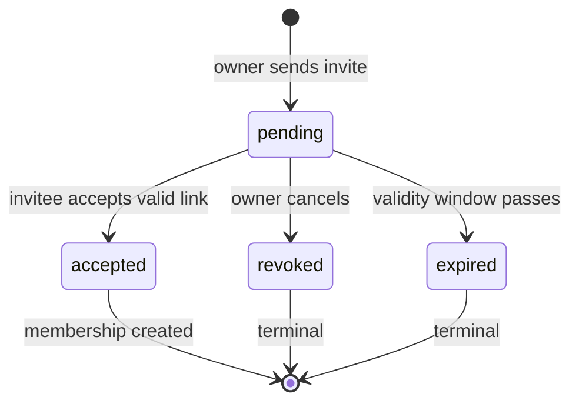
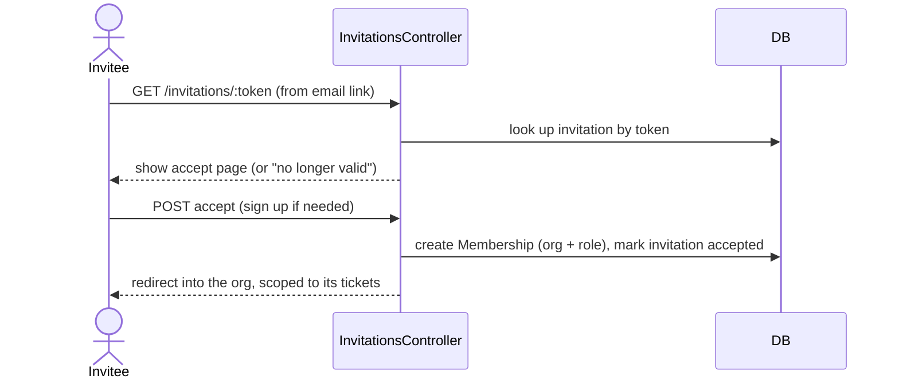
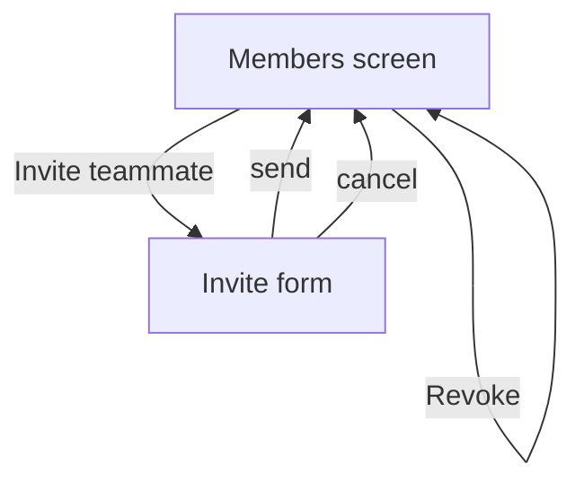

# Sample issue — `@product-owner` output

> Illustrative example of what the `@product-owner` agent produces: a scoped, business-language GitHub issue with explicit acceptance criteria and an embedded Mermaid diagram. The fictional app is **ExampleApp**, a multi-tenant B2B SaaS helpdesk (Organizations → Members → Tickets → Billing). Everything below is the issue body the agent would submit via `mcp__github__issue_write`.

---

**Title:** Team invitations — invite teammates into an organization by email

**Labels:** `feature`, `milestone:team-management`

---

## What we want

Organization owners can invite teammates by email so new people can join the org and start working tickets without an owner manually creating accounts for them.

## Why

Today the only way to add a member is for an owner to share credentials or have someone sign up and then get attached out-of-band — neither is safe or self-serve. Invitations let an org grow its team independently, which is the gating capability for the **Team Management** milestone (every later seat-based billing and role feature assumes members arrive via invitation).

## Acceptance criteria

1. **Owners can send an invitation.** From the org's Members screen, an owner enters an email address and picks a role (`agent` or `viewer`), and the invitee receives an email with a link to accept.
2. **Owners cannot grant `owner` via invitation.** The role picker offers only `agent` and `viewer`; ownership is transferred through a separate, deliberate flow, not handed out by email.
3. **Only owners can invite.** Members with the `agent` or `viewer` role do not see the invite control and cannot send invitations; an attempt returns a not-authorized response.
4. **Invitations are scoped to one organization.** An invitation belongs to the org it was created in and grants membership only to that org. An invite token from Organization A can never be used to join Organization B, and is never visible to members of any other org (cross-tenant access returns 404).
5. **Accepting creates the right membership.** When a signed-out invitee accepts, they complete signup and land in the inviting org with exactly the role on the invitation. When an already-registered user accepts, they are added to the org with that role without losing access to their existing orgs.
6. **The invitation lifecycle is enforced.** An invitation moves through `pending → accepted`, or `pending → revoked` (owner cancels), or `pending → expired` (link unused past its validity window). Only a `pending` invitation can be accepted; accepting a `revoked`, `expired`, or already-`accepted` invitation shows a clear "this invitation is no longer valid" message and creates no membership.
7. **Owners can manage pending invitations.** The Members screen lists pending invitations (email, role, sent date) separately from active members, and an owner can revoke a pending one, which immediately invalidates its link.
8. **Re-inviting is graceful.** Inviting an email that already has a pending invitation to the same org re-sends the invitation rather than creating a duplicate. Inviting someone who is already an active member of the org is blocked with an inline "already a member" message.
9. **The invite link is single-use and unguessable.** Each invitation link works once (consumed on acceptance) and uses a non-sequential token that cannot be guessed from another invitation's link.
10. **Empty / loading / error states are handled.** A Members screen with no pending invitations shows an explainer and the invite CTA rather than a blank table; a failed send re-shows the form with the entered email preserved and an inline error.
11. **The Members screen is usable on a small viewport.** At a phone-width viewport (e.g. 375×667) the members list, pending-invitations list, and invite form are usable with no horizontal scroll.
12. **Cardinal rules pass.** The change ships with the project's pre-commit hooks and CI green.

## Visualizations

Invitation lifecycle (status machine) — the acceptance criteria above hinge on this state graph:

Acceptance flow (cross-component) — how a click on the email link becomes a membership:

Members screen flow:

## Scope notes

- **In scope:**
  - Invite-by-email for `agent` and `viewer` roles, owner-only.
  - Invitation lifecycle: pending / accepted / revoked / expired.
  - Pending-invitations list + revoke on the Members screen.
  - Acceptance for both brand-new signups and existing users.
  - Tenant scoping + 404 on cross-org token use.
- **Out of scope:**
  - Bulk invite / CSV upload (one email at a time for now).
  - Ownership transfer and the `owner` role (separate issue).
  - Seat limits and billing enforcement on member count (Billing milestone).
  - Configurable invitation-expiry windows in org settings (fixed window for v1).
  - Resending notification emails on a schedule / reminder nudges.

## Dependencies

- **Requires:** Organization and Membership models with the `owner` / `agent` / `viewer` roles already in place; transactional email delivery configured.
- **Blocks:** Seat-based billing (needs a real invite-driven member count); per-role ticket permissions (assume members arrive via invitation).

## Milestone / sequencing

Team Management milestone, first issue. It is the prerequisite for the rest of the milestone — seat counting and role-scoped permissions both assume members join through invitations, so this should land before either of those is picked up.
