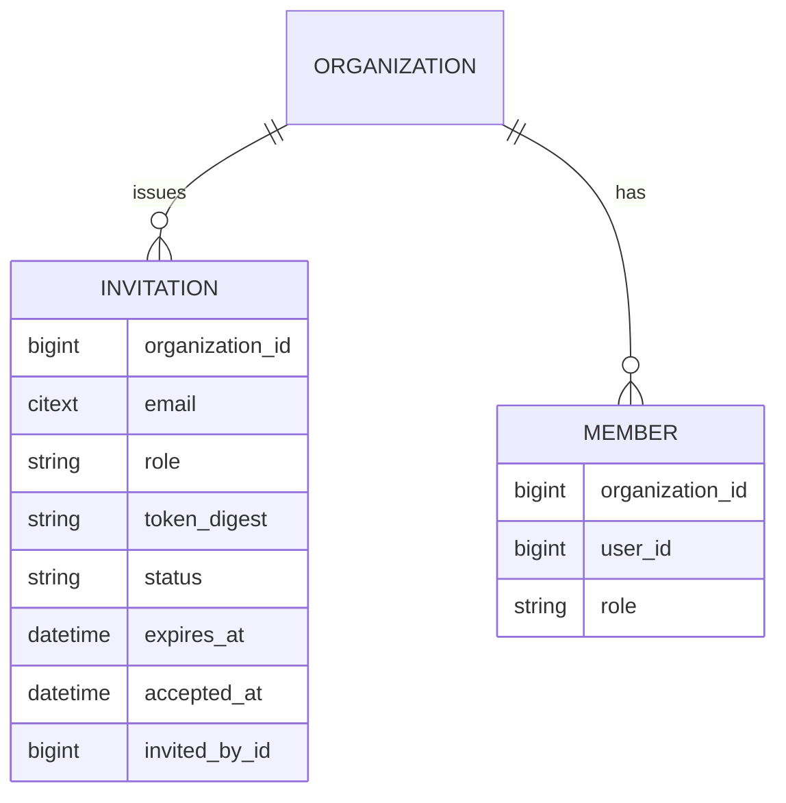
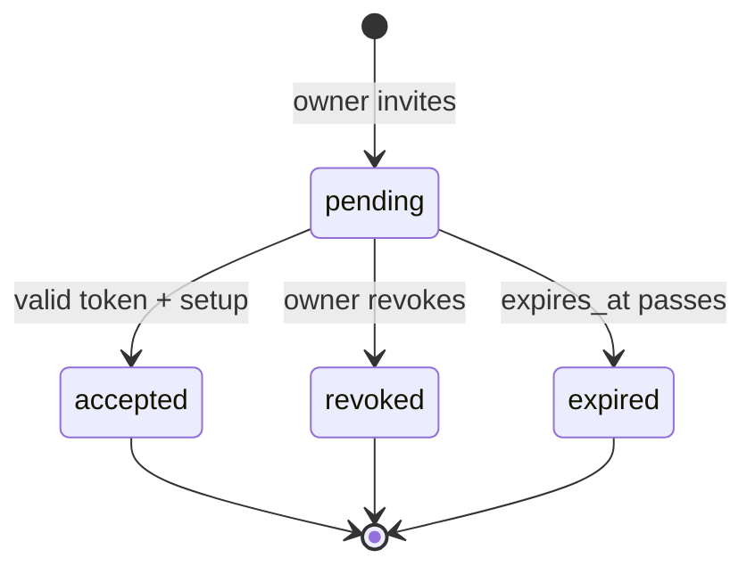
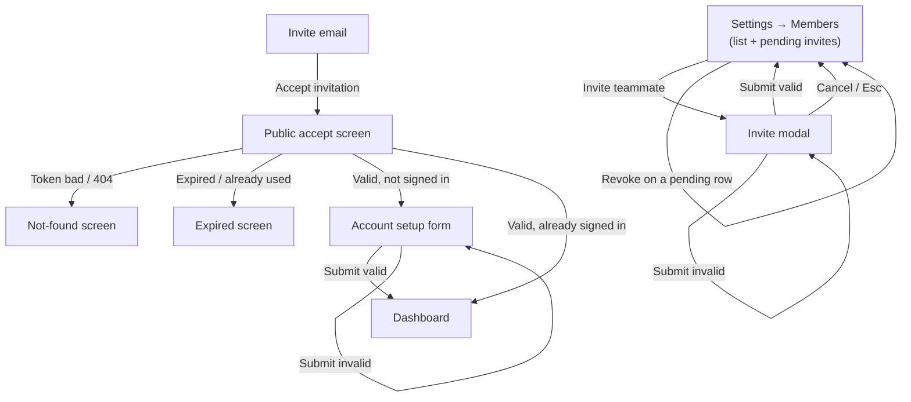
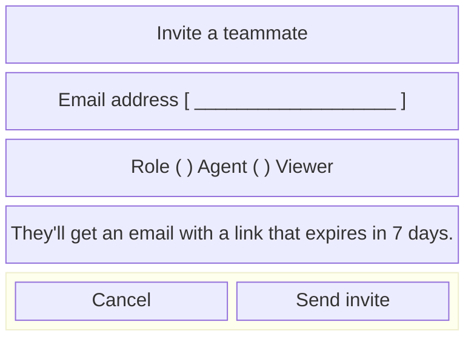

# EX-218 — Team invitations

**GitHub item:** https://github.com/exampleapp/exampleapp/issues/218

> Example `@architect` output. The fictional product is **ExampleApp**, a multi-tenant
> B2B SaaS helpdesk: Organizations → Members (owner / agent / viewer) → Tickets
> (comments, statuses) → Billing (plans, invoices). Every record is scoped to an
> organization; cross-tenant access must 404. Stack is Rails + PostgreSQL + a React
> front-end. This file demonstrates the plan template, including the UI/UX section
> with a screen-flow diagram, a low-fidelity wireframe, and a UX-flow note.

## Goal

Let an organization **owner** invite a new teammate by email and assign them a role
(`agent` or `viewer`) before they have an account. The invitee receives an email with a
single-use, time-limited link; accepting it creates their `Member` record scoped to the
inviting organization. Today the only way to add a member is a manual database insert, so
every onboarding is an engineering ticket. This feature turns onboarding into a
self-service flow owned by the customer.

## Architecture

A new `Invitation` model belongs to an `Organization` and carries the invitee email, the
target role, an opaque token (digested at rest), an expiry, and a status
(`pending` → `accepted` / `revoked` / `expired`). Owners create invitations from
**Settings → Members**; a background job sends the invite email. The acceptance link is the
**only** unauthenticated surface in the feature — it is reachable without a session because
the invitee does not yet have an account, so it is guarded by the token rather than by the
tenant session. Every other action (create, list, resend, revoke) runs inside the normal
authenticated, org-scoped controller stack and is authorized to `owner` only.

Token handling mirrors how the rest of ExampleApp treats secrets: we generate a random
token, email the **raw** value inside the link, and persist only a **SHA-256 digest**. Lookups
hash the incoming token and match on the digest, so a database leak never yields a usable
invite link. Acceptance is **idempotent at the boundary** — a second click on an
already-accepted link routes the now-authenticated member straight to their dashboard
instead of erroring.

Multi-tenancy is the load-bearing constraint. Invitations are created and listed strictly
through `current_organization.invitations`, never `Invitation.find`. The accept route is the
single exception to session-scoping (token-scoped instead), and it derives the organization
*from the invitation*, so an invite can only ever mint a member in the org that issued it —
there is no request parameter that could point acceptance at another tenant.

```mermaid
flowchart TD
    A[POST /settings/members/invitations] --> B{Session = owner?}
    B -->|No| C[403 / redirect]
    B -->|Yes| D{Email valid & not already a member?}
    D -->|No| E[Re-render form with errors]
    D -->|Yes| F{Pending invite already exists?}
    F -->|Yes| G[Reuse invite, resend email]
    F -->|No| H[Create Invitation digest token]
    H --> I[Enqueue InvitationMailer]
    G --> I
    I --> J[201 — row added to members list]

    K[GET /invitations/accept?token=...] --> L{Token matches a digest?}
    L -->|No| M[404]
    L -->|Yes| N{Status pending & not expired?}
    N -->|No| O[Show expired / used screen]
    N -->|Yes| P{Accepter signed in?}
    P -->|No| Q[Account setup screen]
    P -->|Yes| R[Create Member in invite's org]
    Q -->|Submit| R
    R --> S[Mark accepted, redirect to dashboard]
```





The `Invitation` status is a small lifecycle machine; the accept flow is the only transition
that an unauthenticated actor can trigger.



## Files to edit

- `app/models/organization.rb` — add `has_many :invitations`, `has_many :members`.
- `app/controllers/settings/members_controller.rb` — render the members + pending-invites list.
- `config/routes.rb` — nested `invitations` under `settings/members`, plus the public `accept` route.
- `app/frontend/pages/settings/Members.tsx` — add the "Invite teammate" CTA + pending-invite rows.
- `app/policies/member_policy.rb` — gate invite/revoke/resend to `owner`.

## Files to add

- `app/models/invitation.rb` — model, token generation/digest, status helpers, expiry scope.
- `app/controllers/settings/invitations_controller.rb` — `create` / `destroy` (revoke) / `resend`, all org-scoped + owner-only.
- `app/controllers/invitation_acceptances_controller.rb` — public `show` (accept screen) + `update` (finalize), token-scoped.
- `app/mailers/invitation_mailer.rb` + `app/views/invitation_mailer/invite.{html,text}.erb` — the invite email.
- `app/jobs/invitation_mailer_job.rb` — async delivery.
- `app/frontend/pages/settings/InviteTeammateDialog.tsx` — the invite modal (email + role).
- `app/frontend/pages/invitations/Accept.tsx` — the public accept / account-setup screen.
- `db/migrate/<ts>_create_invitations.rb` — see Migrations.

## UI/UX

Two surfaces: an **owner-facing** invite flow inside Settings (modal over the members list)
and a **public** accept flow the invitee lands on from the email. The members list grows a
"Pending invitations" group above the active members, each row carrying a state-appropriate
action (Resend / Revoke). Mobile (~375px): the invite modal becomes a full-screen sheet; the
members list collapses each row to two lines (name/email over a role chip + overflow menu).

### Screen-flow diagram



### Low-fidelity wireframe — Settings → Members (key screen)

```text
+--------------------------------------------------------------+
| ExampleApp        Tickets  Members  Billing      [ Avatar ▾] |
+------------------+-------------------------------------------+
| Settings         |  Members                  [ + Invite ]    |
|  • Profile       |                                            |
|  • Members  ◀     |  PENDING INVITATIONS                      |
|  • Billing       |  +--------------------------------------+  |
|                  |  | sam@acme.com   viewer  · pending      | |
|                  |  |                      [Resend][Revoke] | |
|                  |  | lee@acme.com   agent   · pending      | |
|                  |  |                      [Resend][Revoke] | |
|                  |  +--------------------------------------+  |
|                  |                                            |
|                  |  ACTIVE MEMBERS                            |
|                  |  +--------------------------------------+  |
|                  |  | Dana Owner    owner   (you)           | |
|                  |  | Ana Agent     agent          [ ▾ ]    | |
|                  |  +--------------------------------------+  |
+------------------+-------------------------------------------+
```

And the invite modal that opens over it:



### UX-flow note

- **Happy path (owner):** Owner clicks **+ Invite**, the modal opens with email + role.
  On submit the modal closes, the new invite appears at the top of "Pending invitations"
  with a `pending` chip, and a toast confirms "Invite sent to sam@acme.com." No full-page
  reload.
- **Happy path (invitee):** Invitee opens the email, clicks **Accept invitation**, lands on
  the public accept screen showing the org name and assigned role, sets a name + password,
  and is dropped into their new org's dashboard already signed in.
- **Empty state:** No pending invitations → the "Pending invitations" group is hidden
  entirely; the list shows only active members so the section never renders an empty box.
- **Loading state:** Submitting the modal disables the **Send invite** button and shows an
  inline spinner; the accept screen shows a skeleton card while the token is validated, so
  the invitee never sees a flash of the form before we know the token is good.
- **Error states:** (1) Inviting an email that is already a member → inline field error
  "That person is already on your team," no row added. (2) Invalid email → inline validation,
  modal stays open. (3) Bad/unknown token → dedicated **Not-found** screen (404), no hint that
  a token "almost" matched. (4) Expired or already-accepted token → **Expired** screen with a
  "Ask your admin to re-invite you" message and no form. (5) Mail delivery failure is async —
  the invite still lists as `pending`; **Resend** is the recovery affordance.

## Migrations

`db/migrate/<ts>_create_invitations.rb`:

- Table `invitations`:
  - `organization_id` (bigint, FK → organizations, not null)
  - `email` (citext, not null)
  - `role` (string, not null) — `agent` | `viewer` (no `owner` invites)
  - `token_digest` (string, not null)
  - `status` (string, not null, default `pending`)
  - `expires_at` (datetime, not null)
  - `accepted_at` (datetime, nullable)
  - `invited_by_id` (bigint, FK → members, not null)
  - `timestamps`
- Indexes:
  - unique on `token_digest`
  - unique partial on `(organization_id, email)` **where `status = 'pending'`** — at most one open invite per email per org
  - plain index on `organization_id` for the list query

No backfill — new table, no existing rows.

## Libraries

None. Token generation uses `SecureRandom` + `Digest::SHA256` (stdlib); email uses the
existing ActionMailer setup; the modal/accept screens use the existing React component kit.

## Test plan

- `spec/models/invitation_spec.rb`
  - generates a raw token but persists only the digest (raw never stored)
  - `expired?` true once `expires_at` passes; `pending` scope excludes expired/accepted/revoked
  - partial-unique index rejects a second `pending` invite for the same email in the same org
  - the same email **can** have a pending invite in two different organizations
- `spec/requests/settings/invitations_spec.rb`
  - owner creates an invite → 201, row appears, mailer job enqueued
  - agent/viewer attempting create → 403
  - inviting an existing member → 422 with the field error, no row
  - re-inviting an email with an open pending invite → reuses the row, resends, no duplicate
  - revoke flips status to `revoked` and the link stops working
  - **cross-tenant:** owner of Org A cannot revoke/resend an invite belonging to Org B → 404
- `spec/requests/invitation_acceptances_spec.rb`
  - valid token + setup → creates a `Member` in the **inviting** org with the invited role, marks `accepted`
  - unknown token → 404 (not 401, no token-shape leak)
  - expired token → expired screen, no member created
  - second click on an accepted link while signed in → redirect to dashboard, no duplicate member
  - acceptance ignores any org param and binds to the invitation's org
- `spec/mailers/invitation_mailer_spec.rb`
  - email contains the **raw** token link and the inviting org's name; does not contain the digest
- Front-end: a component test for `InviteTeammateDialog` (validation + disabled-while-submitting)
  and `Accept` (renders setup vs expired vs not-found by props).

## Blast radius

- **Sensitive surfaces:** introduces the feature's only unauthenticated route
  (`/invitations/accept`). Risk is token guessing and cross-tenant escalation — mitigated by
  the digest-at-rest lookup, expiry, single-use status, and deriving the org from the
  invitation rather than from a request param. Authorization for create/revoke/resend is
  owner-only via `MemberPolicy`.
- **Email deliverability:** a new outbound email; delivery runs in a background job so a
  mail-provider hiccup never blocks the request, and **Resend** is the manual recovery path.
- **Rollback:** feature is additive — new table, new routes, new screens. Rollback = revert
  the PR and drop the `invitations` table; no existing data is mutated and no member rows are
  touched on rollback (accepted members simply remain).

## Out of scope

- Inviting at the `owner` role (ownership transfer is its own flow).
- Bulk / CSV invites and domain-based auto-join.
- Seat-count enforcement against the Billing plan (tracked separately under EX-231).
- Re-sending on a configurable cadence / reminder emails.

## Acceptance criteria

- Ships when an **owner** can invite a teammate by email at the `agent` or `viewer` role and
  see the invite listed as `pending`.
- Ships when the invitee receives an email whose link contains a token that is **never**
  stored in plaintext (only its digest is persisted).
- Ships when accepting a valid, unexpired link creates a `Member` in the **inviting**
  organization at the invited role and signs the invitee in.
- Ships when an expired, revoked, or already-used link shows a clear non-form screen and
  creates no member.
- Ships when an unknown/garbage token returns **404** with no indication a token nearly matched.
- Ships when at most one open (`pending`) invite can exist per email per organization, while
  the same email may hold pending invites in **different** organizations.
- Ships when a non-owner (`agent`/`viewer`) cannot create, revoke, or resend invitations.
- Ships when an owner of one organization gets **404** trying to act on another org's
  invitation (no cross-tenant access).
- Ships when the members screen renders correctly at ~375px (invite modal becomes a sheet,
  pending group hides when empty).

## Follow-up at merge time

- [ ] Update `docs/architecture.md` §Members — note the new `Invitation` lifecycle and the single unauthenticated accept route.
- [ ] Update `CLAUDE.md` — record the "email raw token, persist only the digest" convention so future token features follow it.
- [ ] Open the seat-count enforcement issue (EX-231) so invites and Billing plans reconcile.
