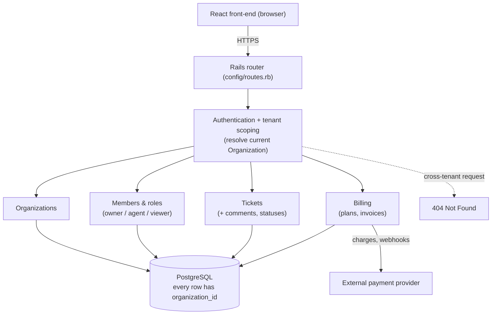

# Architecture Overview

ExampleApp is a multi-tenant helpdesk that several customer companies use at the same time without ever seeing each other's data. Each customer company gets its own private workspace — an "organization" — where its people sign in, work through support requests, and pay for the product. The whole system is built around one promise: anything stored in ExampleApp belongs to exactly one organization, and a person from one organization can never reach another organization's data. This page explains, in plain terms first and then technically, what the major parts of ExampleApp are, how a request flows through them, and where the tenant-isolation promise is enforced.

## Overview / How it works

ExampleApp is a server-rendered-plus-API Rails application backed by PostgreSQL, with a React front-end for the interactive screens. (INFERRED from the stack described in `CLAUDE.md` and the manifest layout; the sample wiki keeps stack detail light.) The system decomposes into four cooperating domain areas:

- **Organizations** — the tenant boundary. Every other record carries an `organization_id` and is queried only within the current organization's scope.
- **Members & roles** — the people in an organization, each holding one of three roles: `owner`, `agent`, or `viewer`. Roles gate what a person may do (e.g. only an `owner` may invite teammates).
- **Tickets** — the support requests themselves, with their comments and a status lifecycle. This is the day-to-day work surface for agents.
- **Billing** — plans and invoices: how an organization pays for ExampleApp. Covered in depth on the [Billing](./module-billing.md) page.

**Tenant isolation (the cardinal rule).** Every domain record is scoped to an organization, and cross-tenant access must return `404` rather than `403` — the system reveals nothing about records in other tenants, not even their existence. (VERIFIED against the project's stated cardinal rule: "every record is scoped to an organization; cross-tenant access must 404.") A controller resolves the current organization from the authenticated member's session, then loads every subsequent record *through* that organization's association, so a record from another tenant is simply not found. (INFERRED — this is the standard Rails pattern the rule implies; the exact scoping helper would be cited at `file:line` in a full build.)

**Request path.** A browser request hits the Rails router, which dispatches to a resource controller. The controller authenticates the member, establishes the tenant scope, performs the domain action against PostgreSQL through the scoped associations, and renders JSON for the React front-end (or HTML for server-rendered pages). Billing-related actions additionally reach an external payment provider for charges and webhooks — see the [Billing](./module-billing.md) page.

### High-level component & data flow

The dashed edge is the load-bearing invariant: a request for a record outside the caller's organization terminates at `404`, never reaching the domain layer for another tenant.

## Related files

> Repo-relative paths for the real ExampleApp source these areas live in. In this sample wiki the file bodies are illustrative; in a full build each line is verified to exist and cites its key symbols at `file:line`.

- `config/routes.rb` — top-level route table; mounts the resource controllers below.
- `app/controllers/application_controller.rb` — `current_organization`, `authenticate_member!` — establishes auth + tenant scope for every request.
- `app/models/organization.rb` — `Organization` — the tenant root; `has_many` for members, tickets, plans, invoices.
- `app/models/membership.rb` — `Membership` — joins a member to an organization with a `role` (`owner`/`agent`/`viewer`).
- `app/models/ticket.rb` — `Ticket`, `Comment` — the support-request lifecycle.
- `app/models/billing/` — `Plan`, `Invoice` — the Billing data layer; see the [Billing](./module-billing.md) page.

## Related pages

- [Billing module](./module-billing.md)
- [Home / index](./Home.md)

---
_Last verified against commit `a1b9f3c`._
