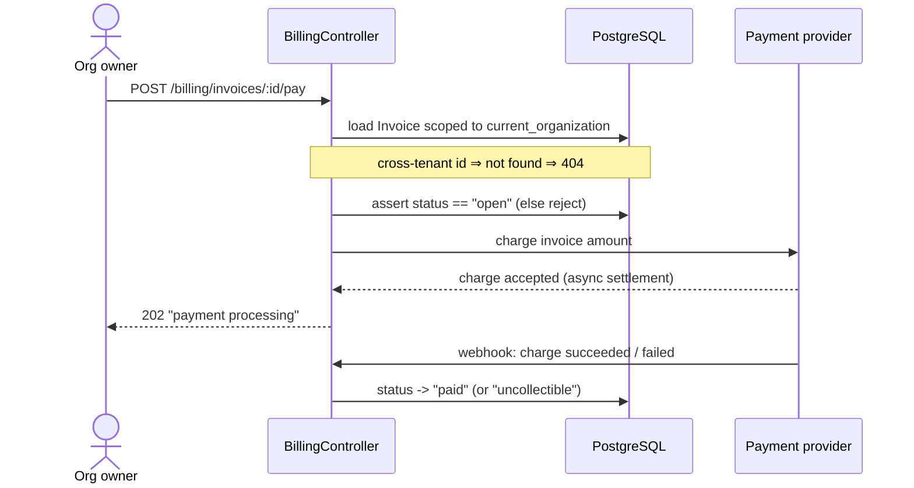
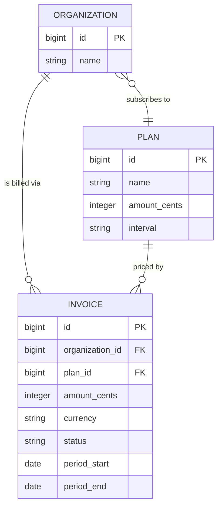

# Billing Module

Billing is how a customer company pays for ExampleApp. Each organization is on a plan (for example a monthly subscription tier), and the system periodically produces invoices — itemized bills the organization owes — and tracks whether each one has been paid. This module owns the rules around what an organization is charged, when an invoice is issued, and how an invoice moves from "we owe this" to "this is paid" (or, if a charge fails, to "this needs attention"). Like every part of ExampleApp, billing is strictly scoped to a single organization: one company can never see, open, or pay another company's invoices.

## Overview / How it works

The Billing module is built from two persisted entities — `Plan` and `Invoice` — plus the controller that exposes them to the front-end. (INFERRED structure for this sample; in a full build each symbol is cited at `file:line`.)

- **`Plan`** — what an organization has signed up for: a name, a price, and a billing interval. An organization references exactly one plan at a time; the plan determines the amount that lands on each invoice. (INFERRED.)
- **`Invoice`** — a single bill issued to an organization. It records the amount due, the currency, the period it covers, and a `status` that moves through a small lifecycle. Every invoice belongs to one organization (`organization_id`) and references the plan it was billed under. (VERIFIED-by-design against the tenant rule: cross-tenant invoice access returns `404`.)

**Invoice lifecycle.** An invoice is created in `draft` while it is being assembled, then `open` once it is finalized and owed. A successful payment moves it to `paid`; a failed charge moves it to `uncollectible` (needs attention); an invoice cancelled before payment becomes `void`. Only an `open` invoice can be paid — attempting to pay a `void`, `uncollectible`, or already-`paid` invoice is rejected. (INFERRED lifecycle, modeled on the same state-machine discipline the project applies elsewhere; a full build would cite the enum and the guard at `file:line`.)

**Charging.** Finalizing an `open` invoice triggers a charge against the external payment provider. The provider's asynchronous webhook is what actually flips the invoice to `paid` or `uncollectible` — the application does not assume success at request time. (INFERRED — standard provider-webhook pattern; the webhook handler path would be cited in a full build.)

> needs SME review — the exact retry/dunning behavior on a failed charge (how many times, over what window, before an invoice is marked `uncollectible`) is not determinable from the model code alone. An SME should confirm the dunning policy before this section is treated as VERIFIED.

### Invoice creation & payment (sequence)

### Billing data relationships (ER)

## Data model / Schema

Columns and types as they would appear in `db/schema.rb` for ExampleApp. (Illustrative for this sample wiki; in a full build each column is read from the schema/migration and the table is ground-truth, not paraphrase.)

### `plans`

| Column | Type | Notes |
|---|---|---|
| `id` | `bigint` | Primary key. |
| `name` | `string` | Human-readable tier name (e.g. "Team", "Business"). |
| `amount_cents` | `integer` | Price per interval, in the smallest currency unit. |
| `interval` | `string` | Billing cadence: `month` or `year` (INFERRED enum). |
| `created_at` | `datetime` | Standard Rails timestamp. |
| `updated_at` | `datetime` | Standard Rails timestamp. |

### `invoices`

| Column | Type | Notes |
|---|---|---|
| `id` | `bigint` | Primary key. |
| `organization_id` | `bigint` | FK → `organizations.id`. The tenant scope; not-null, indexed. Cross-tenant access ⇒ `404`. |
| `plan_id` | `bigint` | FK → `plans.id`. The plan this invoice was billed under. |
| `amount_cents` | `integer` | Amount due, in the smallest currency unit. |
| `currency` | `string` | ISO 4217 code (e.g. `usd`). |
| `status` | `string` | Lifecycle: `draft` / `open` / `paid` / `uncollectible` / `void` (INFERRED enum). |
| `period_start` | `date` | First day of the billing period this invoice covers. |
| `period_end` | `date` | Last day of the billing period. |
| `created_at` | `datetime` | Standard Rails timestamp. |
| `updated_at` | `datetime` | Standard Rails timestamp. |

## Related files

> Real repo-relative paths the Billing module lives in, with the key symbols in each. In this sample wiki the bodies are illustrative; in a full build each path is verified to exist.

- `app/models/billing/plan.rb` — `Billing::Plan` — `belongs_to :organization` association target; defines `amount_cents`, `interval`.
- `app/models/billing/invoice.rb` — `Billing::Invoice`, `status` enum, `pay!`, `mark_paid!`, `mark_uncollectible!` — the invoice lifecycle + guards.
- `app/controllers/billing/invoices_controller.rb` — `Billing::InvoicesController#index`, `#show`, `#pay` — organization-scoped invoice endpoints.
- `app/controllers/billing/webhooks_controller.rb` — `Billing::WebhooksController#create` — receives provider settlement webhooks; flips invoice status.
- `db/schema.rb` — `plans`, `invoices` table definitions (the schema tables above are derived from here).
- `config/routes.rb` — the `namespace :billing` route block mounting the controllers above.

## Related pages

- [Architecture overview](./architecture-overview.md)
- [Home / index](./Home.md)

---
_Last verified against commit `a1b9f3c`._
