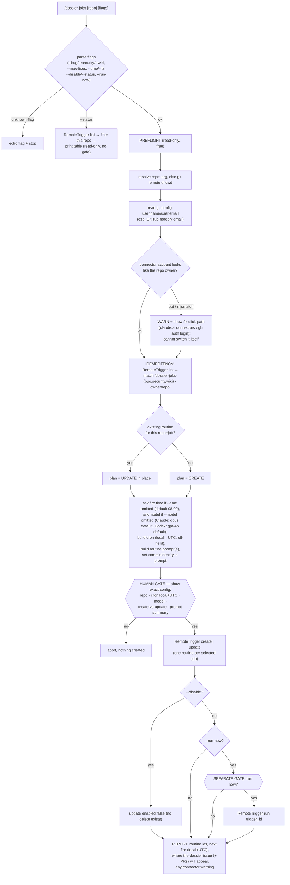

# /dossier-jobs — one-command setup for scheduled cloud "dossier" routines

You are the **conductor**. You do NOT sweep for bugs, run the security compliance sweep, or write wiki pages yourself — you set up and manage the **schedule**. The heavy lifting happens later, in the cloud, when each scheduled routine fires: the routine's *prompt* (which you author here) invokes `/bug-catcher --global`, the compliance sweep, or `/wiki-generator` inside the claude.ai/code environment. Your job is purely **setup + lifecycle of the schedule**, delegated twice over — first to the cloud routine, then (inside the routine) to the existing toolbelt skills (or a generic equivalent on a repo that lacks them).

The argument is in `$ARGUMENTS` — an optional `<repo>` (positional, e.g. `owner/repo` or a clone URL) optionally preceded/followed by flags. With no positional repo, the target is resolved from the cwd's `git remote`. With no actionable flag and no repo and no resolvable remote, explain what the skill does and ask for the repo (or confirm the cwd) **before doing anything**.

The skill's entire value is encoding eight hard-won operational lessons (idempotency, commit identity, connector preflight, rolling-issue dedup, revision stamps, no-AI-attribution, repo-agnostic methodology, human-gating) so a user never re-learns them by hand. See **Eight lessons baked in** below — they are acceptance criteria, not suggestions.

## Auto-detection on every invocation

Before doing anything, detect the shape of the work so the gates, identity, and conventions are right:

1. **`CLAUDE.md` + `CLAUDE.local.md`** — the project's cardinal rules and conventions. They override anything here on conflict.
2. **Target repo** — the positional `$ARGUMENTS` repo if given; else `git -C <cwd> remote get-url origin` (normalize to `owner/repo` + the `https://github.com/owner/repo` URL). If neither resolves, stop and ask.
3. **Commit identity** — `git config user.name` and `git config user.email` of the **invoking user** (especially the GitHub-noreply email that maps commits to their account). These become the `git config` the routine prompt sets at runtime — read them **fresh** during preflight; never hardcode a captured literal into this file.
4. **Host timezone** — the system tz (for the `--time` default), always **echoed** in the confirm panel, never silently assumed.
5. **The `RemoteTrigger` tool** — confirm it is available before the gate. If it is not, do not error — print the exact config + the manual setup path (see the circuit-breaker table).
6. **Whether the target repo / the user's plugins ship `/bug-catcher` and `/wiki-generator`** — informs the HYBRID branch the routine prompt encodes (run the skill if present, else a generic equivalent). This is a *runtime* decision the routine makes inside the cloud env; the prompt carries both branches.

## Cardinal rules (non-negotiable — inherited from the project's CLAUDE.md / CLAUDE.local.md)

1. **Reads and preflights are free; the outward action is gated.** The single outward, gated action is the `RemoteTrigger` create/update/run call. Everything before the gate — resolving the repo, reading `git config`, listing existing routines, the connector sanity-check — is read-only and requires no confirmation.
2. **Explicit, fresh, per-action human confirmation.** Creating/updating routines is gated behind an explicit "yes"; `--run-now` is a **separate** fresh "yes" after that. Never bundle the two; never infer approval from an earlier "go" or from silence. `--status` is read-only — no gate.
3. **No AI attribution** anywhere — not in this skill, not in the routine prompts it installs, not in the commits/PRs those routines produce. The installed prompts must strip any platform-appended "Generated by Claude Code" footer (see lesson 6).
4. **Idempotency is structural.** Before any create, list existing routines and match on the deterministic per-repo+job name (`dossier-jobs-{bug,security,wiki} · owner/repo`); on a match, **UPDATE in place** — never create a second routine. The API has **no delete**, so a duplicate is permanent. The routine-name scheme is **frozen post-ship** — renaming it strands old routines un-findable AND un-deletable.
   > **One-time migration (the former `/overnight` → `/dossier-jobs` rename).** Routines created by the old `/overnight` command used the `overnight-{bug,security,wiki} · owner/repo` scheme and fed an `[overnight] Dossier` issue; `/dossier-jobs` does **not** find them. Delete the stale `overnight-*` routines in the claude.ai UI (Settings → Automations/Routines — the API has no delete), then re-run `/dossier-jobs` to create the renamed routines fresh. The old `[overnight] Dossier` issue can be closed by hand.
5. **Every identity/path value in this skill is a PLACEHOLDER.** Use `<you>@users.noreply.github.com`, `<owner>/<repo>`, `<your-name>` — never a real captured email and never an absolute home path (the repo's leak-grep CI gate hard-fails on `/Users/<lowercase>`). The routine writes `git config` from *runtime* values read during preflight, not from anything written here.
6. **No unattended catastrophe.** SEV1 findings are never auto-developed; security findings never get a fix PR; every auto-developed fix PR is a **DRAFT** the routine **never merges** and that runs the project's local quality gate. The wiki routine is **propose-only** (one rolling PR). These are the structural safety floor (see lesson 4 + the note in **SEV1-exclusion + the cap are best-effort**).

## Flags (the full surface)

Parse flags first; the remaining non-flag token is the positional `<repo>`. An unrecognized `--flag` → **echo it and stop**; never guess intent (mirrors `/chore`).

| Flag | Effect |
|---|---|
| _(none)_ + optional `<repo>` | Set up **all three** job routines (bug · security · wiki) for `<repo>` (or the cwd's `git remote` if omitted), all feeding the shared `[dossier-jobs] Dossier` issue. |
| `--bug` / `--security` / `--wiki` | Select which jobs to set up — each becomes its **own** routine; any subset works (e.g. `--bug --security` ⇒ 2 routines). No job flag ⇒ all three. (`--bug-only` etc. are single-job aliases.) |
| `--max-fixes <n>` | Cap on auto-developed DRAFT fix PRs per bug run (default **5**, SEV2–SEV4 by severity). SEV1 is never auto-developed regardless. **Prompt-enforced/best-effort** (see below), not a tool gate. |
| `--time <hh:mm>` | Local fire time. **If omitted, the skill ASKS for the time before the create gate, defaulting to `08:00` if you skip.** Each selected job's routine is staggered a few minutes apart from this time (off the `:00`/`:30` herd). |
| `--model <model-id>` | Model for the routines. **If omitted, the skill ASKS at setup time** — Claude path: `claude-opus-4-8` (default), `claude-sonnet-4-6`, `claude-haiku-4-5`; Codex path: `gpt-4o` (default), `gpt-4.1`, `o3`, `o4-mini`. |
| `--tz <IANA>` | Timezone for `--time` (default: host system tz, **always echoed** in the confirm). |
| `--status` | **Read-only**: list this repo's dossier-jobs routines (enabled?, next fire local+UTC, last run). No gate. |
| `--disable` | Set `enabled:false` on this repo's routines (the API has no delete). Re-running `/dossier-jobs` re-enables. |
| `--run-now` | After create/update, fire `RemoteTrigger {action:"run"}` **behind its own separate gate** to validate the connector/identity wiring immediately instead of waiting for the next scheduled fire. |
| unknown `--flag` | Echo it and stop — never guess intent. |

`$ARGUMENTS` empty and no actionable flag → the skill explains what it does and asks for the repo (or confirms the cwd) before doing anything.

## How the RemoteTrigger routine is shaped

Cloud routines are created with the **`RemoteTrigger`** tool (the claude.ai/code routines API). The create body shape — verified working — is:

```jsonc
{ "name": "<routine name>",
  "cron_expression": "<5-field UTC, MIN interval 1h>",
  "enabled": true,
  "job_config": { "ccr": {
    "environment_id": "<env id>",
    "session_context": {
      "model": "<user-selected or runtime default — Claude: claude-opus-4-8/sonnet-4-6/haiku-4-5; Codex: gpt-4o/gpt-4.1/o3/o4-mini>",
      "sources": [ { "git_repository": { "url": "https://github.com/<owner>/<repo>" } } ],
      "allowed_tools": ["Bash","Read","Write","Edit","Glob","Grep"]
    },
    "events": [ { "data": {
      "uuid": "<fresh v4 uuid>",
      "session_id": "",
      "type": "user",
      "parent_tool_use_id": null,
      "message": { "role": "user", "content": "<routine prompt>" }
    } } ]
  } } }
```

- **`model` + `allowed_tools` are a target-seam parameter**, not a literal the conductor hardcodes. The user selects the model at setup time (via `--model` or the at-setup ask); the conductor injects the chosen value here. Claude path options: `claude-opus-4-8` (default), `claude-sonnet-4-6`, `claude-haiku-4-5`. Codex path options: `gpt-4o` (default), `gpt-4.1`, `o3`, `o4-mini`. Keep the create/update/run mechanism behind this seam so the conductor logic ports unchanged. **Wiring the Codex routine backend is out of scope here** (it belongs to the Codex port); this iteration only keeps the seam clean.
- **Cron is UTC** with a **minimum interval of 1h**. The skill converts the user's local `--time`/`--tz` to a 5-field UTC expression and deliberately **avoids the `:00`/`:30` herd** — e.g. for 08:00 Pacific it schedules bug at `0 15 * * *`, security a few minutes later at `5 15 * * *`, wiki at `10 15 * * *` (08:00 / 08:05 / 08:10 local), so two routines for the same repo never fire in the same instant and the cloud fleet isn't stampeded on the hour.
- `RemoteTrigger {action:"list"}` enumerates routines; `{action:"update",trigger_id}` edits one; `{action:"run",trigger_id}` runs one now. **There is no delete** — `--disable` sets `enabled:false` via `update`.
- **DST-drift note.** RemoteTrigger crons are **UTC and DST-naive**. A cron pinned to a fixed UTC hour will fire **±1h off the intended local time** across a daylight-saving transition (e.g. an 08:00-Pacific routine drifts to 09:00 or 07:00 local for the half of the year on the other side of the DST boundary) **until the routine is re-saved** at the new offset. State this in the confirm panel / report when the resolved tz observes DST, so the user knows a seasonal re-run of `/dossier-jobs` re-pins the local fire time.

## Control flow

**parse args/flags → preflight (read-only, free) → idempotency list-check → gated confirm → create-or-update the routine(s) → optional gated run-now → report.** The single outward, gated action is the `RemoteTrigger` create/update/run call; everything before the gate is read-only.



## Steps

### 1 — Parse + resolve

Parse flags (job selection, `--max-fixes`, `--time`/`--tz`, `--status`/`--disable`, `--run-now`); an unknown flag → echo + stop. Resolve the target repo (positional arg, else cwd's `git remote`); if neither resolves, stop and ask. `--status` short-circuits to a read-only list (Step 6) with no gate. If no `--time` was given and the run will create/update (not `--status`/`--disable`), **ask the user for the local fire time before building the config — default to `08:00` if they skip.** Similarly, if no `--model` was given, **ask which model the routines should use — Claude path: `claude-opus-4-8` (default), `claude-sonnet-4-6`, `claude-haiku-4-5`; Codex path: `gpt-4o` (default), `gpt-4.1`, `o3`, `o4-mini` — default to the runtime's native default if the user skips.** (The chosen time is still echoed in the confirm panel, so the gate shows it either way.)

### 2 — Preflight (read-only, free)

- **Commit identity (lesson 2):** read `git config user.name` / `user.email` — *especially the GitHub-noreply email*. These feed the `git config …` the routine prompt sets at runtime so dossier commits attribute to the user, not the cloud env's default bot.
- **Connector preflight (lesson 3):** the account that authenticates the push / opens the PR is the **claude.ai GitHub connection** (account-level, bound at routine creation) — **NOT settable from the routine prompt**. Detect/warn if it looks like a bot vs the repo owner, and document the fix click-path: **the claude.ai connectors settings** (Settings → Connectors → GitHub), or `gh auth login`; then **re-create or re-save** the routines after switching, since identity binds at creation. The skill **cannot switch the connector itself** — it can only warn loudly.
- **Tooling (lesson 7):** note whether `/bug-catcher` and `/wiki-generator` are reachable so the routine prompt's HYBRID branch is accurate.

### 3 — Idempotency list-check (lesson 1)

`RemoteTrigger {action:"list"}`, **reading the full list** (handle pagination / eventual-consistency, so a not-yet-visible prior create can't spawn a duplicate). Match on the deterministic name per repo+job: `dossier-jobs-bug · <owner>/<repo>`, `dossier-jobs-security · <owner>/<repo>`, `dossier-jobs-wiki · <owner>/<repo>`. A match ⇒ plan = **UPDATE** that routine; no match ⇒ plan = **CREATE**. Surface the result as `action: CREATE|UPDATE` per job in the confirm panel.

### 4 — Build the config

For each selected job: build the cron (local `--time`/`--tz` → 5-field UTC, honoring the 1h-minimum, staggered off-herd), build the routine prompt (templates below), and inject the commit-identity config from Step 2. The `model`/`allowed_tools` come from the target seam.

### 5 — Gated confirm + create/update (lesson 8)

Show the **exact** config and require an explicit "yes" BEFORE any `RemoteTrigger create/update`. The panel shows, per selected job: repo · cron in **local AND UTC** · model · create-vs-update · a prompt summary · the commit-identity line · the connector warning (if any) · the DST note (if the tz observes DST). Shape:

```text
About to CREATE 3 dossier-jobs routines for <owner>/<repo>
  (all feed one shared issue: [dossier-jobs] Dossier)
  ┌ bug        dossier-jobs-bug · <owner>/<repo>            [action: CREATE]
  │   fires: 08:00 <IANA tz>  →  cron (UTC): 0 15 * * *
  │   runs: /bug-catcher --global (or generic) → its Bug comment
  │         + auto-dev top 5 NON-SEV1 findings → DRAFT, never-merged fix PRs
  ├ security   dossier-jobs-security · <owner>/<repo>       [action: CREATE]
  │   fires: 08:05 <IANA tz>  →  cron (UTC): 5 15 * * *
  │   runs: generic repo-wide compliance sweep → its Security comment
  │         (issue-only, NO fix PRs)
  ├ wiki       dossier-jobs-wiki · <owner>/<repo>           [action: CREATE]
  │   fires: 08:10 <IANA tz>  →  cron (UTC): 10 15 * * *
  │   runs: /wiki-generator (or generic) full build → its Wiki comment
  │         + ONE rolling propose-only PR (not one PR per page)
  │ model: <user-selected — claude-opus-4-8 / claude-sonnet-4-6 / claude-haiku-4-5 on Claude; gpt-4o / gpt-4.1 / o3 / o4-mini on Codex>
  └ commits attribute to: <your-name> <<you>@users.noreply.github.com>
  ⚠ connector check: the claude.ai GitHub connection authenticates the push/PR —
    verify it is YOUR account (not a bot) before relying on attribution.
    Fix: claude.ai → Settings → Connectors → GitHub (or `gh auth login`),
         then re-save these routines (identity binds at creation).
  ⓘ DST: cron is UTC + DST-naive — the local fire time drifts ±1h across a DST
    transition until you re-run /dossier-jobs to re-pin it.
Proceed? (explicit "yes" required)
```

On "yes" → `RemoteTrigger create | update`, one routine per selected job. `--disable` instead issues `update` with `enabled:false`.

### 5b — Optional run-now (separate gate)

If `--run-now`, after the routines exist, ask a **separate, fresh** "run now?" gate. On "yes" → `RemoteTrigger {action:"run", trigger_id}` per created/updated routine, to validate the connector/identity wiring end-to-end immediately.

### 6 — Report (or `--status` table)

Report routine ids, next fire (local + UTC), where the dossier issue (+ PRs) will appear, any connector warning, and the DST note. `--status` prints a read-only table of this repo's routines (name, enabled?, next fire local+UTC, last run) with no gate and no create/update.

**Rollback note for the report/PR body:** reverting the toolbelt plugin removes this skill but does **not** delete any cloud routines a user already created — those live in the RemoteTrigger backend, not in the repo. `--disable` is the teardown path for already-created routines.

---

## The dossier output model

The dossier is a **rolling GitHub tracking ISSUE** titled `[dossier-jobs] Dossier` (one per repo). Each enabled job is **always its own cloud routine**, staggered a few minutes apart; they condense into the one shared issue.

### Race-safe coordination via per-job COMMENTS (not a shared body)

`gh issue edit --body` is a **full-body overwrite** with no per-section atomicity, and the bug run alone can take 20–40 min and overlap the others — three routines editing one body would lost-update each other. So:

- The issue **body** is a static index + a `🚨 Review first` skeleton **seeded once** on first setup and **never rewritten by a routine**.
- **Each job owns ONE comment** tagged with a hidden marker — `<!-- dossier-jobs:bug -->`, `<!-- dossier-jobs:security -->`, `<!-- dossier-jobs:wiki -->` (the three tokens are distinct, so the routines never edit each other's comment) — and **only ever edits THAT comment**, leading its comment with its own criticals (bug SEV1/SEV2; security compliance-blockers / P0s). There is no single `gh` create-or-edit-by-marker primitive, so the routine does it in two steps: **read** the issue's comments, **find** its own marker, then **edit that comment by id** if present (`gh api -X PATCH …/issues/comments/<id>`) or **create** one with the marker embedded (`gh issue comment`) if not — the exact commands are in the shared preamble's step 3 below.
- Because every routine touches only its own marker-tagged comment, they **cannot clobber each other** — the per-comment edit is the race-safe coordination primitive. With one job selected there is just the one job-comment.

### Rolling discipline (all jobs)

Each run FIRST `gh issue list … "[dossier-jobs] Dossier in:title"` (reading the **full** list — handle pagination / eventual-consistency so a not-yet-visible prior create can't spawn a duplicate). On an open match it finds **its own marked comment** and rolls it forward in place: adds new items with `First seen: <date>`, leaves still-open items unchanged (their original date is the reference), checks off resolved ones, bumps that comment's `Last updated: <date>`. If the issue is absent it creates it (seeding the body skeleton) and adds its comment; if the issue exists but its own comment is missing, it adds the comment. Auto-developed fix PRs (bug) and the single rolling wiki PR follow the same find-open-then-update-else-create rule. **A quiet run touches nothing.**

### SEV1-exclusion + the `--max-fixes` cap are PROMPT-enforced (best-effort)

The SEV1-never-auto-developed rule and the `--max-fixes` cap are **prompt-enforced/best-effort**, not a tool gate. The **structural** safety floor is **draft + never-merged** (bug fix PRs) and **propose-only** (wiki PR): every auto-dev PR is unreviewed-by-construction, never auto-merged, and runs the project's local quality gate. The manual read of the bug prompt's SEV-gating clause is an explicit acceptance gate (covered by `@pr-reviewer`).

---

## Routine-prompt templates (what each routine installs)

These are the prompts the skill writes into each routine's `message.content`. The cloud routine *executes* them; this skill only *authors* them. Every `<placeholder>` is filled at preflight from runtime values — never a captured literal, never an absolute home path. Each prompt opens with the shared preamble.

### Shared preamble (every routine)

```text
You are an unattended scheduled routine for <owner>/<repo>. Operate autonomously and idempotently.

COMMIT IDENTITY: run, before any commit —
  git config user.name "<your-name>"
  git config user.email "<you>@users.noreply.github.com"
so commits attribute to the invoking user, not the cloud env's default bot.

NO AI ATTRIBUTION: never add an AI co-author trailer or a "generated by an AI assistant"
footer to any commit or PR. If the platform auto-appends a "Generated by Claude Code"
footer to a PR body, STRIP it via `gh pr edit <n> --body "<clean body>"`.

SHARED DOSSIER ISSUE: there is ONE rolling issue per repo, titled exactly `[dossier-jobs] Dossier`.
  1. `gh issue list --search "[dossier-jobs] Dossier in:title" --state open` — read the FULL list
     (handle pagination / eventual-consistency; a not-yet-visible prior create must NOT spawn a duplicate).
  2. If absent: create it, seeding a STATIC body = an index + a `## 🚨 Review first` skeleton.
     NEVER rewrite the body on later runs.
  3. Roll YOUR OWN comment forward — there is NO single `gh` create-or-edit-by-marker primitive,
     so do it in four explicit steps (your marker is `<!-- dossier-jobs:JOB -->`, where JOB is your job
     name — distinct from the other jobs', so you can never touch theirs):
       a. READ the issue's comments via the REST list endpoint — it returns each comment's
          NUMERIC id, which the PATCH in step (c) requires:
            `gh api repos/{owner}/{repo}/issues/<n>/comments --paginate`
          (do NOT read with `gh issue view <n> --json comments` here: that path is GraphQL-backed
          and yields node ids like `IC_kwDO…`, which 404 against the REST PATCH endpoint in step c.)
       b. FIND the comment whose body contains your `<!-- dossier-jobs:JOB -->` marker; capture its
          numeric `id` (e.g. `jq -r '.[] | select(.body|contains("<!-- dossier-jobs:JOB -->")) | .id'`).
       c. If FOUND → EDIT that comment in place by id (keep the marker embedded so the next run finds it):
            `gh api -X PATCH repos/{owner}/{repo}/issues/comments/<comment-id> -F body=@<file>`
            (use `-F`/`--field`, NOT `-f`/`--raw-field`: only `-F` honors the `@<file>` "read body
            from file" syntax — with `-f` the body would be set to the literal string `@<file>`.)
       d. If NOT FOUND → CREATE a new comment with the marker embedded in its body:
            `gh issue comment <n> --body-file <file>`
     Touch ONLY your own comment — never another job's comment, never the body.
  4. Roll forward (the `<file>` body you PATCH/create in step 3): new items get `First seen: <date>`;
     still-open items keep their original date; resolved items are checked off; bump your comment's
     `Last updated: <date>`.
  5. Quiet run → touch nothing.
```

### Bug routine prompt (`<!-- dossier-jobs:bug -->`)

```text
[shared preamble, JOB = bug]

SWEEP (HYBRID — repo-agnostic):
  IF `/bug-catcher` is available → run `/bug-catcher --global` for a whole-codebase + docs sweep.
  ELSE → generic equivalent on the detected stack: read manifests → derive language + test
    framework → enumerate the codebase + test suites + docs → for each candidate bug:
    diagnose root cause with a file:line evidence chain → adversarially verify → DROP anything unconfirmed.

DOSSIER COMMENT (your `<!-- dossier-jobs:bug -->` comment):
  - Lead with `## 🚨 SEV1 & SEV2 — review first` listing every SEV1/SEV2 finding.
  - Below it, the full SEV-ranked checklist (SEV1 → SEV4), one item per CONFIRMED finding:
    `- [ ] SEV# · <title> · file:line · root cause · fix direction · First seen <date>`
    (+ a link to its fix PR when one was auto-developed).
  - Carry a revision stamp near the top: `Last updated: <date> — swept against main @ <sha>`,
    plus a dated revision log.

AUTO-DEVELOP (bounded, best-effort cap — the structural floor is draft + never-merged):
  - Take the top N findings by severity AMONG SEV2–SEV4 ONLY, where N = <max-fixes> (default 5).
  - SEV1 is NEVER auto-developed — it stays an issue item for the morning dev (a wrong unattended
    SEV1 security/data-loss fix is the worst case).
  - For each: run an autonomous implement cycle (branch → fix → write/run tests → the project's
    LOCAL QUALITY GATE) and open a DRAFT, clearly-marked "auto-generated, unreviewed" fix PR linked
    to the dossier issue (`Part of #<issue>`). Each fix PR is its own rolling PR (find-open-then-update-else-create).
  - NEVER merge any fix PR. Skip auto-dev for any finding whose fix is genuinely ambiguous — leave it
    an issue item. Findings beyond the cap stay issue items for manual triage.
```

### Security routine prompt (`<!-- dossier-jobs:security -->`)

```text
[shared preamble, JOB = security]

SWEEP (ALWAYS GENERIC — there is NO skill to delegate to):
  `@security-reviewer` is a PR-scoped gatekeeper (it takes `PR <n>`, posts inline PR comments, and its
  secret-grep is scoped to changed files), so there is no `--global` security mode and no HYBRID branch.
  Author this as a generic repo-wide compliance sweep that REUSES the `@security-reviewer` RUBRIC TEXT
  as a checklist, applied across the WHOLE TREE:
    - AuthN / AuthZ correctness (SOC2 CC6.1, NIST 800-63B, OWASP A01/A07)
    - Multi-tenant isolation (the dominant catastrophic bug class — bare global finders on tenant-scoped
      tables in request paths)
    - Input validation + injection (OWASP A03)
    - Encryption at rest + key management (SOC2 CC6.7, OWASP A02, PCI DSS 3.5)
    - Logging / audit-trail / PII-in-logs hygiene (SOC2 CC7.2/CC7.3, OWASP A09)
    - Supply chain / dependency CVEs (SOC2 CC6.8, OWASP A06)
    - Configuration + secrets hygiene
    - Rate limiting + abuse resistance
    - A secret-pattern grep RE-SCOPED from changed-files to the WHOLE TREE
      (private keys, AWS/GCP keys, `sk_(live|test)_…`, slack/github tokens, etc.).
  Map findings to SOC2 CC1–CC9 / OWASP Top 10 / PCI DSS / NIST 800-63B.

DOSSIER COMMENT (your `<!-- dossier-jobs:security -->` comment):
  - Lead with the compliance-blockers / P0s.
  - Tag each finding with its control ref + `FAIL` / `CONCERN` / `COMPLIANCE BLOCKER`.
  - Carry a `Last updated: <date>` stamp.

ISSUE-ONLY — NO FIX PRs. Security fixes are held for a human (like SEV1). NEVER auto-remediate a leaked
secret beyond flagging that it must be ROTATED, not just removed.
```

### Wiki routine prompt (`<!-- dossier-jobs:wiki -->`)

```text
[shared preamble, JOB = wiki]

BUILD (HYBRID — repo-agnostic, full coverage):
  IF `/wiki-generator` is available → run `/wiki-generator` (the FULL build, NOT `--update`) toward
    near-100% coverage: drift-sync existing pages, add a FAQ page and a page for EVERY un-documented
    module/topic, plus a Home index + coverage report.
  ELSE → generic equivalent: enumerate modules/topics → write/refresh one page each + a FAQ + a coverage index.

DOSSIER COMMENT (your `<!-- dossier-jobs:wiki -->` comment):
  - Record coverage status: pages present · stale-synced · newly-added · still-missing.
  - Carry a `Last synced: <date>` stamp.

ONE ROLLING PROPOSE-ONLY PR (NOT one PR per page):
  Because the full `/wiki-generator` build opens no PR of its own (it writes pages and leaves committing
  to the human), THIS routine opens ONE rolling propose-only PR carrying ALL page changes (drift + new
  pages), refreshed daily (find-open-then-update-else-create). One-PR-per-page on a near-100% first
  build would be PR spam. The PR body carries `Last synced: <date>` and NO AI attribution.
```

---

## Eight lessons baked in (acceptance criteria)

The skill MUST encode each of these:

1. **Idempotency / no-duplicate routines.** List-then-match-then-UPDATE before any create; the API cannot delete, so a duplicate is permanent — design it out. The name scheme is frozen post-ship.
2. **Commit identity.** The routine prompt sets `git config user.name`/`user.email` (incl. the GitHub-noreply email) from the invoking user's identity read at preflight — so dossier commits attribute to them, not the cloud bot.
3. **GitHub connector preflight + warning.** Detect/warn on a bot-vs-owner connector mismatch; document the fix click-path (claude.ai connectors settings, or `gh auth login`; re-save routines after switching). Cannot switch the connector itself — only warn.
4. **Rolling dossier ISSUE + bounded auto-dev (no spam).** One rolling issue, rolled forward in place via per-job marker-tagged comments (race-safe, no shared body); bug auto-develops top `--max-fixes` (default 5) NON-SEV1 findings into DRAFT never-merged fix PRs; security is issue-only; wiki opens ONE rolling propose-only PR; quiet run → nothing.
5. **Visible revision stamp + SEV1/2-first.** The bug comment carries `Last updated: <date> — swept against main @ <sha>`, a prominent `🚨 SEV1 & SEV2 — review first` lead, and a dated revision log; the wiki comment + PR body carry `Last synced: <date>`. Bumped every refresh.
6. **No AI attribution + footer-strip.** No AI attribution on any commit/PR; strip any auto-appended "Generated by Claude Code" footer via `gh pr edit`.
7. **Repo-agnostic methodology (HYBRID).** Bug + wiki run `/bug-catcher --global` / `/wiki-generator` (full build) when available, else a generic stack-adapted equivalent — they never assume the target repo ships the toolbelt's own `skills/*` files. **Security is always generic** (no skill to delegate to).
8. **Human-gated.** Creating/updating routines and `--run-now` are each gated behind an explicit, fresh "yes" that follows a panel showing repo · cron (local AND UTC) · model · create-vs-update · prompt summary; `--status` is read-only with no gate.

## A note on the two schedulers

`docs/scheduling.md` documents a **local daemon** cron path for `/wiki-generator --update` (5-field *local*-time cron in `.claude/scheduled_tasks.json`, daemon-gated). This skill targets the **cloud RemoteTrigger** path instead (UTC cron, account-bound connector, dossier issue + PRs) — a different, complementary mechanism. Use the local-daemon path for a self-maintaining wiki on an always-on host you control; use `/dossier-jobs` for unattended cloud routines that need no local daemon.

## Circuit-breakers (failure-mode table)

| Failure | Action |
|---|---|
| `RemoteTrigger` tool unavailable | **Do NOT error.** Print the exact routine config (per job: name, cron local+UTC, model, prompt summary) + the manual setup path (claude.ai → Settings → Automations/Routines → create with the printed config), so the user can stand it up by hand. |
| Target repo can't be resolved (no arg, no git remote) | Stop and ask for `owner/repo` or a clone URL; do not guess. |
| Connector looks like a bot / mismatches the repo owner | WARN loudly + show the fix click-path; proceed only if the user confirms at the gate. The skill cannot switch the connector itself. |
| Cron would violate the 1h-minimum interval, or `--time`/`--tz` is unparseable | Surface the constraint + the resolved values; do not create. |
| `RemoteTrigger list` returns a partial/paginated page | Read the FULL list before the idempotency decision — a missed prior routine creates an un-deletable duplicate. |
| A `dossier-jobs-<job> · owner/repo` routine already exists | Plan = UPDATE in place; never CREATE a second (the API has no delete). |
| User declines the create/update gate | Abort; nothing is created. Report that nothing changed. |
| `--run-now` requested but the create/update gate was declined | There is nothing to run; skip run-now and report. |
| Unknown `--flag` | Echo it and stop; never guess intent. |
| Token usage > 60% of cap | Checkpoint: finish the current job's config; if multiple jobs remain, set up the highest-value selected job(s) and report what's left. |
| Token usage > 80% of cap | Halt; report which routines were created/updated and which remain, with the exact config for the user to finish by hand. |

## Token cap (self-imposed)

Soft budget: 100k tokens per invocation (conductor work is light — preflight reads + a few RemoteTrigger calls). Checkpoint at 60% (~60k — start being conservative), escalate at 80% (~80k — halt + report remaining routines with their exact config). NOT a harness-enforced hard limit; the skill self-checkpoints by tracking its own context use.

## Out of scope

- **Any sub-hourly cadence.** RemoteTrigger's minimum interval is 1h; this skill is built around a once-daily fire. A general cron-builder is a separate concern.
- **Jobs beyond bug · security · wiki.** The skill ships exactly these three job routines. A pluggable "register an arbitrary routine prompt" mode is a possible follow-up.
- **Wiring the Codex routine backend.** Kept behind a target seam; building the backend belongs to the Codex port, not this iteration.
- **Switching the claude.ai GitHub connector.** The skill warns + documents the fix; it structurally cannot change the account-level connection.
- **A true delete.** The RemoteTrigger API has no delete; `--disable` (`enabled:false`) is the only teardown.
- **Auto-developing SEV1, or merging any PR.** SEV1 is never auto-developed; every auto-generated fix PR is a DRAFT the routine never merges; the wiki PR is propose-only.
